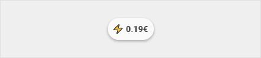
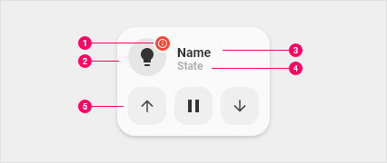
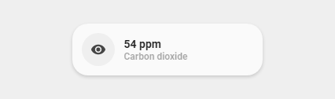
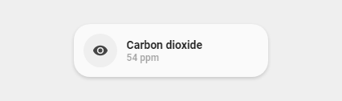
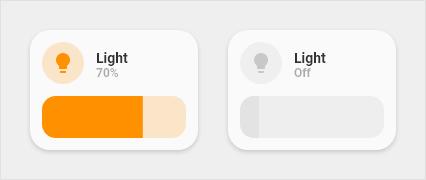
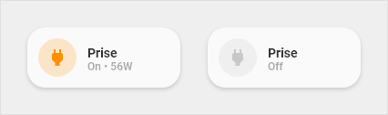
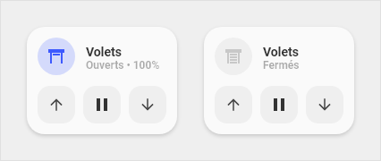
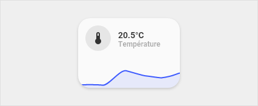

# UI-Lovelace-Minimalist  
It's kind of hard to explain what this is, so let's call it a "theme" (in quotation marks). But one thing is for sure, it is very nice! Taking the exceptional work of tben as a basis, this repository is aimed to ease installation and maintainance of his wonderful work. You can use this interpretation of a SmartHomeUI more or less like a theme in HomeAssistant. 

    

> ### Contributions
> This is a living project and all input is very welcome! If you configured and designed a card, that you would like to share, please feel free to do so! We are happy to include your contribution so others can use it as well!  

## Table of Contents  

<details>
<summary>Show table of contents</summary>

#### This page
* [Credits](#credits)
* [Design system](#design-system)
* [Installation and update](#installation-and-update)
* [Chips](#chips)
* [Title](#title)
* [Vertical buttons](#vertical-buttons)
* [Cards](#cards)
  * [1-line cards](#1-line-cards)
  * [2-line-cards](#2-line-cards)
* [Extra cards](#extra-cards)
  * [Special cards](#special-cards)
  * [Custom cards](#custom-cards)
  * [List of special/custom cards](#list-special-custom-cards)
* [Color scheme](#color-scheme)
* [Icons](#icons)
* [Changing templates](#changing-templates)
* [Legacy templates](#legacy-templates)
* [Internal templates](#internal-templates)
* [Notes](#notes)
  * [My-slider](#my-cards)

#### Seperate pages in this repository
* [Examples](examples.md)
* [FAQ](faq.md)
* [Developing custom-cards](custom-cards.md)
* [Changelog](CHANGELOG.md)
</details>

## Credits  
* This design was made by [tben](https://community.home-assistant.io/u/tben/summary)
* A lot of inspiration is taken from [7ahang’s work](https://www.behance.net/gallery/88433905/Redesign-Smart-Home) found on Behance.
* Contributions from others in the HomeAssistant forum thread, you can find it [here](https://community.home-assistant.io/t/lovelace-ui-minimalist/322687).
* The technical part is realised mostly by taking advantage of the great work RomRaider did with his [button-card](https://github.com/custom-cards/button-card).
* Code refactor, cleanup and maintainance by clemalex, schumijo and paddy0174.

## Design system  
This system is depending on two things, namely using a theme and make extensive use of the `template` function from the `custom_component` [button-card](https://github.com/custom-cards/button-card) made by RomRaider.

The design system consists of a few graphical buttons, that are changed depending on their use.

* [Chips](#chips) At the top of each page we find the chips, which allow to quickly visualize important information.
* [Title](#title) to separate the different sections.
* [Vertical buttons](#vertical-buttons) for using the cards as a button.
* [Cards](#cards) to represent and interact with devices, sensors, etc.

## Installation and update  

<details>
<summary>Installation with HACS</summary>

We are planning to release this "theme" with HACS, but for now we can only offer manual installation, unfortunately. This task is a priority for us - stay tuned, we will make an announcement, when we are ready. 
</details>

<details>
<summary>Manual installation</summary>

1. Download this repository as a *zip file* to your computer. You can do so by clicking the green button in the top right with the lable "CODE" and choosing "Download ZIP".
1. Unpack the zip-file to a location of your choice on your computer.
1. Copy the content (files **and** folders) of the folder `config` from this repository into your HomeAssistant `config` folder.  
1. If you want language specific strings (not english) for your states, copy the file for your language from the folder `language` to `config/minimalist-templates`, eg. DE.yaml for German or FR.yaml for French.
1. Install these `custom_cards`, preferably via HACS. If you don't use HACS, please refer to the installation instructions from the specific card.  

   <table>
   <tr>
   <th>Card</th>
   <th>Required</th>
   <th>Required by</th>
   <th>Note</th>
   </tr>
   <tr>
   <td><a href="https://github.com/custom-cards/button-card">button-card</a></td>
   <td>yes</td>
   <td>all cards</td>
   <td></td>
   </tr>
   <tr>
   <td><a href="https://github.com/thomasloven/lovelace-card-mod">lovelace-card-mod</a></td>
   <td>no</td>
   <td>card_light_slider</td>
   <td></td>
   </tr>
   <tr>
   <td><a href="https://github.com/kalkih/mini-graph-card">mini-graph-card</a></td>
   <td>no</td>
   <td>card_graph</td>
   <td></td>
   </tr>
   <tr>
   <td><a href="https://github.com/AnthonMS/my-cards">my-cards (formerly known as ha-slider-card)</a></td>
   <td>no</td>
   <td>card_light_slider</td>
   <td><a href="#my-cards">find the note here</a></td>
   </tr>
   <tr>
   <td colspan="4"><b><i>Not used, but recommended</i></b></td>
   </tr>
   <tr>
   <td><a href="https://github.com/thomasloven/lovelace-auto-entities">lovelace-auto-entities</a></td>
   <td>no</td>
   <td></td>
   <td></td>
   </tr>
   <tr>
   <td><a href="https://github.com/thomasloven/lovelace-state-switch">lovelace-state-switch</a></td>
   <td>no</td>
   <td></td>
   <td></td>
   </tr>
   <tr>
   <td><a href="https://github.com/kalkih/mini-media-player">mini-media-player</a></td>
   <td>no</td>
   <td></td>
   <td></td>
   </tr>
   <tr>
   <td><a href="https://github.com/bramkragten/swipe-card">swipe-card</a></td>
   <td>no</td>
   <td></td>
   <td></td>
   </tr>
   <tr>
   <td><a href="https://github.com/ofekashery/vertical-stack-in-card">vertical-stack-in-card</a></td>
   <td>no</td>
   <td></td>
   <td></td>
   </tr>
   </table>  

1. Make sure, that the cards are correctly installed.
1. You now have two possibilities to setup the "theme":  
    * In `UI mode`, you have to open the "Raw config editor"  
        1. Look for the string `views`  
        1. Insert a new line above  
        1. Paste this code into the new line:  
          `button_card_templates: !include_dir_merge_named minimalist-templates/`  
        1. Safe and close the editor  
    * In `yaml mode`  
        1. Search for the string `views`, normally this should be one of your dashboard files, like `ui-lovelace.yaml`.  
        1. Insert a new line above  
        1. Paste this code into the new line:  
          `button_card_templates: !include_dir_merge_named minimalist-templates/`  
        1. Safe and close the file  
        1. Reload your lovelace configuration via the three dot menu in the upper right corner  
1. If you want to use more than one theme (in general, not only this one), it is highly recommended to use the "HACS way" of doing so.  
    
    > If you want to have more than one theme installed, this is the **only** way to go.  
    
    * Open `config.yaml` and add this under the section `frontend` (if not already there, create it), so it looks like this:  
        ```
        frontend:
          themes: !include_dir_merge_named themes
        ```
    * If you have followed the instructions from this readme, you should already have a folder called `themes` with two new themes (=folders) inside, namely `minimalist-desktop` and `minimalist-mobile`.
    * Restart Home Assistant
    * Enable the theme in your user profile (bottom left in Home Assistant), this "theme" offers two versions, `minimalist-desktop` and `minimalist-mobile`. Both themes support light and dark mode, they are just different in the way they place your cards (desktop is for a wider screen)  
1. Start setting up your new design  
</details>

<details>
<summary><a name="update"></a>Update</summary>

Updating is a straightforwarded process. Just follow the steps you already did for installing this "theme":  
1. Download this repository as a *zip file* to your computer. You can do so by clicking the green button in the top right with the lable "CODE" and choosing "Download ZIP".
1. Unpack the zip-file to a location of your choice on your computer.
1. Copy the content (files **and** folders) of the folder `config` from this repository into your HomeAssistant `config` folder, overwriting the files with the downloaded (new) version.
1. If you're using *language specific settings*, remember to also copy the language file!
1. If you use `custom-cards` and followed the instructions to install them, everything is fine, they will not be overwritten or otherwise changed.  

To check, which version you have installed, you can always find the version number(s) in the seperate file [changelog](CHANGELOG.md).  
</details>

<details>
<summary>Language specific settings</summary>

If you are using this "theme" in another language than english, you might want to have your states in your language. Unfortunately it is sometimes not possible to use the already translated strings from Home Assistant, so we found a simple solution for this. 

* In the repository you can find a folder called `languages`, inside this folder you find files for each supported language.  
* Copy your language file into the folder `minimalist-templates` (that's the folder where `button_card_templates.yaml` lives).  
* Delete all other language files but the one you just copied over!  
* There must be **only ONE** language file present, otherwise your language strings get messed up. 

This should look like this:

```
  └── minimalist-templates/
     └── button_card_templates.yaml
     └── EN.yaml # or DE.yaml, FR.yaml, IT.yaml
  ```

If you want other than the provided strings, please change/add them in the copied file.  

</details>

## Examples and FAQ
To show the use of this "theme", we have two seperate pages set up. You can find them here:
* [Examples](examples.md)
* [FAQ](faq.md)  

## Chips  


### Chip - temperature  
This `chip` is to display a weather icon together with the outside and inside temperature.


<details>
<summary>Usage</summary>

#### Example

```yaml
- type: 'custom:button-card'
  template: chips_temperature
  variables:
    ulm_chip_temperature_inside: sensor.my_temperature_sensor_inside
    ulm_chip_temperature_outside: sensor.my_temperature_sensor_outside
    ulm_chip_temperature_weather: weather.my_weather_provider 
  tap_action:
    action: navigate
    navigation_path: /lovelace/climate
```

#### Variables  
<table>
<tr>
<th>Variable</th>
<th>Example</th>
<th>Required</th>
<th>Explanation</th>
</tr>
<tr>
<td>ulm_chip_temperature_inside</td>
<td>sensor.livingroom_temperature</td>
<td>yes</td>
<td>This is the sensor that provides your inside temperature. The state of this sensor should represent a numeric value (°C or °F doesn't matter).</td>
</tr>
<tr>
<td>ulm_chip_temperature_outside</td>
<td>sensor.outside_temperature</td>
<td>yes</td>
<td>This is the sensor that provides your outside temperature. If you want to use eg. a temperature value from your weather provider, you'd need to setup a template sensor first. The state of this sensor should represent a numeric value (°C or °F doesn't matter).</td>
</tr>
<tr>
<td>ulm_chip_temperature_weather</td>
<td>weather.accu_weather</td>
<td>yes</td>
<td>This is the sensor from your weather provider, like AccuWeather or DarkSky. The state of this sensor should provide a value like "rainy" or "cloudy" or something like that. If you're using one of the standard weather providers in HA, the state already is this value.</td>
</tr>
<tr>
<td>tap_action</td>
<td></td>
<td>optional</td>
<td>If you want to use a <i>tap_action</i> for your button, like eg. <i>more-info</i>, you can set this here with the options from <i>button-card</i> itself. If you just want to display the temperatures, you can safely leave these options out.</td>
</tr>
</table>
<br />
</details>

<details>
<summary>Template code</summary>

```yaml
chips_temperature:
  template: chips
  triggers_update: 
    - "[[[ variables.ulm_chip_temperature_weather ]]]"
    - "[[[ variables.ulm_chip_temperature_outside ]]]"
    - "[[[ variables.ulm_chip_temperature_inside ]]]"
  label: |
    [[[
      var icon = '🌡️';
      if (states[variables.ulm_chip_temperature_weather].state == 'clear-night'){
        var icon = '🌙';
      } else if(states[variables.ulm_chip_temperature_weather].state == 'cloudy'){
        var icon = '☁️';
      } else if(states[variables.ulm_chip_temperature_weather].state == 'exceptional'){
        var icon = '🌞';
      } else if(states[variables.ulm_chip_temperature_weather].state == 'fog'){
        var icon = '🌫️';
      } else if(states[variables.ulm_chip_temperature_weather].state == 'hail'){
        var icon = '⛈️';
      } else if(states[variables.ulm_chip_temperature_weather].state == 'lightning'){
        var icon = '⚡';
      } else if(states[variables.ulm_chip_temperature_weather].state == 'lightning-rainy'){
        var icon = '⛈️';
      } else if(states[variables.ulm_chip_temperature_weather].state == 'partlycloudy'){
        var icon = '⛅';
      } else if(states[variables.ulm_chip_temperature_weather].state == 'pouring'){
        var icon = '🌧️';
      } else if(states[variables.ulm_chip_temperature_weather].state == 'rainy'){
        var icon = '💧';
      } else if(states[variables.ulm_chip_temperature_weather].state == 'snowy'){
        var icon = '❄️';
      } else if(states[variables.ulm_chip_temperature_weather].state == 'snowy-rainy'){
        var icon = '🌨️';
      } else if(states[variables.ulm_chip_temperature_weather].state == 'sunny'){
        var icon = '☀️';
      } else if(states[variables.ulm_chip_temperature_weather].state == 'windy'){
        var icon = '🌪️';
      }
      return icon + ' ' + states[variables.ulm_chip_temperature_outside].state + '° / ' + states[variables.ulm_chip_temperature_inside].state + '°' ;
    ]]]
```
  
</details>

### Chip - icon only  
This `chip` displays just an icon. 

@dev PICTURE MISSING

<details>
<summary>Usage</summary>


#### Example

```yaml
- type: 'custom:button-card'
  template: chips_icon_only
  variables:
    ulm_chip_icon_only: '❤️'
  tap_action:
    action: navigate
    navigation_path: /lovelace/bedroom
```

#### Variables  
<table>
<tr>
<th>Variable</th>
<th>Example</th>
<th>Required</th>
<th>Explanation</th>
</tr>
<tr>
<td>ulm_chip_icon_only</td>
<td>❤️</td>
<td>no</td>
<td>This is the icon to show. See [icons](#icons) at the end of this page to read more about the used unicode `emojis`.</td>
</tr>
<tr>
<td>tap_action</td>
<td></td>
<td>optional</td>
<td>If you want to use a <i>tap_action</i> for your button, like eg. <i>more-info</i>, you can set this here with the options from <i>button-card</i> itself. If you just want to display the temperatures, you can safely leave these options out.</td>
</tr>
</table>
<br />
</details>

<details>
<summary>Template code</summary>

```yaml
chips_icon_only:
  template: chips
  variables:
    icon: '❔'
  show_icon: true
  icon: "[[[ return variables.ulm_chip_icon_state_icon ? variables.ulm_chip_icon_state_icon : variables.icon ]]]"
  styles:
    grid:
      - grid-template-areas: '"i"'
```

</details>

### Chip - icon with state  
This `chip` displays an icon and a label, where the label can be any state of a sensor you configure. 

@dev PICTURE MISSING

<details>
<summary>Usage</summary>


#### Example

```yaml
- type: 'custom:button-card'
  template: chips_icon_state
  variables:
    ulm_chip_icon_state_icon: '🛏️'
    ulm_chip_icon_state_entity: sensor.bed_occupancy
  tap_action:
    action: navigate
    navigation_path: /lovelace/bedroom
```

#### Variables  
<table>
<tr>
<th>Variable</th>
<th>Example</th>
<th>Required</th>
<th>Explanation</th>
</tr>
<tr>
<td>ulm_chip_icon_state_icon</td>
<td>🛏️</td>
<td>yes</td>
<td>This is the icon to show. See [icons](#icons) at the end of this page to read more about the used unicode `emojis`.</td>
</tr>
<tr>
<td>ulm_chip_icon_state_entity</td>
<td>sensor.bed_occupancy</td>
<td>yes</td>
<td></td>
</tr>
<tr>
<td>tap_action</td>
<td></td>
<td>optional</td>
<td>If you want to use a <i>tap_action</i> for your button, like eg. <i>more-info</i>, you can set this here with the options from <i>button-card</i> itself. If you just want to display the temperatures, you can safely leave these options out.</td>
</tr>
</table>
<br />
</details>

<details>
<summary>Template code</summary>

```yaml
chips_icon_state:
  template: chips
  variables:
    icon: "❔"
  triggers_update:
    - "[[[ variables.ulm_chip_icon_state_entity ]]]"
  show_icon: true
  show_label: true
  icon: "[[[ return variables.ulm_chip_icon_state_icon ? variables.ulm_chip_icon_state_icon : variables.icon ]]]"
  label: "[[[ return variables.ulm_chip_icon_state_entity ? states[variables.ulm_chip_icon_state_entity].state : '' ]]]"
  styles:
    label:
      - justify-self: center
      - padding: 0px 6px
      - font-weight: bold
      - font-size: 14px
    grid:
      - grid-template-areas: '"i l"'
```

</details>

### Chip - icon with double state  
This `chip` displays an icon and a two labels, where each label can be any state of a sensor you configure. 

@dev PICTURE MISSING

<details>
<summary>Usage</summary>


#### Example

```yaml
- type: 'custom:button-card'
  template: chips_icon_double_state
  variables:
    ulm_chip_icon_double_state_icon: '💻'
    ulm_chip_icon_double_state_entity_1: sensor.nas_disk_used
    ulm_chip_icon_double_state_entity_2: sensor.nas_cpu_load
  tap_action:
    action: navigate
    navigation_path: /lovelace/systems
```

#### Variables  
<table>
<tr>
<th>Variable</th>
<th>Example</th>
<th>Required</th>
<th>Explanation</th>
</tr>
<tr>
<td>ulm_chip_icon_double_state_icon</td>
<td>💻</td>
<td>yes</td>
<td>This is the icon to show. See [icons](#icons) at the end of this page to read more about the used unicode `emojis`.</td>
</tr>
<tr>
<td>ulm_chip_icon_double_state_entity_1</td>
<td>sensor.nas_disk_used</td>
<td>yes</td>
<td></td>
</tr>
<tr>
<td>ulm_chip_icon_double_state_entity_2</td>
<td>sensor.nas_cpu_load</td>
<td>yes</td>
<td></td>
</tr>
<tr>
<td>tap_action</td>
<td></td>
<td>optional</td>
<td>If you want to use a <i>tap_action</i> for your button, like eg. <i>more-info</i>, you can set this here with the options from <i>button-card</i> itself. If you just want to display the temperatures, you can safely leave these options out.</td>
</tr>
</table>
<br />
</details>

<details>
<summary>Template code</summary>

```yaml
chips_icon_double_state:
  template: chips
  variables:
    icon: "❔"
  triggers_update:
    - "[[[ variables.ulm_chip_icon_state_entity_1 ]]]"
    - "[[[ variables.ulm_chip_icon_state_entity_2 ]]]"
  show_icon: true
  show_label: true
  icon: "[[[ return variables.ulm_chip_icon_double_state_icon ? variables.ulm_chip_icon_double_state_icon : variables.icon ]]]"
  label: "[[[ return variables.ulm_chip_icon_double_state_entity_1 ? states[variables.ulm_chip_icon_double_state_entity_1].state + states[variables.ulm_chip_icon_double_state_entity_2].state : '' ]]]"
  styles:
    label:
      - justify-self: center
      - padding: 0px 6px
      - font-weight: bold
      - font-size: 14px
    grid:
      - grid-template-areas: '"i l"'
```

</details>

### Chip - back button  
This is a `back-button`, primarly used if you switch between views and want a convenient way back. Set the `tap-action` to navigate back to the default view, eg. home.


<details>
<summary>Usage</summary>


#### Example

```yaml
- type: 'custom:button-card'
  template: chips_back
  tap_action:
    action: navigate
    navigation_path: /ui-lovelace-minimalist/home
```

#### Variables  
<table>
<tr>
<th>Variable</th>
<th>Example</th>
<th>Required</th>
<th>Explanation</th>
</tr>
<tr>
<td>tap_action</td>
<td>see example code above</td>
<td>yes</td>
<td>Set the navigation path to your default view, eg. <i>ui-lovelace-minimalist/home</i> or <i>lovelace</i></td>
</tr>
</table>
<br />
</details>

<details>
<summary>Template code</summary>

```yaml
chips_back:
  template: chips
  tap_action:
    action: navigate
    navigation_path: /lovelace
  show_icon: true
  icon: 'mdi:arrow-left'
  styles:
    grid:
      - grid-template-areas: '"i"'
```

</details>

### Chip - presence counter  
This `chip` shows you the actual presence in your home. Shows residents and guests (guests only if one or more).


<details>
<summary>Usage</summary>


#### Example

```yaml
- type: 'custom:button-card'
  template: chips_presence_detection
  variables:
    ulm_chip_presence_counter_residents: sensor.my_residents_counter
    ulm_chip_presence_counter_guests: sensor.my_guests_counter
  tap_action:
    action: navigate
    navigation_path: /lovelace/location
```

#### Variables  
<table>
<tr>
<th>Variable</th>
<th>Example</th>
<th>Required</th>
<th>Explanation</th>
</tr>
<tr>
<td>ulm_chip_presence_counter_residents</td>
<td>sensor.my_residents_counter</td>
<td>yes</td>
<td>This is the sensor that shows your residents counter.</td>
</tr>
<tr>
<td>ulm_chip_presence_counter_guests</td>
<td>sensor.my_guests_counter</td>
<td>yes</td>
<td>This is the sensor that shows your guests counter.</td>
</tr>
<tr>
<td>tap_action</td>
<td>see example code above</td>
<td>yes</td>
<td>Set the navigation path to your default view, eg. <i>ui-lovelace-minimalist/home</i> or <i>lovelace</i></td>
</tr>
</table>
<br />
</details>

<details>
<summary>Template code</summary>

```yaml
chips_presence_detection:
  template: chips
  triggers_update:
    - "[[[ variables.ulm_chip_presence_counter_residents ]]]"
    - "[[[ variables.ulm_chip_presence_counter_guests ]]]"
  label: |
    [[[
      var guests = states[variables.ulm_chip_presence_counter_guests].state ? ' / ' + states[variables.ulm_chip_presence_counter_guests].state : '';
      return '🏠 ' +  states[variables.ulm_chip_presence_counter_residents].state + guests;
    ]]]
```

</details>

### Chip - electric consumption  
This `chip` shows you the electric consumption from a sensor. Configurable to show power (kWh) or price (currency).



<details>
<summary>Usage</summary>


#### Example

```yaml
- type: 'custom:button-card'
  template: chips_power_consumption
  variables:
    ulm_chip_electric_consumption: sensor.my_electric_power_consumption
    ulm_chip_electric_price: sensor.my_electric_power_price
  tap_action:
    action: navigate
    navigation_path: /lovelace/consumption
```

#### Variables  
<table>
<tr>
<th>Variable</th>
<th>Example</th>
<th>Required</th>
<th>Explanation</th>
</tr>
<tr>
<td>ulm_chip_electric_consumption</td>
<td>sensor.my_electric_power_consumption</td>
<td>yes</td>
<td>This is your consumed energy. This is the sensor, that shows how many *kWh*s are consumed.</td>
</tr>
<tr>
<td>ulm_chip_electric_price</td>
<td>sensor.my_electric_power_price</td>
<td>no</td>
<td>This is the price for your consumed energy, if you have such a sensor. This should be a sensor that shows a price in your defined currency. If this variable is not set, the chip shows only the *kWh*s! If this variable is set the chip shows the price for the consumed energy!</td>
</tr>
<tr>
<td>tap_action</td>
<td>see example code above</td>
<td>yes</td>
<td>Set the navigation path to your default view, eg. <i>ui-lovelace-minimalist/home</i> or <i>lovelace</i></td>
</tr>
</table>
<br />
</details>

<details>
<summary>Template code</summary>

```yaml
chips_power_consumption:
  template: chips
  triggers_update:
    - "[[[ variables.ulm_chip_electric_consumption ]]]"
  label: |
    [[[
      var amount = variables.ulm_chip_electric_price != '' ? true : false

      if (amount){
        return '⚡ ' +  states[variables.ulm_chip_electric_price].state + variables.ulm_currency;
      } else {
        return '⚡ ' +  states[variables.ulm_chip_electric_consumption].state;
      }
    ]]]
```

</details>

## Title  
Titles (and optionally subtitles) are used to seperate different areas in your design.


<details>
<summary>Usage</summary>

#### Example

```yaml
- type: 'custom:button-card'
  template: card_title
  name: My Title
  label: 'Subtitle'  
```

</details>

<details>
<summary>Template code</summary>

```yaml
card_title:
  tap_action:
    action: none
  show_icon: false
  show_label: true
  show_name: true
  styles:
    card:
      - background-color: rgba(0,0,0,0)
      - box-shadow: none
      - height: auto
      - width: auto
      - margin-top: 12px
      - margin-left: 24px
      - margin-bottom: 0px
    grid:
      - grid-template-areas: '"n" "l"'
      - grid-template-columns: 1fr
      - grid-template-rows: min-content min-content
    name:
      - justify-self: start
      - font-weight: bold
      - font-size: '1.5rem'
    label:
      - justify-self: start
      - font-weight: bold
      - font-size: '1rem'
      - opacity: '0.4'
```

</details>

## Vertical buttons  
Vertical buttons are just another style of buttons, mainly you can display an icon, a state *and* a label, all aligned vertically. 

> In previous versions of this "theme" these buttons were called *scenes*, as these were primarly used for showing different presence states. If you still want to use these as in previous versions, please refer to the [examples page](examples.md).


<details>
<summary>Usage</summary>

#### Variables  
<table>
<tr>
<th>Variable</th>
<th>Example</th>
<th>Required</th>
<th>Explanation</th>
</tr>
<tr>
<td></td>
<td></td>
<td></td>
<td></td>
</tr>
</table>

#### Example

```yaml
- type: 'custom:button-card'
  template: vertical_buttons
  entity: sensor.present
  
```

</details>

<details>
<summary>Template code</summary>

```yaml
vertical_buttons:
  show_label: true
  label: "[[[ return (entity.attributes.value )]]]"
  styles: 
    icon:
      - color: 'rgba(var(--color-theme),0.2)'
    label:
      - justify-self: center
      - align-self: start
      - font-weight: bolder
      - font-size: 12px
      - filter: opacity(40%)
    name:
      - margin-top: 10px
      - justify-self: center
      - font-weight: bold
      - font-size: 14px
    img_cell:
      - background-color: 'rgba(var(--color-theme),0.05)'
      - border-radius: 50%
      - place-self: center
      - width: 42px
      - height: 42px
    grid:
      - grid-template-areas: '"i" "n" "l"'
    card:
      - border-radius: var(--border-radius)
      - box-shadow: var(--box-shadow)
      - padding: 10px 0px 8px 0px
  size: 20px
```

```yaml
vertical_buttons_blue:
  template: vertical_buttons
  state:
    - operator: template
      value: "[[[ return states['input_select.localisation_thomas'].state == variables.state ]]]"
      styles:
        icon:
          - color: 'rgba(var(--color-blue),1)'
        label:
          - color: 'rgba(var(--color-blue-text),1)'
        name:
          - color: 'rgba(var(--color-blue-text),1)'
        img_cell:
          - background-color: 'rgba(var(--color-blue), 0.2)'
        card:
          - background-color: 'rgba(var(--color-background-blue), var(--opacity-bg))'
```

```yaml
vertical_buttons_green:
  template: vertical_buttons
  state:
    - operator: template
      value: "[[[ return states['input_select.localisation_thomas'].state == variables.state ]]]"
      styles:
        icon:
          - color: 'rgba(var(--color-green),1)'
        label:
          - color: 'rgba(var(--color-green-text),1)'
        name:
          - color: 'rgba(var(--color-green-text),1)'
        img_cell:
          - background-color: 'rgba(var(--color-green), 0.2)'
        card:
          - background-color: 'rgba(var(--color-background-green), var(--opacity-bg))'
```

</details>

## Cards  
`Cards` are the main part of this design and are widely used in very different designs and functions. With these `cards` you can set up nearly every entity in HA, showing from "state-only" over a "full blown" information graphic with various values to "controlling" your covers and climate entities.


### Anatomy  

1. **Dot**: Visible when the device is unavailable. Also used on the entity **person**
2. **Icon**: Icon that represents the device
3. **Primary line**: Main information
4. **Secondary line**: Secondary information
5. **Optional part**: Possibility to display buttons to launch actions related to the device. Or display a graph to view the history of a sensor or you let your fantasy take the ride...

In the list above #5 enhances the normal `cards` with a "second line", that is used to display other information like a graph or the controls for your covers. For this readme the `cards` are divided into three groups:
* 1-line cards: These are cards for `sensor` or `binary_sensors` like *light* or *power outlets*.
* 2-line cards: These are cards with a second line for informations or controls, eg. your `cover controls`.
* Special cards: These are special cards, based on the other cards but enhanced by specific functions. Eg. an `aircondition-card` that shows the state of your aircondition and buttons to control it.

## 1-line cards

### Generic (aka sensor)
This is the `generic-card` to display values from a sensor, eg. to show humidity, your next waste collection date or whatever sensor value is provided.



<details>
<summary>Usage</summary>

#### Example

```yaml
- type: 'custom:button-card'
  template: card_generic
  entity: sensor.next_waste_collection
```

#### Variables
<table>
<tr>
<th>Variable</th>
<th>Example</th>
<th>Required</th>
<th>Explanation</th>
</tr>
<tr>
<td>entity</td>
<td>sensor.next_waste_collection</td>
<td>yes</td>
<td></td>
</tr>
</table>
<br />
</details>

<details>
<summary>Template code</summary>

```yaml
card_generic:
  template: 
    - icon_info_bg
    - ulm_language_variables
  label: >
    [[[
      var unit = entity.attributes.unit_of_measurement != null ? ' ' + entity.attributes.unit_of_measurement : ''
      if (entity.state == 'on') {
        return variables.ulm_on;
      } else if (entity.state == 'off') {
        return variables.ulm_off;
      } else if (entity.state == 'unavailable') {
        return variables.ulm_unavailable;
      } else if (entity.state == 'idle') {
        return variables.ulm_idle;
      } else if (entity.state == 'open') {
        return variables.ulm_open;
      } else if (entity.state == 'closed') {
        return variables.ulm_closed;
      } else {
        return entity.state + unit;
      }
    ]]]
  styles:
    icon:
      - color: 'rgba(var(--color-theme),0.9)'
    label:
      - align-self: end
      - justify-self: start
      - font-weight: bold
      - font-size: 14px
      - margin-left: 12px
      - filter: opacity(100%)
    name:
      - justify-self: start
      - align-self: start
      - font-weight: bolder
      - font-size: 12px
      - filter: opacity(40%)
      - margin-left: 12px
    grid:
      - grid-template-areas: '"i l" "i n"'
      - grid-template-columns: min-content auto
      - grid-template-rows: min-content min-content
```

</details>

### Generic swapped 
This is the same as the `generic-card`, but with *name* and *state* swapped.



@dev WRONG PICTURE

<details>
<summary>Usage</summary>

#### Example

```yaml
- type: 'custom:button-card'
  template: card_generic_swap
  entity: sensor.next_waste_collection
```

#### Variables
<table>
<tr>
<th>Variable</th>
<th>Example</th>
<th>Required</th>
<th>Explanation</th>
</tr>
<tr>
<td>entity</td>
<td>sensor.next_waste_collection</td>
<td>yes</td>
<td></td>
</tr>
</table>
<br />
</details>

<details>
<summary>Template code</summary>

```yaml
card_generic_swap:
  template: 
    - icon_info_bg
    - ulm_language_variables
  label: >
    [[[
      var unit = entity.attributes.unit_of_measurement != null ? ' ' + entity.attributes.unit_of_measurement : ''
      if (entity.state == 'on') {
        return variables.ulm_on;
      } else if (entity.state == 'off') {
        return variables.ulm_off;
      } else if (entity.state == 'unavailable') {
        return variables.ulm_unavailable;
      } else if (entity.state == 'idle') {
        return variables.ulm_idle;
      } else if (entity.state == 'open') {
        return variables.ulm_open;
      } else if (entity.state == 'closed') {
        return variables.ulm_closed;
      } else {
        return entity.state + unit;
      }
    ]]]
  styles:
    icon:
      - color: 'rgba(var(--color-theme),0.9)'
    label:
      - justify-self: start
      - align-self: start
      - font-weight: bolder
      - font-size: 12px
      - filter: opacity(40%)
      - margin-left: 12px
    name:
      - align-self: end
      - justify-self: start
      - font-weight: bold
      - font-size: 14px
      - margin-left: 12px
      - filter: opacity(100%)
    grid:
      - grid-template-areas: '"i n" "i l"'
      - grid-template-columns: min-content auto
      - grid-template-rows: min-content min-content
```

</details>

### Light  
This is the `light-card`, used to toggle a light or a light group. Shows state of the light and, if available, brightness in %.

 

<details>
<summary>Usage</summary>

#### Example

```yaml
- type: 'custom:button-card'
  template: card_light
  entity: light.my_livingroom_light
  name: Livingroom Light
```

#### Variables
<table>
<tr>
<th>Variables</th>
<th>Example</th>
<th>Required</th>
<th>Explanation</th>
</tr>
<tr>
<td>tap_action</td>
<td>action: toggle</td>
<td>no</td>
<td>The default <i>tap_action</i> is set to toggle your light. As always, you can overwrite this with your personal settings in your view template.</td>
</tr>
<tr>
<td>hold_action</td>
<td>action: more-info</td>
<td>no</td>
<td>The default <i>hold_action</i> is set to show the "more-info" pop-up (lovelace default), where you can eg. change the brightness or color. As always, you can overwrite this with your personal settings in your view template.</td>
</tr>
</table>
<br />
</details>

<details>
<summary>Template code</summary>

```yaml
card_light:
  template: 
    - icon_info_bg
    - yellow
    - ulm_language_variables
  tap_action:
    action: toggle
  hold_action:
    action: more-info
  label: >-
    [[[ if (entity.state !='unavailable'){
          if (entity.state =='off'){
            var bri = Math.round(entity.attributes.brightness / 2.55);
            return variables.ulm_off;  
          } else {
            var bri = Math.round(entity.attributes.brightness / 2.55);
            return (bri ? bri : '0') + '%'; 
          }
        } else {
          return variables.ulm_unavailable;
        }
    ]]]
```

</details>

### Light slider  
The `light-slider-card` controls a light or light-group with the added possibilty to control the brightness of your light with a slider.

 

<details>
<summary>Usage</summary>

#### Example

```yaml
- type: 'custom:button-card'
  template: card_light_slider
  entity: light.my_livingroom_light
  variables:
    ulm_card_light_slider_name: Livingroom Light
```

#### Variables
<table>
<tr>
<th>Variables</th>
<th>Example</th>
<th>Required</th>
<th>Explanation</th>
</tr>
<tr>
<td>ulm_card_light_slider_name</td>
<td>Livingroom light</td>
<td>no</td>
<td>If you want to set a specific name, eg. because your friendly name is too long for the card, this is the place to fill it in. If this is not set, the friendly name will be used.</td>
</tr>
</table>
<br />
</details>

<details>
<summary>Template code</summary>

```yaml
card_light_slider:
  variables:
    ulm_card_light_slider_name: "[[[ return entity.attributes.friendly_name ]]]"
  show_icon: false
  show_name: false
  show_label: false
  state:
    - operator: template
      value: "[[[ return entity.state == 'on' ]]]"
      styles:
        card:
          - background-color: 'rgba(var(--color-background-yellow),var(--opacity-bg))'
  styles:
    grid:
      - grid-template-areas: '"item1" "item2"'
      - grid-template-columns: 1fr
      - grid-template-rows: min-content  min-content
      - row-gap: 12px
    card:
      - border-radius: var(--border-radius)
      - box-shadow: var(--box-shadow)
      - padding: 12px
  custom_fields:
    item1:
      card:
        type: 'custom:button-card'
        template:
          - icon_info
          - light
        entity: "[[[ return entity.entity_id ]]]"
        name: "[[[ return variables.ulm_card_light_slider_name ]]]"
        styles:
          card:
            - box-shadow: none
            - border-radius: var(--border-radius) var(--border-radius) 0px 0px
            - padding: 0px
    item2:
      card:
        type: 'custom:my-slider'
        entity: '[[[ return entity.entity_id ]]]'
        radius: 14px
        height: 42px
        mainSliderColor: rgba(var(--color-yellow),1)
        secondarySliderColor: rgba(var(--color-yellow),0.2)
        mainSliderColorOff: rgba(var(--color-theme),0.05)
        secondarySliderColorOff: rgba(var(--color-theme),0.05)
        thumbHorizontalPadding: '0px'
        thumbVerticalPadding: '0px'   
        thumbWidth: 0px
        card_mod:
        style: |
          ha-card {
            border-radius: 14px;
            box-shadow: none;
          }
```

</details>

### Power Outlet  
This is the `power-outlet-card`. It shows you the state of a power outlet, and if configured, the actual power consumption of the power outlet.



<details>
<summary>Usage</summary>

#### Example

```yaml
- type: 'custom:button-card'
  template: card_power_outlet
  entity: switch.power_outlet_livingroom
  name: Power Outlet Livingroom
  variables:
    ulm_power_outlet_consumption_sensor: sensor.power_outlet_livingroom_consumption 
```

#### Variables
<table>
<tr>
<th>Variable</th>
<th>Example</th>
<th>Required</th>
<th>Explanation</th>
</tr>
<tr>
<td>ulm_power_outlet_consumption_sensor</td>
<td>sensor.power_outlet_livingroom_consumption</td>
<td>no</td>
<td>If you set this sensor, the `power-outlet-card` shows the energy consumption next to the state.</td>
</tr>
</table>
<br />
</details>

<details>
<summary>Template code</summary>

```yaml
card_power_outlet:
  template: 
    - yellow
    - icon_info_bg 
  label: |-
    [[[ 
      if (entity.state =='on') && (variables.ulm_power_outlet_consumption_sensor != '' {
        return entity.label + ' ' + variables.ulm_power_outlet_consumption_sensor + 'W';
      } else {
        return entity.label;
      }
    ]]]
```

</details>

### Binary sensor  
The `binary-sensor-card` is to show the state (on/off, open/close, etc.) of a binary sensor, eg. your garage door or a window contact sensor.

 <br /> 

<details>
<summary>Usage</summary>

#### Example

```yaml
- type: 'custom:button-card'
  template: card_binary_sensor
  entity: binary_sensor.garage_door
  name: Garage Door
  icon: 'mdi:garage'
  show_last_changed: true
```

#### Variables
<table>
<tr>
<th>Variable</th>
<th>Example</th>
<th>Required</th>
<th>Explanation</th>
</tr>
<tr>
<td>entity</td>
<td>binary_sensor.garage_door</td>
<td>yes</td>
<td>The <i>binary_sensor</i> to show</td>
</tr>
<tr>
<td>name</td>
<td>Garage Door</td>
<td>no</td>
<td>The name, if not set, the friendly name is used.</td>
</tr>
<tr>
<td>icon</td>
<td>mdi:garage</td>
<td>no</td>
<td>If not set, the standard icon from HA will be used.</td>
</tr>
<tr>
<td>show_last_changed</td>
<td>13 minutes ago</td>
<td>no</td>
<td>Set this to <i>true</i> or <i>false</i>. This is set to <i>true</i> be default and shows the `last_changed` attribute of your <i>binary_sensor</i>.</td>
</tr>
</table>
<br />
</details>

<details>
<summary>Template code</summary>

```yaml
card_binary_sensor:
  template: 
    - icon_info_bg
    - blue
  name: "[[[ return entity.name != '' ? entity.name : entity.attribute.friendly_name ]]]"
  show_last_changed: true
```

</details>

### Input boolean  
The `input-boolean-card` is to switch an `input_boolean` on or off.

 <br /> 

<details>
<summary>Usage</summary>

#### Example

```yaml
- type: 'custom:button-card'
  template: card_input_boolean
  entity: input_boolean.guest_mode
```

#### Variables
<table>
<tr>
<th>Variable</th>
<th>Example</th>
<th>Required</th>
<th>Explanation</th>
</tr>
<tr>
<td>entity</td>
<td>input_boolean.guest_mode</td>
<td>yes</td>
<td>The <i>input_boolean</i> to switch</td>
</tr>
</table>
<br />
</details>

<details>
<summary>Template code</summary>

```yaml
card_input_boolean:
  template: 
    - icon_info_bg
    - ulm_language_variables
    - blue
  name: "[[[ return entity.name != '' ? entity.name : entity.attribute.friendly_name ]]]"
  label: >
    [[[
      if (entity.state != 'unavailable'){
        if (entity.state == 'on'){
          return variables.ulm_on;
        } else {
          return variables.ulm_off;
        }
      } else {
        return variable.ulm_unavailable;
      }
    ]]]
```

</details>

### Media player  
The `media-player-card` shows you the *app*, the *title* and the *album name* playing, if the data is available through HA. The *app* is shown via a different icon.  


Currently there are icons for 
* *Spotify*
* *GooglePodcast*
* *Plex*
* *Soundcloud*
* *YoutubeMusic*

Unfortunately *AmazonMusic*, *AppleMusic* and *Deezer* don't have an `mdi:icon`, so the default icon (a speaker) will be presented.

If you're looking for a `media-player-card-with-controls`, see a little downwards under *2-line cards*.
<details>
<summary>Usage</summary>

#### Example

```yaml
- type: 'custom:button-card'
  template: card_media_player
  entity: media_player.livingroom_shield
  name: Livingroom Nvidia Shield
```

#### Variables
<table>
<tr>
<th>Variable</th>
<th>Example</th>
<th>Required</th>
<th>Explanation</th>
</tr>
<tr>
<td>entity</td>
<td>media_player.livingroom_shield</td>
<td>yes</td>
<td>The entity of the media player</td>
</tr>
<tr>
<td>name</td>
<td>Livingroom Nvidia Shield</td>
<td>no</td>
<td>The displayed name of your media player</td>
</tr>
</table>
<br />
</details>

<details>
<summary>Template code</summary>

```yaml
card_media_player:
  template:
    - icon_info_bg
  icon: |
    [[[
        var app = entity.attributes.app_name;
        var icon = 'mdi:speaker';
        if(app == 'Spotify'){
          var icon = 'mdi:spotify';
        } else if(app == 'Google Podcasts'){
          var icon = 'mdi:google-podcast';
        } else if(app == 'Plex'){
          var icon = 'mdi:plex';
        } else if(app == 'Soundcloud'){
          var icon = 'mdi:soundcloud';
        } else if(app == 'Youtube Music'){
          var icon = 'mdi:youtube';
        } else if (app == 'Oto music'){
          var icon = 'mdi:music-circle';
        }
        return icon;
    ]]]
  label: "[[[ return entity.state; ]]]"
  state:
    - operator: template
      value: "[[[ return entity.state != 'off' ]]]"
      name: "[[[ return states[entity.entity_id].attributes.media_title; ]]]"
      label: "[[[ return states[entity.entity_id].attributes.media_album_name; ]]]"
      styles:
        label: 
          - color: white
          - filter: opacity(100%)
        img_cell:
          - background-color: 'rgba(var(--color-theme),0.0)'
        icon:
          - color: white
        name:
          - color: white
  styles:
    label:
      - opacity: '0.6'
    icon:
      - color: 'rgba(var(--color-theme),0.2)'
    img_cell:
      - background-color: 'rgba(var(--color-theme),0.05)'
    card:
      - background-blend-mode: multiply
      - background: "[[[ return states[entity.entity_id].attributes.entity_picture_local != null ? 'center / cover url(' + states[entity.entity_id].attributes.entity_picture_local + ') rgba(0, 0, 0, 0.15)' : '' ]]]"
```

</details>

### Media player with cover art (album picture)
This is the second `media-player-card`, in contrast to the first one above, it shows the cover art from your media player. 

@dev PICTURE MISSING

<details>
<summary>Usage</summary>

#### Example
```yaml
- type: 'custom:button-card'
  template: card_media_player_mini_album
  entity: media_player.livingroom_shield
```

#### Variables
<table>
<tr>
<th>Variable</th>
<th>Example</th>
<th>Required</th>
<th>Explanation</th>
</tr>
<tr>
<td>entity</td>
<td>media_player.livingroom_shield</td>
<td>yes</td>
<td>The entity of the media player</td>
</tr>
</table>
<br />
</details>

<details>
<summary>Template code</summary>

```yaml
card_media_player_mini_album:
  label: "[[[ return entity.state; ]]]"
  state:
    - operator: template
      value: "[[[ return entity.state != 'off' ]]]"
      name: "[[[ return entity.attributes.media_title; ]]]"
      label: "[[[ return entity.attributes.media_album_name; ]]]"
      styles:
        img_cell:
          - background: "[[[ return 'center / cover url(' + entity.attributes.entity_picture + ')'; ]]]"
        icon:
          - color: 'rgba(var(--color-theme),0.0)'
  styles:
    icon:
      - color: 'rgba(var(--color-theme),0.2)'
    img_cell:
      - background-color: 'rgba(var(--color-theme),0.05)'
```

</details>

### Battery
The `battery-card` is a slightly enhanced `generic-card`, just to ease the use. You could always configure it from the `generic-card` yourself. 

@dev PICTURE MISSING

<details>
<summary>Usage</summary>

#### Example

```yaml
- type: 'custom:button-card'
  template: card_battery
  variables:
    ulm_card_battery_attribute: battery_attribute
  entity: sensor.livingoom_thermometer_battery
```

#### Variables
<table>
<tr>
<th>Variable</th>
<th>Example</th>
<th>Required</th>
<th>Explanation</th>
</tr>
<tr>
<td>ulm_card_battery_attribute</td>
<td>battery_attribute</td>
<td>no</td>
<td>If your entity provides the battery percent in an attribute (= not as an own sensor), fill in the <u>attributes name</u> here.<br />Eg. if you have `sensor.livingroom_thermometer` and the attribute for your battery power is `sensor.livingroom_thermometer.attributes.battery_percent`, you fill in <i>battery_percent</i> here.</td>
</tr>
<tr>
<td>entity</td>
<td>sensor.livingroom_thermometer_battery</td>
<td>yes</td>
<td>This is your battery entity</td>
</tr>
</table>
<br />
</details>

<details>
<summary>Template code</summary>

```yaml
card_battery:
  template: card_generic
  icon: |
    [[[
        var battery = variables.ulm_card_battery_attribute != null ? states[entity.entity_id].attributes. + variables.ulm_card_battery_attribute : entity.state;
        var icon = 'mdi:help-circle-outline';
        if (battery >= 90){
          var icon = 'mdi:battery';
        } else if(battery >= 80){
          var icon = 'mdi:battery-90';
        } else if(battery >= 70){
          var icon = 'mdi:battery-80️';
        } else if(battery >= 60){
          var icon = 'mdi:battery-70️';
        } else if(battery >= 50){
          var icon = 'mdi:battery-60️';
        } else if(battery >= 40){
          var icon = 'mdi:battery-50️';
        } else if(battery >= 30){
          var icon = 'mdi:battery-40️';
        } else if(battery >= 20){
          var icon = 'mdi:battery-30️';
        } else if(battery >= 10){
          var icon = 'mdi:battery-20️';
        } else if(battery >= 0){
          var icon = 'mdi:battery-10️';
        } else if(battery == 0){
          var icon = 'mdi:battery-outline️';
        }
         return icon;
    ]]]
```

</details>

## 2-line cards

### Cover  
With the `cover-card` you have the state of your cover and on the second line UP / PAUSE / DOWN to control it. 



<details>
<summary>Usage</summary>

#### Example

```yaml
- type: 'custom:button-card'
  template: 
    - card_cover_with_buttons
  variables:
    ulm_card_cover_with_buttons_name: "Cover Livingroom Window"
    ulm_card_cover_with_buttons_entity: "cover.livingroom_window"
```

#### Variables
<table>
<tr>
<th>Variable</th>
<th>Example</th>
<th>Required</th>
<th>Explanation</th>
</tr>
<tr>
<td>ulm_card_cover_with_buttons_name</td>
<td>Cover Livingroom Window</td>
<td>no</td>
<td>The name of your cover entity</td>
</tr>
<tr>
<td>ulm_card_cover_with_buttons_entity</td>
<td>cover.livingroom_window</td>
<td>yes</td>
<td>The <i>entity_id</i> of your cover</td>
</tr>
</table>
<br />
</details>

<details>
<summary>Template code</summary>

```yaml
card_cover_with_buttons:
  variables:
    ulm_card_cover_with_buttons_name: "n/a"
  triggers_update:
    - "[[[ variables.ulm_card_cover_with_buttons_entity ]]]"
  styles:
    grid:
      - grid-template-areas: '"item1" "item2"'
      - grid-template-columns: 1fr
      - grid-template-rows: min-content  min-content
      - row-gap: 12px
    card:
      - border-radius: var(--border-radius)
      - box-shadow: var(--box-shadow)
      - padding: 12px
  custom_fields:
    item1:
      card:
        type: 'custom:button-card'
        template:
          - icon_info
          - ulm_language_variables
          - cover
        tap_action:
          action: more-info
        entity: '[[[ return variables.ulm_card_cover_with_buttons_entity ]]]'
        name: '[[[ return variables.ulm_card_cover_with_buttons_name ]]]'
    item2:
      card:
        type: 'custom:button-card'
        template: list_items
        custom_fields:
          item1:
            card:
              type: 'custom:button-card'
              template: widget_icon
              tap_action:
                action: call-service
                service: cover.close_cover
                service_data:
                  entity_id: '[[[ return variables.ulm_card_cover_with_buttons_entity ]]]'
              icon: 'mdi:arrow-down'
          item2:
            card:
              type: 'custom:button-card'
              template: widget_icon
              tap_action:
                action: call-service
                service: cover.stop_cover
                service_data:
                  entity_id: '[[[ return variables.ulm_card_cover_with_buttons_entity ]]]'
              icon: 'mdi:pause'
          item3:
            card:
              type: 'custom:button-card'
              template: widget_icon
              tap_action:
                action: call-service
                service: cover.open_cover
                service_data:
                  entity_id: '[[[ return variables.ulm_card_cover_with_buttons_entity ]]]'
              icon: 'mdi:arrow-up'
```

</details>

### Graph  
The `graph-card` shows an entity with the actual state and a *min-graph-card* integrated. This can be used for a thermostat to show the actual temperature and the history.



<details>
<summary>Usage</summary>

#### Example

```yaml
- type: 'custom:button-card'
  template: card_graph
  variables:
    ulm_card_graph_color: "var(--google-blue)"
    ulm_card_graph_name: Temperature Livingroom
    ulm_card_graph_entity: sensor.livingroom_temperature
```

#### Variables
<table>
<tr>
<th>Variable</th>
<th>Example</th>
<th>Required</th>
<th>Explanation</th>
</tr>
<tr>
<td>ulm_card_graph_color</td>
<td>var(--google-blue)</td>
<td>no</td>
<td>This is to adjust your color value. Use a CSS varible from HA or set a color value (eg. #FFFFFF)</td>
</tr>
<tr>
<td>ulm_card_graph_name</td>
<td>Temperature Livingroom</td>
<td>no</td>
<td>The name of your sensor</td>
</tr>
<tr>
<td>ulm_card_graph_entity</td>
<td>sensor.livingroom_temperature</td>
<td>yes</td>
<td>Your <i>entity_id</i> for the temperature sensor</td>
</tr>
</table>
<br />
</details>

<details>
<summary>Template code</summary>

```yaml
card_graph:
  variables:
    ulm_card_graph_color: "var(--info-color)"
    ulm_card_graph_name: "n/a"
  triggers_update:
    - "[[[ variables.ulm_card_graph_entity ]]]"
  styles:
    grid:
      - grid-template-areas: '"item1" "item2"'
      - grid-template-columns: 1fr
      - grid-template-rows: min-content  min-content
    card:
      - border-radius: var(--border-radius)
      - box-shadow: var(--box-shadow)
      - padding: 0px
  custom_fields:
    item1:
      card:
        type: 'custom:button-card'
        template: 
          - icon_info
          - card_generic
        styles:
          card:
            - box-shadow: none
            - border-radius: var(--border-radius) var(--border-radius) 0px 0px
            - padding: 12px
        entity: '[[[ return variables.ulm_card_graph_entity ]]]'
        name: '[[[ return variables.ulm_card_graph_name ]]]'
    item2:
      card:
        type: 'custom:mini-graph-card'
        entities:
          - entity: '[[[ return variables.ulm_card_graph_entity ]]]'
        line_color: '[[[ return variables.ulm_card_graph_color ]]]'
        show:
          name: false
          icon: false
          legend: false
          state: false
        style: |
          ha-card {
            box-shadow: none;
            border-radius: var(--border-radius);
          }
```

</details>

### Media player with controls
@dev DESCRIPTION MISSING  
@dev PICTURE MISSING  

<details>
<summary>Usage</summary>

#### Example
```yaml
- type: 'custom:button-card'
  template: 
    - card_media_player_with_controls
  variables:
    ulm_card_media_player_with_controls_entity: media_player.livingroom_shield
    ulm_card_media_player_with_controls_name: "Livingroom Shield"
```

#### Variables
<table>
<tr>
<th>Variable</th>
<th>Example</th>
<th>Required</th>
<th>Explanation</th>
</tr>
<tr>
<td>ulm_card_media_player_with_controls_entity</td>
<td>media_player.livingroom_shield</td>
<td>yes</td>
<td>The entity of the media player</td>
</tr>
<tr>
<td>ulm_card_media_player_with_controls_name</td>
<td>Livingroom Shield</td>
<td>no</td>
<td>The name of the media player</td>
</tr>
</table>
<br />
</details>

<details>
<summary>Template code</summary>

```yaml
card_media_player_with_controls:
  variables:
    name: "n/a"
  triggers_update:
    - "[[[ ulm_card_media_player_with_controls_entity ]]]"
  styles:
    grid:
      - grid-template-areas: '"item1" "item2"'
      - grid-template-columns: 1fr
      - grid-template-rows: min-content  min-content
      - row-gap: 12px
    card:
      - border-radius: var(--border-radius)
      - box-shadow: var(--box-shadow)
      - padding: 12px
  custom_fields:
    item1:
      card:
        type: 'custom:button-card'
        template:
          - icon_info
          - card_media_player_mini_album
        tap_action:
          action: more-info
        entity: '[[[ return variables.ulm_card_media_player_with_controls_entity ]]]'
        name: '[[[ return variables.ulm_card_media_player_with_controls_name ]]]'
    item2:
      card:
        type: 'custom:button-card'
        template: list_items
        custom_fields:
          item1:
            card:
              type: 'custom:button-card'
              template: widget_icon
              tap_action:
                action: call-service
                service: media_player.media_previous_track
                service_data:
                  entity_id: '[[[ return variables.ulm_card_media_player_with_controls_entity ]]]'
              icon: 'mdi:skip-previous'
          item2:
            card:
              type: 'custom:button-card'
              template: widget_icon
              tap_action:
                action: call-service
                service: media_player.media_play_pause
                service_data:
                  entity_id: '[[[ return variables.ulm_card_media_player_with_controls_entity ]]]'
              icon: 'mdi:pause'
          item3:
            card:
              type: 'custom:button-card'
              template: widget_icon
              tap_action:
                action: call-service
                service: media_player.media_next_track
                service_data:
                  entity_id: '[[[ return entity.ulm_card_media_player_with_controls_entity ]]]'
              icon: 'mdi:skip-next'
```

</details>

## Extra cards
### Special cards
`Special cards` are cards, that are designed mostly for one specific need in an installation specific way. If you want to use these cards, you need to adapt them to your installation, eg. with these cards you may need to setup other things in HA to get them working correctly. If you have problems using them, feel free to ask for support in the corresponding forum thread [here](https://community.home-assistant.io/t/lovelace-ui-minimalist/322687).  

### Custom cards  
This "theme" is designed with an open structure in mind, that's why it is possible to add `custom-cards` without much hassle. A few `custom-cards` are readily available through the folder `custom-cards` in your download. The installation of these is easy and straightforward.

* Copy the folder of the `custom-card` you want to use and paste it in the folder `minimalist-templates`. This should give you this structure:
  
  ```
  └── minimalist-templates/
     └── button_card_templates.yaml
     └── EN.yaml
     └── custom_card_paddy0174_temperature/
        └── custom_card_paddy0174_temperature.yaml
        └── readme.md
        └── languages/
           └── EN.yaml
  ```
  
* Check, if the folder `languages` is available. This is only the case, if the `custom-card` needs specific language variables.  
  If this folder is present, you need to take care, that **only ONE** language file is used by **deleting all but one**. If more than one language file is present, the language strings will possibly get messed up and you may find a mix between all provided languages. 

> If you want to develop and share your card with the community, please [see this page](custom-cards.md) to get further information.  

### <a name="list-special-custom-cards"></a>List of special and custom cards (in alphabetical order)  
<table>
<tr>
<th>Name</th>
<th>Page</th>
<th>Description</th>
<th>Author</th>
</tr>
<tr>
<td>AirCondition card</td>
<td><a href="custom_cards/custom_card_tpx01_aircondition/readme.md">more information</a></td>
<td>2-line card to control your air condition.</td>
<td>tpx01</td>
</tr>
<tr>
<td>DWD pollen card</td>
<td><a href="custom_cards/custom_card_paddy_dwd_pollen/readme.md">more information</a></td>
<td>Card to show the DWD pollen warning</td>
<td>paddy0174</td>
</tr>
<tr>
<td>NAS card</td>
<td><a href="custom_cards/custom_card_nas/readme.md">more information</a></td>
<td>A card to show values from your NAS.</td>
<td></td>
</tr>
<tr>
<td>Playstation card</td>
<td><a href="custom_cards/custom_card_playstation/readme.md">more information</a></td>
<td>Card to show...</td>
<td></td>
</tr>
<tr>
<td>Waste collection card</td>
<td><a href="custom_cards/custom_card_paddy_waste_collection/readme.md">more information</a></td>
<td>Card to show the next waste collection date</td>
<td>paddy0174</td>
</tr>
<tr>
<td>Welcome card</td>
<td><a href="custom_cards/custom_card_paddy_welcome/readme.md">more information</a></td>
<td>Card to show a welcome message and optionally weather data, the current date or a news block.</td>
<td>paddy0174</td>
</tr>
</table>

## Color scheme  
|Type|Color|Hex|RGB|
|---|---|---|---|
|💡 Light<br />⚡ Electricity|<span style="height: 30px; width: 30px; border-radius: 50%; display: inline-block; background-color: #FF9101;"></span>|#FF9101|rgb(255,145,1)|
|🔥 Heating|<span style="height: 30px; width: 30px; border-radius: 50%; display: inline-block; background-color: #F54436;"></span>|#F54436|rgb(245,6,54)|
|☑️ On/off devices<br />🏠 Home|<span style="height: 30px; width: 30px; border-radius: 50%; display: inline-block; background-color: #3D5AFE;"></span>|#3D5AFE|rgb(61,90,254)|
|🌲 Exterior|<span style="height: 30px; width: 30px; border-radius: 50%; display: inline-block; background-color: #01C852;"></span>|#01C852|rgb(1,200,82)|

## Icons  
For the `chips`, this "theme" uses the standard *unicode emojis*. The main reason is, they are multi-color whereas the `mdi-icons` that HomeAssistant uses are one color only. 
> These emojis are *only used* on the `chips`, all *other cards or buttons* use the standard `mdi-icons`!

Overview over standard *unicode emojis*:  
* [https://emojipedia.org](https://emojipedia.org) or  
* [https://github.com/ikatyang/emoji-cheat-sheet](https://github.com/ikatyang/emoji-cheat-sheet)  

Overview Home Assistant *mdi-icons*: 
* [https://materialdesignicons.com/](https://materialdesignicons.com/) 

Using emojis is easy:
* Go to one of the Github pages above
* Select the emoji you want and copy it ("CTRL + C" or right-click "copy" / at <i>emojipedia.org</i> you already find a "copy" button)
* Go to your view and paste the icon

> There are a lot of emojis on these pages, so we suggest you use the built-in search at <i>emojipedia</i> or the browser integrated search by pressing "CTRL + F" and type in your query like "heart". 

## Changing templates
This "theme" is build with the idea to make its use easy. But there are cases (actually a lot of them), where you want to change settings in the template to fit it to your needs.  

To make your life easy and to asure the next update will not brake anything, we recommend the following way to change settings.

<details>
  <summary>See how this works</summary>

* Look for a chip or card, that looks like the one you want to newly create.
* Open the pull-down named <i>Template code</i> under that chip/card.  
* Go to your `config` folder of HA, go to the folder `minimalist_templates` and add a new folder.
* Go into the newly created folder and add a new file. 
* <b>IMPORTANT!</b>  
  Name the folder and file to your liking (preferably describing your chip/card), <b>but you must add the prefix <i>custom_</i></b> to both, the folder and the file name. Otherwise the file will not be correctly included!  
  Example: <i>custom_chip_temperature/custom_chip_temperature.yaml</i>
* Now copy the <i>Template code</i> and add it to your newly created file.

  ```yaml
  chips_temperature:
    template: chips
    label: |
      [[[
        var icon = '🌡️';
        if (states[variables.ulm_chip_temperature_weather].state == 'clear-night'){
          var icon = '🌙';

          [...]

        }
        return icon + ' ' + states[variables.ulm_chip_temperature_outside].state + '° / ' + states[variables.ulm_chip_temperature_inside].state + '°' ;
      ]]]
  ```

* Change the name of your chip/card, but leave at least the used <i>template</i> in place. 
  ```yaml
  paddy_chips_temperature: # <- change name
    template: chips # <- leave this in place
    # from here down you can change/delete everything
    label: |
      [[[
        var icon = '🌡️';
        if (states[variables.ulm_chip_temperature_weather].state == 'clear-night'){
          var icon = '🌙';

          [...]

        }
        return icon + ' ' + states[variables.ulm_chip_temperature_outside].state + '° / ' + states[variables.ulm_chip_temperature_inside].state + '°' ;
      ]]]
  ```
* You can now overwrite basically every setting that is pre-configured. See the documentation of [button-card](https://github.com/custom-cards/button-card) to look up all the settings, you can configure.  
  > <u>Note</u>  
    The configuration that you set in your own file, overwrites the configuration set by this theme. Eg. if you set `label` in your file, the settings from `label` in this "themes" file will be overwritten. But as long as you follow this readme, these settings are reversible. Just delete the content of your file and start new. 
* Safe the file and reload your lovelace configuration via the three-dot menu in the upper right corner of your lovelace view pressing `Reload resources`.
* You can now use your newly created template for your chip/card.
</details>

## Legacy templates
As this is a major re-write of the originally created templates, we tried to leave legacy templates in place, so you can easily adjust your code over time. These legacy templates work by using the *old* naming and forwarding these to the *new* functions, that have a new name. Eg. if you previously used `chips_return` for your **back** button, the new code works with **back** button. You can still use your code, as we forward this to the new style like this:

  ```yaml
  chips_return:
    template: chips_back
  ```

<details>
<summary>Show all legacy templates</summary>

```yaml
chips_icon:
  template: chips_icon_state
chips_return:
  template: chips_back
chips_localisation_present:
  template: chips_presence_detection
title:
  template: card_title
generic:
  template: card_generic
light:
  template: card_light
light_slider:
  template: card_light_slider
binary_sensor:
  template: card_binary_sensor
outlet:
  template: card_power_outlet
thermostat:
  template: card_thermostat
cover_buttons:
  template: card_cover_with_buttons
graph:
  template: card_graph
media:
  template: card_media_player
battery:
  template: card_battery
media_mini_album:
  template: card_media_player_mini_album
media_buttons:
  template: card_media_player_with_controls
nas:
  template: custom_card_nas
scene:
  template: vertical_buttons
scene_blue:
  template: vertical_buttons_blue
scene_green:
  template: vertical_buttons_green
```

</details>

## Internal Templates
This "theme" is working with a lot of templates (in *button_card_templates.yaml*) that inherit settings from other templates. This is to shorten the code, avoid duplication and make the use easier.

> <b><i>This section is only for documenting purposes. You won't need these templates directly in your view(s)!</i></b>

<details>
<summary>Template name: <i>blue</i></summary>

```yaml
blue:
  state:
    - styles:
        icon:
          - color: 'rgba(var(--color-blue),1)'
        label:
          - color: 'rgba(var(--color-blue-text),1)'
        name:
          - color: 'rgba(var(--color-blue-text),1)'
        img_cell:
          - background-color: 'rgba(var(--color-blue), 0.2)'
        card:
          - background-color: 'rgba(var(--color-background-blue), var(--opacity-bg))'
      value: 'on'
```

</details>

<details>
<summary>Template name: <i>chips</i></summary>

```yaml
chips:
  tap_action:
    action: more-info
  show_icon: false
  show_label: true
  show_name: false
  show_state: false
  styles:
    label:
      - justify-self: center
      - padding: 0px 6px
      - font-weight: bold
      - font-size: 14px
    img_cell:
      - width: 24px
    grid:
      - grid-template-areas: '"l"'
    card:
      - border-radius: 18px
      - box-shadow: var(--box-shadow)
      - height: 36px
      - width: auto
      - padding-left: 6px
      - padding-right: 6px
  size: 80%
```

</details>

<details>
<summary>Template name: <i>cover</i></summary>

```yaml
cover:
  tap_action:
    action: more-info
  icon: |
    [[[
        var icon = 'mdi:window-shutter';
        if (states[entity.entity_id].attributes.current_position == 0){
          var icon = 'mdi:window-shutter';
        } else
          var icon = 'mdi:window-shutter-open';
        return icon ;
    ]]]
  label: >-
    [[[ 
        if (states[entity.entity_id].attributes.current_position == 0){
          return variables.ulm_closed;
        } else {
          return variables.ulm_open + ' • ' + (states[entity.entity_id].attributes.current_position) + '%' ;
        }
    ]]]
  state:
    - operator: template
      value: "[[[ return states[entity.entity_id].attributes.current_position != 0; ]]]"
      styles:
        icon:
          - color: 'rgba(var(--color-blue),1)'
        img_cell:
          - background-color: 'rgba(var(--color-blue),0.2)'
```

</details>

<details>
<summary>Template name: <i>edge</i></summary>

```yaml
edge:
  styles:
    card:
      - width: 0px
```

</details>

<details>
<summary>Template name: <i>icon</i></summary>

```yaml
icon:
  color: var(--google-grey)
  show_icon: true
  show_label: false
  show_name: false
  state:
    - styles:
        custom_fields:
          notification:
            - border-radius: 50%
            - position: absolute
            - left: 24px
            - top: -2px
            - height: 16px
            - width: 16px
            - border: 2px solid var(--card-background-color)
            - font-size: 12px
            - line-height: 14px
            - background-color: >
                [[[
                  return "rgba(var(--color-red),1)";
                ]]]
      value: unavailable
  styles:
    icon:
      - color: 'rgba(var(--color-theme),0.2)'
    img_cell:
      - background-color: 'rgba(var(--color-theme),0.05)'
      - border-radius: 50%
      - place-self: center
      - width: 42px
      - height: 42px
    grid:
      - grid-template-areas: '"i"'
      - grid-template-columns: min-content
      - grid-template-rows: min-content
    card:
      - border-radius: 21px
      - box-shadow: none
      - padding: 0px
  custom_fields:
    notification: >
      [[[
        if (entity.state =='unavailable'){
          return `<ha-icon icon="mdi:exclamation" style="width: 12px; height: 12px; color: var(--primary-background-color);"></ha-icon>`
        }
      ]]]
  size: 20px
```

</details>

<details>
<summary>Template name: <i>icon_info</i></summary>

```yaml
icon_info:
  color: var(--google-grey)
  show_icon: true
  show_label: true
  show_name: true
  state:
    - styles:
        custom_fields:
          notification:
            - border-radius: 50%
            - position: absolute
            - left: 24px
            - top: -2px
            - height: 16px
            - width: 16px
            - border: 2px solid var(--card-background-color)
            - font-size: 12px
            - line-height: 14px
            - background-color: >
                [[[
                  return "rgba(var(--color-red),1)";
                ]]]
      value: unavailable
  styles:
    icon:
      - color: 'rgba(var(--color-theme),0.2)'
    label:
      - justify-self: start
      - align-self: start
      - font-weight: bolder
      - font-size: 12px
      - filter: opacity(40%)
      - margin-left: 12px
    name:
      - align-self: end
      - justify-self: start
      - font-weight: bold
      - font-size: 14px
      - margin-left: 12px
    state:
      - justify-self: start
      - align-self: start
      - font-weight: bolder
      - font-size: 12px
      - filter: opacity(40%)
      - margin-left: 12px
    img_cell:
      - background-color: 'rgba(var(--color-theme),0.05)'
      - border-radius: 50%
      - place-self: center
      - width: 42px
      - height: 42px
    grid:
      - grid-template-areas: '"i n" "i l"'
      - grid-template-columns: min-content auto
      - grid-template-rows: min-content min-content
    card:
      - border-radius: 21px 8px 8px 21px 
      - box-shadow: none
      - padding: 0px
      # - background-color: 'rgba(var(--color-theme),0)'
  custom_fields:
    notification: >
      [[[
        if (entity.state =='unavailable'){
          return `<ha-icon icon="mdi:exclamation" style="width: 12px; height: 12px; color: var(--primary-background-color);"></ha-icon>`
        }
      ]]]
  size: 20px
```

</details>

<details>
<summary>Template name: <i>icon_info_bg</i></summary>

```yaml
icon_info_bg:
  color: var(--google-grey)
  show_icon: true
  show_label: true
  show_name: true
  state:
    - styles:
        custom_fields:
          notification:
            - border-radius: 50%
            - position: absolute
            - left: 38px
            - top: 8px
            - height: 16px
            - width: 16px
            - border: 2px solid var(--card-background-color)
            - font-size: 12px
            - line-height: 14px
            - background-color: >
                [[[
                  return "rgba(var(--color-red),1)";
                ]]]
      value: unavailable
  styles:
    icon:
      - color: 'rgba(var(--color-theme),0.2)'
    label:
      - justify-self: start
      - align-self: start
      - font-weight: bold
      - font-size: 12px
      - filter: opacity(40%)
      - margin-left: 12px
    name:
      - align-self: end
      - justify-self: start
      - font-weight: bold
      - font-size: 14px
      - margin-left: 12px
    state:
      - justify-self: start
      - align-self: start
      - font-weight: bold
      - font-size: 12px
      - filter: opacity(40%)
      - margin-left: 12px
    img_cell:
      - background-color: 'rgba(var(--color-theme),0.05)'
      - border-radius: 50%
      - place-self: center
      - width: 42px
      - height: 42px
    grid:
      - grid-template-areas: '"i n" "i l"'
      - grid-template-columns: min-content auto
      - grid-template-rows: min-content min-content
    card:
      - border-radius: var(--border-radius)
      - box-shadow: var(--box-shadow)
      - padding: 12px
  custom_fields:
    notification: >
      [[[
        if (entity.state =='unavailable'){
          return `<ha-icon icon="mdi:exclamation" style="width: 12px; height: 12px; color: var(--primary-background-color);"></ha-icon>`
        }
      ]]]
  size: 20px
```

</details>

<details>
<summary>Template name: <i>icon_info_line</i></summary>

```yaml
icon_info_line:
  show_icon: true
  show_label: true
  show_name: false
  styles:
    icon:
      - filter: opacity(40%)
    label:
      - padding: 2px
      - justify-self: start
      - align-self: center
      - font-weight: bolder
      - font-size: 12px
      - margin-left: 0px
      - filter: opacity(40%)
    img_cell:
      - place-self: center
      - width: 14px
      - height: 24px
    grid:
      - grid-template-areas: '"i l"'
      - grid-template-columns: max_content auto
      - grid-template-rows: min-content
    card:
      - box-shadow: none
      - padding: 0px
  size: 100%
```

</details>

<details>
<summary>Template name: <i>list_items</i></summary>

```yaml
list_items:
  styles:
    grid:
      - grid-template-areas: '"item1 item2 item3"'
      - grid-template-columns: 1fr 1fr 1fr
      - grid-template-rows: min-content
      - column-gap: 7px
    card:
      - box-shadow: none
      - padding: 0px
```

</details>

<details>
<summary>Template name: <i>list_items_line</i></summary>

```yaml
list_items_line:
  styles:
    grid:
      - grid-template-areas: '"item1 item2 item3"'
      - grid-template-columns: max-content max-content max-content
      - grid-template-rows: min-content
      - column-gap: 8px
    card:
      - box-shadow: none
      - padding: 0px
```

</details>

<details>
<summary>Template name: <i>widget_icon</i></summary>

```yaml
widget_icon:
  tap_action:
    action: toggle
  show_icon: true
  show_name: false
  styles:
    grid:
      - grid-template-areas: '"i"'
    card:
      - box-shadow: none
      - padding: 0px
      - background-color: 'rgba(var(--color-theme),0.05)'
      - border-radius: 14px
      - place-self: center
      - height: 42px
    icon:
      - color: 'rgba(var(--color-theme),0.9)'
  size: 20px
  color: var(--google-grey)
```

</details>

<details>
<summary>Template name: <i>yellow</i></summary>

```yaml
yellow:
  state:
    - styles:
        icon:
          - color: 'rgba(var(--color-yellow),1)'
        label:
          - color: 'rgba(var(--color-yellow-text),1)'
        name:
          - color: 'rgba(var(--color-yellow-text),1)'
        img_cell:
          - background-color: 'rgba(var(--color-yellow), 0.2)'
        card:
          - background-color: 'rgba(var(--color-background-yellow),var(--opacity-bg))'
      value: 'on'
```

</details>

## Notes 
* <a name="my-cards"></a><u>my-cards (formerly known as ha-slider-card)</u>  
  The `custom_component` *ha-slider-card* was recently renamed to *my-cards* from the author. With this update the card is now usable without an internet connection, as the files from *unpkg.com* are now compiled into the `custom_component` and don't need to be loaded from an external server. This is a great update and you should use the new version. This "theme" is already changed to use the new version.  