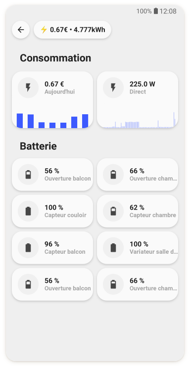
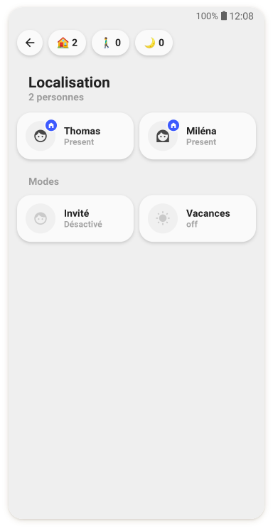

# UI-Lovelace-Minimalist

It's kind of hard to explain what this is, so let's call it a "theme" (in quotation marks). But one thing is for sure, it is very nice! Taking the exceptional work of tben as a basis, this repository is aimed to ease installation and maintainance of his wonderful work. You can use this interpretation of a SmartHomeUI more or less like a theme in HomeAssistant.

   

> ### Contributions

> This is a living project and all input is very welcome! If you configured and designed a card, that you would like to share, please feel free to do so! We are happy to include your contribution so others can use it as well!
Your developments should always start from "dev" as the base branch. Due to the many contributions, it cannot be guaranteed that the "main" branch with the last published version contains all current changes.
This project uses pre-commit for consistent and clean code. If possible, please make sure that you also use pre-commit for local development before creating a pull request.

## Wiki for documentation

We have setup an extensive Wiki for our documentation. It is more comfortable for you to read and for us to handle, than this file and gives our documentation the right framework to grow.
Take a look here: [https://ui-lovelace-minimalist.github.io/UI/](https://ui-lovelace-minimalist.github.io/UI/)

Table of content from the WIKI

 

<table>
<tr>
<th style="width: 25%;">Installation and update</th>
<th style="width: 25%;">Usage</th>
<th style="width: 25%;">Development</th>
<th style="width: 25%;">CodeGenerators</th>
</tr>
<tr>
  <td style="vertical-align: top;">
    
We have provided different guides to help you install and update this "theme"

  </td>
  <td style="vertical-align: top;">
    
These usage guides give you a deeper knowledge about this "theme"

  </td>
  <td style="vertical-align: top;">
    
This is our developer corner

  </td>
  <td style="vertical-align: top;">
    
Generate some code

  </td>
<tr>
<td style="vertical-align: top;">
  

    <a href="https://ui-lovelace-minimalist.netlify.app/installation">Installation</a> 
    <a href="https://ui-lovelace-minimalist.netlify.app/installation/yaml-mode">&raquo;&nbsp;Yaml-mode</a> 
    <a href="https://ui-lovelace-minimalist.netlify.app/installation/ui-mode">&raquo;&nbsp;UI-mode</a> 
    <a href="https://ui-lovelace-minimalist.netlify.app/installation/update">&raquo;&nbsp;Update</a> 
    <a href="https://ui-lovelace-minimalist.netlify.app/installation/custom_cards">&raquo;&nbsp;Custom-cards</a>
    <a href="https://ui-lovelace-minimalist.netlify.app/installation/Uninstall">&raquo;&nbsp;Uninstall</a>
  

</td>
<td style="vertical-align: top;">
  

    <a href="https://ui-lovelace-minimalist.netlify.app/usage">Usage</a> 
    <a href="https://ui-lovelace-minimalist.netlify.app/usage/template_list">&raquo;&nbsp;Template list (use)</a> 
    <a href="https://ui-lovelace-minimalist.netlify.app/usage/custom_card_list">&raquo;&nbsp;Custom-cards list</a> 
    <a href="https://ui-lovelace-minimalist.netlify.app/usage/first_page">&raquo;&nbsp;First page</a> 
    <a href="https://ui-lovelace-minimalist.netlify.app/usage/changing_template">&raquo;&nbsp;Changing a template</a> 
    <a href="https://ui-lovelace-minimalist.netlify.app/usage/examples">&raquo;&nbsp;Examples</a>
  

</td>
<td style="vertical-align: top;">
  

    <a href="https://ui-lovelace-minimalist.netlify.app/development">Development</a> 
    <a href="https://ui-lovelace-minimalist.netlify.app/development/custom_card">&raquo;&nbsp;Custom-card</a> 
    <a href="https://ui-lovelace-minimalist.netlify.app/development/list_templates">&raquo;&nbsp;Template list (dev)</a> 
    <a href="https://ui-lovelace-minimalist.netlify.app/development/legacy_templates">&raquo;&nbsp;Legacy templates</a> 
    <a href="https://ui-lovelace-minimalist.netlify.app/development/boilerplate">&raquo;&nbsp;Boilerplate</a>
  

</td>
<td style="vertical-align: top;">
  

    <a href="https://ui-lovelace-minimalist.netlify.app/codegen">CodeGenerators</a> 
    <a href="https://ui-lovelace-minimalist.netlify.app/codegen/installation">&raquo;&nbsp;Installation</a> 
    <a href="https://ui-lovelace-minimalist.netlify.app/codegen/example">&raquo;&nbsp;Example</a> 
    <a href="https://ui-lovelace-minimalist.netlify.app/codegen/button">&raquo;&nbsp;Button</a>
  

</td>
</tr>
</table>

## Credits

- This design was made by [tben](https://community.home-assistant.io/u/tben/summary)
- A lot of inspiration is taken from [7ahang’s work](https://www.behance.net/gallery/88433905/Redesign-Smart-Home) found on Behance.
- Contributions from others in the HomeAssistant forum thread, you can find it [here](https://community.home-assistant.io/t/lovelace-ui-minimalist/322687).
- The technical part is realised mostly by taking advantage of the great work RomRaider did with his [button-card](https://github.com/custom-cards/button-card).
- Code refactor, cleanup and maintainance schumijo and paddy0174.
- Wiki by paddy0174.
- Special thanks to clemalex and schumijo for contributing their cards to the main repository.

### Code Generator(s)

We offer two (soon three) code generators, that support you in installing, getting example code and soon in configuring a button. Take a look at [this page](https://ui-lovelace-minimalist.netlify.app/codegen).

## Installation and update

At the moment there are two methods of installing this "theme", one for `yaml`-mode and one for `UI`-mode. We are working on getting this "theme" installable via HACS, but for now, we can only provide these two methods, sorry.

We can offer you in-depth instructions for installation, as well as for future updates or from a previous version. Check our WIKI for more info:

- [Instructions for installation in `yaml`-mode](https://ui-lovelace-minimalist.netlify.app/installation/yaml-mode)
- [Instructions for installation in `UI`-mode](https://ui-lovelace-minimalist.netlify.app/installation/ui-mode)
- [Update in `yaml`mode](https://ui-lovelace-minimalist.netlify.app/installation/update#yaml-mode)
- [Update in `UI`-mode](https://ui-lovelace-minimalist.netlify.app/installation/update#ui-mode)
- [Update from previous version](https://ui-lovelace-minimalist.netlify.app/installation/update#previous-version)

TL;DR
Download and copy content of `config` folder to HA `config` folder. Set link to include `button_card_templates`, install `lovelace-cards`, use example code to get started.

## List of templates

The actual version of this "theme" has 20 different cards, seven chips and other templates bundled into the download. We're sorry, but the list wouldn't fit into this readme. [Please see this page, where you can find an extensive list of templates with code examples, screenshots and explaination](https://ui-lovelace-minimalist.netlify.app/usage/template_list).

## Custom cards

The same goes for our `custom_cards`. As the number grows, the list would be to big for this readme, so we provide you with an overview page with pictures, code examples and additional informations. [Find the list here](https://ui-lovelace-minimalist.netlify.app/usage/custom_card_list).

## Legacy templates

As this "theme" evolved, there were some major changes and re-writes in the code, compared to the previous versions. That's why we tried to keep some legacy templates in place, to still be able to use your old template format.

We provide a list of all legacy templates we support [here](https://ui-lovelace-minimalist.netlify.app/development/legacy_templates).

And if you had installed one of the previous versions, we made a short write-up, on how you can move to the new format and be able to use this theme in the future with all it's features and without worrying about updates. Take a look [here](https://ui-lovelace-minimalist.netlify.app/installation/update#previous-version).
