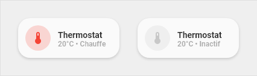

# Custom-card "Thermostat"

> NOTE
> This card is under review and is not ready to use!

The `thermostat-card` is used to switch a climate entity on/off and show the temperature from a (different) `sensor`.



## Credits
Author: tben - 2021
Version: 1.0.0

## Changelog
<details>
<summary>1.0.0</summary>
Initial release
</details>

## Usage

```yaml
- type: 'custom:button-card'
  template:
    - card_thermostat
  variables:
    ulm_card_thermostat_sensor: sensor.livingroom_temperature
  entity: climate.livingroom
```

## Requirements
n/a

## Variables
<table>
<tr>
<th>Variable</th>
<th>Example</th>
<th>Required</th>
<th>Explanation</th>
</tr>
<tr>
<td></td>
<td></td>
<td></td>
<td></td>
</tr>
</table>

## Template code

```yaml
card_thermostat:
  template:
    - icon_info_bg
  hold_action:
    action: more-info
    entity: input_boolean.radiateur_arret_force
  label: >-
    [[[
        if (entity.state =='off'){
          return 'Off' ;
        }else{
          if (states['light.qubino'].state == 'on'){
            var etat = "Chauffe";
          }else{
            var etat = "Inactif";
          }
          return (entity.attributes.temperature ) + '°' + ' • ' + etat ;
        }
    ]]]
  state:
    - operator: template
      value: >
        [[[
          return states['light.qubino'].state == 'on'
        ]]]
      styles:
        icon:
          - color: 'rgba(var(--color-red),1)'
        img_cell:
          - background-color: 'rgba(var(--color-red),0.2)'
        card:
          - background-color: 'rgba(var(--color-background-red),var(--opacity-bg))'
        name:
          - color: 'rgba(var(--color-red-text),1)'
        label:
          - color: 'rgba(var(--color-red-text),1)'
```
