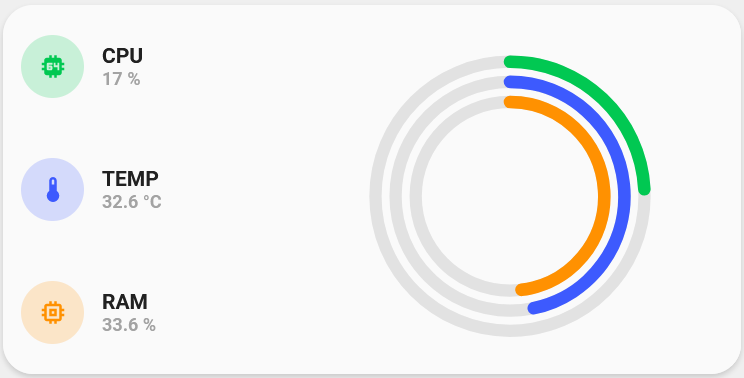
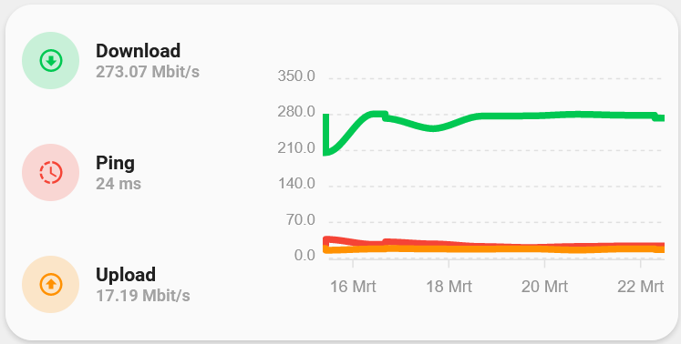
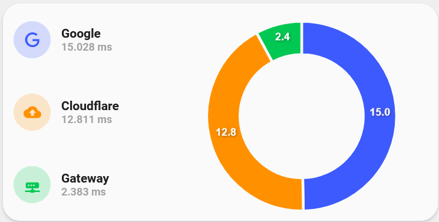

<!-- markdownlint-disable MD046 -->

# Custom-card "Apexcharts"





## Credits

- Author: AndyVRD - 2022
- Credits to benm7
- Version: 1.0.0

## Changelog

<details>
<summary>1.0.0</summary>
Initial release
</details>
<details>
<summary>1.0.1</summary>
Fix for UI Minimalist v1.0.1.
</details>

## Usage

```yaml
- type: "custom:button-card"
  template: "custom_card_apexcharts"
  variables:
    chart_type: "donut"
    graph_span: "1d"
    entity_1:
      entity_id: "sensor.google"
      icon: ""
      name: "Google"
      color: "blue"
      max_value: 300
    entity_2:
      entity_id: "sensor.cloudflare"
      icon: ""
      name: "Cloudflare"
      color: "yellow"
      max_value: 50
    entity_3:
      entity_id: "sensor.gateway"
      icon: ""
      name: "Gateway"
      color: "green"
      max_value: 30
```

## Requirements

Integration from HACS: "custom:apexcharts-card" from RomRider

## Variables

<table>
<tr>
<th>Variable</th>
<th>Example</th>
<th>Required</th>
<th>Explanation</th>
</tr>
<tr>
<td>chart_type</td>
<td>line, scatter, pie, donut or radialBar</td>
<td>yes</td>
<td>The chart type you want to display</td>
</tr>
<tr>
<td>graph_span</td>
<td>1h, 12min, 1d, 1h25, 10sec, ...</td>
<td>no</td>
<td>The span of the graph as a time interval</td>
</tr>
<tr>
<td>entity_id</td>
<td>sensor.speedtest_download</td>
<td>yes</td>
<td>Entity sensor of choice</td>
</tr>
<tr>
<td>icon</td>
<td>mdi:cpu-64-bit</td>
<td>no</td>
<td>mdi icon you want to be exposed in the img_cell, '' will return entity.attributes.icon </td>
</tr>
<tr>
<td>name</td>
<td>name for the used sensor</td>
<td>no</td>
<td>'' will return entity.attributes.friendly_name</td>
</tr>
<tr>
<td>color</td>
<td>green, blue, yellow, red or grey</td>
<td>no</td>
<td>if you don't use the color variable it will choice a random color</td>
</tr>
<tr>
<td>max_value</td>
<td>10, 300, ...</td>
<td>no</td>
<td>Maximum value of the sensor. Default will be 100</td>
</tr>
</table>

??? note "Template Code"

    ```yaml title="apexcharts.yaml"
    --8<-- "custom_cards/custom_card_apexcharts/apexcharts.yaml"
    ```
