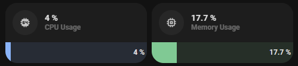

<!-- markdownlint-disable MD046 -->

# Custom-card "Bar Card"

This is a `custom-card` to display a percentage value as a bar.



## Credits

Author: rphlwnk - 2021
Version: 1.0.0

## Changelog

<details>
<summary>1.0.0</summary>
Initial release.
</details>
<details>
<summary>0.1.1</summary>
Fix for UI Minimalist v1.0.1.
</details>
<details>
<summary>0.1.2</summary>
Fix border radius
</details>

## Requirements

This card needs the following to function correctly:

[Custom Card 'Bar-Card'](https://github.com/custom-cards/bar-card)

## Usage

```yaml
- type: "custom:button-card"
  template: custom_card_bar_card
  variables:
    ulm_custom_card_bar_card_entity: sensor.memory_use_percent
    ulm_custom_card_bar_card_name: Memory Usage
    ulm_custom_card_bar_card_value: true
    ulm_custom_card_bar_card_indicator: true
    ulm_custom_card_bar_card_color: "var(--google-green)"
    ulm_custom_card_bar_card_min: 10
    ulm_custom_card_bar_card_max: 20
```

## Variables

<table>
<tr>
<th>Variable</th>
<th>Example</th>
<th>Required</th>
<th>Default</th>
<th>Explanation</th>
</tr>
<tr>
<td>ulm_custom_card_bar_card_entity</td>
<td>sensor.memory_use_percent</td>
<td>yes</td>
<td></td>
<td>The entity with the desired value</td>
</tr>
<tr>
<td>ulm_custom_card_bar_card_name</td>
<td>"Memory Consumption"</td>
<td>no</td>
<td>Sensor Name</td>
<td>Overwrites the sensor name</td>
</tr>
<tr>
<td>ulm_custom_card_bar_card_icon</td>
<td>"mdi:icon"</td>
<td>no</td>
<td>Sensor Icon</td>
<td>Overwrites the sensor icon</td>
</tr>
<tr>
<td>ulm_custom_card_bar_card_value</td>
<td>true / false</td>
<td>no</td>
<td>false</td>
<td>If true, shows the value in the bar</td>
</tr>
<tr>
<td>ulm_custom_card_bar_card_indicator</td>
<td>true / false</td>
<td>no</td>
<td>false</td>
<td>If true, shows if the value has changed up or down</td>
</tr>
<tr>
<td>ulm_custom_card_bar_card_color</td>
<td>"var(--google-green)"</td>
<td>no</td>
<td>"var(--google-blue)"</td>
<td>Change the color of the bar</td>
</tr>
<tr>
<td>ulm_custom_card_bar_card_min</td>
<td>10</td>
<td>no</td>
<td>0</td>
<td>Change the minimum value of the bar</td>
</tr>
<tr>
<td>ulm_custom_card_bar_card_max</td>
<td>20</td>
<td>no</td>
<td>100</td>
<td>Change the maximum value of the bar</td>
</tr>
</table>

## Example

```yaml
- type: "custom:button-card"
  template: custom_card_bar_card
  variables:
    ulm_custom_card_bar_card_entity: sensor.memory_use_percent
    ulm_custom_card_bar_card_name: Memory Usage
```

??? note "Template Code"

    ```yaml title="custom_card_bar_card.yaml"
    --8<-- "custom_cards/custom_card_bar_card/custom_card_bar_card.yaml"
    ```
