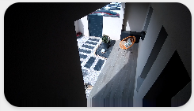

<!-- markdownlint-disable MD046 -->

# Custom-card "Camera"

This is a `custom-card` to display a camera live view.




## Credits

Author: Eltarius, from the script of [Clemalex](https://forum.hacf.fr/t/dashboard-minimalist/5507/183?u=clemalex) - 2022
Version: 1.0.0

## Changelog

<details>
<summary>1.0.1</summary>
Added variable to passthrough aspect ratio to the picture entity card. Fix minor issues with title.
</details>
<details>
<summary>1.0.0</summary>
Initial release.
</details>

## Usage

```yaml
- type: "custom:button-card"
  entity: "camera.sensor"
  template: "custom_card_camera"
  show_icon: false #True if you set ulm_custom_card_camera_title: true
  variables:
    ulm_custom_card_camera_title: true
    ulm_custom_card_camera_name: "name"
    ulm_custom_card_camera_label: "label"
    ulm_custom_card_camera_aspect_ratio: "16:9"
```

## Variables

<table>
<tr>
<th>Variable</th>
<th>Example</th>
<th>Required</th>
<th>Default</th>
<th>Explanation</th>
</tr>
<tr>
<td>ulm_custom_card_camera_title</td>
<td>true</td>
<td>yes</td>
<td></td>
<td>If you want header card</td>
</tr>
<tr>
<td>ulm_custom_card_camera_name</td>
<td>"Garden"</td>
<td>no</td>
<td></td>
<td>Name of your choice</td>
</tr>
<tr>
<td>ulm_custom_card_camera_label</td>
<td>"Room"</td>
<td>no</td>
<td></td>
<td>Label of your choice</td>
</tr>
<tr>
<td>ulm_custom_card_camera_aspect_ratio</td>
<td>'16:9'</td>
<td>no</td>
<td></td>
<td>Aspect ratio of camera entity</td>
</tr>
</table>

??? note "Template Code"

    ```yaml title="custom_card_camera.yaml"
    --8<-- "custom_cards/custom_card_camera/custom_card_camera.yaml"
    ```
