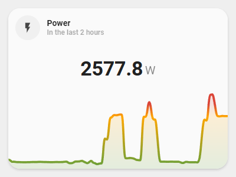

<!-- markdownlint-disable MD046 -->

# Custom-card "Power details"

The `custom_card_damix48_power_details` is an extension of the standard graph card and can show a detailed graphs of power consumption. If hover (or tap in mobile) the points of the line show the average power in that time interval.



## Credits

Author: Damix48
Version: 0.1.1

## Changelog

<details>
<summary>0.1.0</summary>
Initial release.
</details>
<details>
<summary>0.1.1</summary>
Fix for UI Minimalist v1.0.1.
</details>

!!! Warning "Breaking Change"

    Since `v1.0.2` you also need to specify the entity outside the variables section.

## Usage

```yaml
- type: "custom:button-card"
  template: custom_card_damix48_power_details
  entity: sensor.shellyem_id_channel_1_power
  variables:
    ulm_card_power_details_name: Power
    ulm_card_power_details_entity: sensor.shellyem_id_channel_1_power
    ulm_card_power_details_hours: 2
    ulm_card_power_details_24hour: true
    ulm_card_power_details_thresholds:
      - value: 0
        color: "#43A047"
      - value: 2500
        color: "#FFA600"
      - value: 3000
        color: "#DB4437"
```

## Requirements

Need [mini-graph-card](https://github.com/kalkih/mini-graph-card)

## Variables

<table>
<tr>
<th>Variable</th>
<th>Example</th>
<th>Required</th>
<th>Explanation</th>
</tr>
<tr>
<td>ulm_card_power_details_entity</td>
<td>sensor.shellyem_id_channel_1_power</td>
<td>yes</td>
<td>Power sensor entity</td>
</tr>
<tr>
<td>ulm_card_power_details_name</td>
<td>"Power"</td>
<td>no</td>
<td>Name to show on card.</td>
</tr>
<tr>
<td>ulm_card_power_details_hours</td>
<td>2</td>
<td>no</td>
<td>Number of hour to show in the graph (2 is the default value)</td>
</tr>
<tr>
<td>ulm_card_power_details_24hour</td>
<td>true</td>
<td>no</td>
<td>Switch from AM/PM (default) to 24h format</td>
</tr>
<tr>
<td>ulm_card_power_details_thresholds</td>
<td>
<pre>
- value: 0
  color: "#43A047"
- value: 2500
  color: "#FFA600"
- value: 3000
  color: "#DB4437"
<pre>
</td>
<td>no</td>
<td>Thresholds to change color in the graph according to power value (default is only one color)</td>
</tr>
<tr>
<td>ulm_card_power_details_height</td>
<td>180</td>
<td>no</td>
<td>Height of the graph (180 is the default value)</td>
</tr>
</table>

??? note "Template Code"

    ```yaml title="custom_card_damix48_power_details.yaml"
    --8<-- "custom_cards/custom_card_damix48_power_details/custom_card_damix48_power_details.yaml"
    ```
