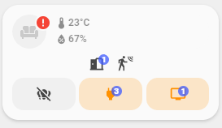

<!-- markdownlint-disable MD046 -->

# Custom-card "Drealine RoomView"



## Credits

- Author: Drealine - 2022
- Version: 1.0.0

## Changelog

<details>
<summary>1.0.0</summary>
Initial release
</details>

## Usage

```yaml
- type: "custom:button-card"
  template: "custom_card_drealine_roomview"
  variables:
    icon: "mdi:home-variant-outline"
    name: "Entrée"
    group_lights:
    group_motions:
    group_doors:
    group_windows:
    group_outlets:
    group_tv:
    group_water:
    group_windows_shutters:
    temperature:
    humidity:
```

## Requirements

No requirements at the moment.

## Variables

<table>
<tr>
<th>Variable</th>
<th>Example</th>
<th>Required</th>
<th>Explanation</th>
</tr>
<tr>
<td>Icon</td>
<td>mdi:bedroom</td>
<td>no</td>
<td>Icon of the card</td>
</tr>
<tr>
<td>Name</td>
<td>Text</td>
<td>no</td>
<td>Title for the card (it's not showing, just for more readable)</td>
</tr>
<tr>
<td>group_lights</td>
<td>group.lights</td>
<td>no</td>
<td>Any groups that contain lights</td>
</tr>
<tr>
<td>group_motions</td>
<td>group.motions</td>
<td>no</td>
<td>Any groups that contain motions sensors</td>
</tr>
<tr>
<td>group_doors</td>
<td>group.doors</td>
<td>no</td>
<td>Any groups that contain doors sensors</td>
</tr>
<tr>
<td>group_windows</td>
<td>group.windows</td>
<td>no</td>
<td>Any groups that contain windows sensors</td>
</tr>
<tr>
<td>group_outlets</td>
<td>group.outlets</td>
<td>no</td>
<td>Any groups that contain outlets</td>
</tr>
<tr>
<td>group_tv</td>
<td>group.tv</td>
<td>no</td>
<td>Any groups that contain TV's</td>
</tr>
<tr>
<td>group_water</td>
<td>group.water</td>
<td>no</td>
<td>Any groups that contain water sensors</td>
</tr>
<tr>
<td>group_windows_shutters</td>
<td>group.windows_shutters</td>
<td>no</td>
<td>Any groups that contain windows shutters</td>
</tr>
<tr>
<td>temperature</td>
<td>entity.temperature_saloon</td>
<td>no</td>
<td>Temperature sensor or the room</td>
</tr>
<tr>
<td>humidity</td>
<td>entity.humidity_saloon</td>
<td>no</td>
<td>Humidity sensor or the room</td>
</tr>
</table>

??? note "Template Code"

    ```yaml title="custom_card_drealine_roomview.yaml"
    --8<-- "custom_cards/custom_card_drealine_roomview/custom_card_drealine_roomview.yaml"
    ```
