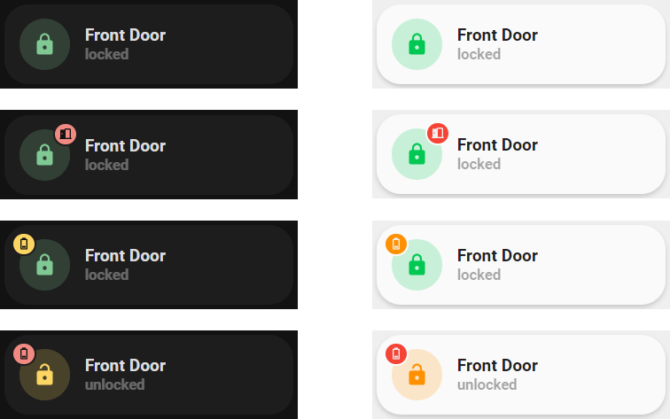

<!-- markdownlint-disable MD046 -->

# Custom-card "Lock"

This is a `custom-card` that works in switch logic with a `lock` entity. Card structure uses `lock`, `unlock` (optional `open`) actions and `lock`,`unlock`,`locking`,`unlocking`, `jammed` states.



## Credits

Author: eraycetinay - 2022
Version: 0.0.3

## Changelog

<details>
  <summary>0.0.3</summary>
  <ul>
    <h4>Contributor: <a href="https://github.com/sisimomo">Sisimomo</a> - 2022-06-14</h4>
    <li>Now can displays a warning when the battery is low.</li>
    <li>Now can displays a warning when the door is lock but the door is still open.</li>
    <li>Code refactoring to fit <a href="https://ui-lovelace-minimalist.github.io/UI/development/custom_cards/#order">framework structure</a>.</li>
    <li>Documentation clean up.</li>
    <li>Code clean up.</li>
  </ul>
</details>
<details>
  <summary>0.0.2</summary>
  Added option to only use lock.open
</details>
<details>
  <summary>0.0.1</summary>
  Initial release
</details>

## Usage

```yaml
- type: "custom:button-card"
  entity: lock.door_lock
  template: "custom_card_eraycetinay_lock"
  name: "Door Lock"
  variables:
    ulm_custom_card_eraycetinay_lock_tap_control: true
    ulm_custom_card_eraycetinay_lock_battery_level: sensor.door_battery
    ulm_custom_card_eraycetinay_lock_door_open: binary_sensor.door_open
  triggers_update:
    - "sensor.door_battery"
    - "binary_sensor.door_open"
```

## Variables

<table>
  <tr>
    <th>Variable</th>
    <th>Example</th>
    <th>Default</th>
    <th>Required</th>
    <th>Explanation</th>
  </tr>
    <tr>
    <td>ulm_custom_card_eraycetinay_lock_tap_control</td>
    <td>true</td>
    <td>false</td>
    <td>no</td>
    <td>Lock/Unlock on tap action</td>
  </tr>
  <tr>
    <td>ulm_custom_card_eraycetinay_lock_only_open</td>
    <td>true</td>
    <td>false</td>
    <td>no</td>
    <td>Only use the card to open the door (always sends lock.open on tap)</td>
  </tr>
  <tr>
    <td>ulm_custom_card_eraycetinay_lock_battery_level</td>
    <td>sensor.door_battery</td>
    <td></td>
    <td>no</td>
    <td>Displays a warning when the battery is low.</td>
  </tr>
  <tr>
    <td>ulm_custom_card_eraycetinay_lock_battery_warning</td>
    <td>25</td>
    <td>20</td>
    <td>no</td>
    <td>At what battery percentage should the low battery warning appear.</td>
  </tr>
  <tr>
    <td>ulm_custom_card_eraycetinay_lock_battery_warning_low</td>
    <td>10</td>
    <td>5</td>
    <td>no</td>
    <td>At what battery percentage should the very low battery warning appear.</td>
  </tr>
  <tr>
    <td>ulm_custom_card_eraycetinay_lock_door_open</td>
    <td>binary_sensor.door_open</td>
    <td></td>
    <td>no</td>
    <td>Displays a warning when the door is lock but the door is still open.</td>
  </tr>
  <tr>
    <td>ulm_custom_card_eraycetinay_lock_battery_sensor_binary</td>
    <td>true</td>
    <td>false</td>
    <td>no</td>
    <td>Set to true if using a binary battery sensor. Will ignore battery_warning percentage settings</td>
  </tr>
  <tr>
    <td>ulm_custom_card_eraycetinay_lock_battery_sensor_binary_low_state</td>
    <td>off</td>
    <td>on</td>
    <td>no</td>
    <td>Set whether the binary sensor turns to on or off when in low state</td>
  </tr>
</table>

??? note "Template Code"

    ```yaml title="custom_card_eraycetinay_lock.yaml"
    --8<-- "custom_cards/custom_card_eraycetinay_lock/custom_card_eraycetinay_lock.yaml"
    ```
