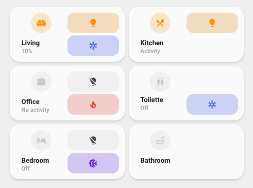
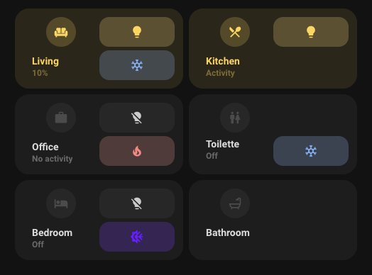

<!-- markdownlint-disable MD046 -->

# Custom Card "Room"




## Credits

- Authors: Everything Smart Home - 2022 and mpeterson
- Full credit to user [bms on the forum](https://community.home-assistant.io/t/lovelace-ui-minimalist/322687/192), they created the design and base of it in full, EverythingSmartHome put it into a PR as the basis
- beasthouse and basbruss on the EverythingSmartHome discord channel for emoji/humidity customization
- mpeterson added support for a switch to control climate and also to remove the need to have an entity associated
- Version: 2.0.0

## Changelog

<details>
<summary>1.0.0</summary>
Initial release
</details>
<details>
<summary>2.0.0</summary>
Breaking changes!
This change introduces two variables to allow the display of the card with no buttons, one for light, one for climate or both for light and climate.
It also now allows the use of no entity at all.
</details>

## Description

This is an alternative room card to the standard one that is more rectangular than square.

## Variables

| Variable                                     | Default | Required | Notes                                                                    |
| -------------------------------------------- | ------- | -------- | ------------------------------------------------------------------------ |
| entity                                       |         | No       | The entity to represent on the room icon                                 |
| Name                                         |         | Yes      | Name of the room to display                                              |
| icon                                         |         | No       | The icon to show                                                         |
| tap_action                                   |         | No       | The action to perform when tapping                                       |
| label                                        |         | No       | The label to display information, this can be a template or static text  |
| ulm_custom_card_esh_room_light_entity        |         | No       | The entity to use for the light button                                   |
| ulm_custom_card_esh_room_climate_entity      |         | No       | The entity to use for the climate button                                 |

## Usage

```yaml
- type: "custom:button-card"
  template:
    - card_esh_room
    - yellow_on
  name: Bathroom
  entity: light.bathroom_lights
  icon: mdi:bathtub
  tap_action:
    action: navigate
    navigation_path: "bathroom"
  variables:
    ulm_custom_card_esh_room_light_entity: light.bathroom_lights
    ulm_custom_card_esh_room_climate_entity: climate.bathroom
  label: '[[[ return states["sensor.room_temperature"].state + "°C" ]]]'
```

## Customizations

To add both temperature and humidity (as shown below) to the card, replace the label section with this code:


```yaml
label: >
  [[[
    return "🌡️ " + states['sensor.temperature'].state + " °C" + " 💧 " + states['sensor.humidity'].state + " %"
  ]]]
```

You can also replace 🌡️ and 💧 with any desired Emoji, and sensor.room_temperature/sensor.room_humidity to match any of your HA entities you would like to be displayed. Ensure that the correct units of measurement are also updated (or removed) to match your custom entities. In this example they are °C and %.

## Template code

??? note "Template Code"

    ```yaml title="custom_card_esh_room.yaml"
    --8<-- "custom_cards/custom_card_esh_room/custom_card_esh_room.yaml"
    ```
