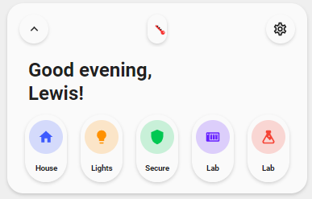
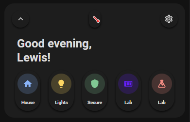

<!-- markdownlint-disable MD046 -->

# Custom Card "Welcome Navigation"




## Credits

- Author: Everything Smart Home - 2022
- Credits to the [welcome scenes card](https://ui-lovelace-minimalist.github.io/UI/usage/cards/card_welcome_scenes/) as the basis
- Version: 1.1.0

## Changelog

<details>
<summary>1.1.0</summary>
  <ul>
    <h4>Contributor: <a href="https://github.com/sisimomo">Sisimomo</a> - 2022-06-12</h4>
    <li>Now support from 0-5 navigation pill.</li>
    <li>Added dynamic nav pill size.</li>
    <li>Code refactoring to fit <a href="https://ui-lovelace-minimalist.github.io/UI/development/custom_cards/#order">framework structure</a>.</li>
    <li>Code clean up.</li>
  </ul>
</details>

<details>
<summary>1.0.0</summary>
Initial release
</details>

## Description

This is a welcome card based on the [welcome scenes card](https://ui-lovelace-minimalist.github.io/UI/usage/cards/card_welcome_scenes/) but replaces the scenes for page navigation instead.

## Variables

| Variable                      | Default | Required | Notes                                                                                              |
| ----------------------------- | ------- | -------- | -------------------------------------------------------------------------------------------------- |
| ulm_card_esh_welcome_collapse |         | No       | Enables the collapse function. <br> requires an `input_boolean` to track the state                 |
| ulm_weather                   |         | Yes      | This is your weather provider. <br> Example: `weather.your_provider`                               |
| entity\_                      |         | Yes      | Support almost all types of entities <br> Scenes do always show as off                             |
| icon\_                        |         | Yes      | The icon to show                                                                                   |
| name\_                        |         | Yes      | The name to show                                                                                   |
| color\_                       |         | Yes      | Color of the icon <br> Can choose between: `blue`, `red`, `green`, `yellow`, `pink`, `purple` <br> |
| nav\_                         |         | Yes      | The page/view to navigate to                                                                       |

## Collapse

!!! note
This feature is fully optional. It requires some more manual configuration!
You need to create a `input_boolean` in HA to track the state. See [Docs](https://www.home-assistant.io/integrations/input_boolean/).
Furthermore, you need to add the `input_boolean` to the variable `ulm_card_esh_welcome_collapse` **and** to either the `entity` or `triggers_update` to make sure it directly refreshes the state.
!!! warning
Do not use `triggers_update: "all"`! This will lead to unwanted behavior with the random colors generator.

## Usage

```yaml
- type: "custom:button-card"
  template: "card_esh_welcome"
  triggers_update: "input_boolean.welcome_toggle"
  variables:
    ulm_card_esh_welcome_collapse: input_boolean.welcome_toggle
    ulm_weather: "weather.your_weather"
    entity_1:
      nav: "house"
      icon: "mdi:home"
      name: "House"
      color: "blue"
    entity_2:
      nav: "lights"
      icon: "mdi:lightbulb"
      name: "Lights"
      color: "yellow"
    entity_3:
      nav: "security"
      icon: "mdi:shield"
      name: Secure
      color: "green"
    entity_4:
      nav: "network"
      icon: "mdi:nas"
      name: Lab
      color: "purple"
    entity_5:
      nav: "network"
      icon: "mdi:flask"
      name: Lab
      color: "red"
```

## Template code

??? note "Template Code"

    ```yaml title="custom_card_esh_welcome.yaml"
    --8<-- "custom_cards/custom_card_esh_welcome/custom_card_esh_welcome.yaml"
    ```
