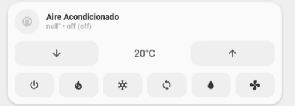

<!-- markdownlint-disable MD046 -->

# Custom-card "Heat Pump"

The `custom_card_heat_pump` allows you to control your HVAC system and all its modes. This card is inspired by [Simple Thermostat Card](https://github.com/nervetattoo/simple-thermostat).

## Credits

Author: Kam - 2022
Version: 1.0.0

## Changelog

<details>
<summary>1.0.0</summary>
Initial release
</details>

## Images




## Usage

```yaml
- type: custom:button-card
  template: custom_card_heat_pump
  entity: climate.heat_pump
```

## Requirements

Entity climate with only heat mode

## Modification

If your entity does not have all the available options in the `hvac component`, modify (delete or comment out) the following part to match your setup. Each button corresponds to a mode of the `hvac component`.

```yaml
item3:
      card:
        type: "horizontal-stack"
        cards:
          - type: "custom:button-card"
            template: "widget_icon_juve"
            icon: "mdi:power"
            tap_action:
              action: "call-service"
              service: "climate.set_hvac_mode"
              service_data:
                entity_id: "[[[ return entity.entity_id ]]]"
                hvac_mode: "off"
          - type: "custom:button-card"
            template: "widget_icon_juve"
            icon: "mdi:fire"
            tap_action:
              action: "call-service"
              service: "climate.set_hvac_mode"
              service_data:
                entity_id: "[[[ return entity.entity_id ]]]"
                hvac_mode: "heat"
            ...
          - type: "custom:button-card"
            template: "widget_icon_juve"
            icon: "mdi:snowflake"
            tap_action:
              action: "call-service"
              service: "climate.set_hvac_mode"
              service_data:
                entity_id: "[[[ return entity.entity_id ]]]"
                hvac_mode: "cool"
            ...
          - type: "custom:button-card"
            template: "widget_icon_juve"
            icon: "mdi:sync"
            tap_action:
              action: "call-service"
              service: "climate.set_hvac_mode"
              service_data:
                entity_id: "[[[ return entity.entity_id ]]]"
                hvac_mode: "heat_cool"
            ...
          - type: "custom:button-card"
            template: "widget_icon_juve"
            icon: "mdi:water"
            tap_action:
              action: "call-service"
              service: "climate.set_hvac_mode"
              service_data:
                entity_id: "[[[ return entity.entity_id ]]]"
                hvac_mode: "dry"
            ...
          - type: "custom:button-card"
            template: "widget_icon_juve"
            icon: "mdi:fan"
            tap_action:
              action: "call-service"
              service: "climate.set_hvac_mode"
              service_data:
                entity_id: "[[[ return entity.entity_id ]]]"
                hvac_mode: "fan_only"
            ...
```

??? note "Template Code"

    ```yaml title="custom_card_heat_pump.yaml"
    --8<-- "custom_cards/custom_card_heat_pump/custom_card_heat_pump.yaml"
    ```
