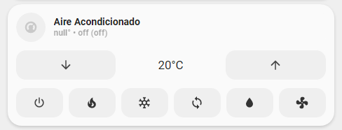
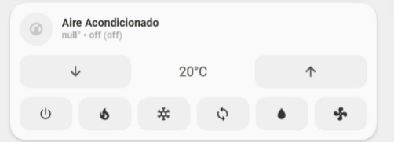

<!-- markdownlint-disable MD046 -->

# Custom-card "Heat Pump"

The `custom_card_heat_pump` allows you to control your HVAC system and all its modes. This card is inspired by  [Simple Thermostat Card](https://github.com/nervetattoo/simple-thermostat).

## Credits

Author: Kam - 2022
Version: 1.0.0

## Changelog

<details>
<summary>1.0.0</summary>
Initial release
</details>

## Images





## Usage

```yaml
- type: custom:button-card
  template: custom_card_heat_pump
  entity: climate.heat_pump
```

## Requirements

Entity climate with only heat mode

## Modification

If your entity does not have all the available options in the `hvac component`, modify (delete or comment out) the following part to match your setup. Each button corresponds to a mode of the `hvac component`.

```yaml
item3:
      card:
        type: "horizontal-stack"
        cards:
          - type: "custom:button-card"
            template: "widget_icon_juve"
            icon: "mdi:power"
            tap_action:
              action: "call-service"
              service: "climate.set_hvac_mode"
              service_data:
                entity_id: "[[[ return entity.entity_id ]]]"
                hvac_mode: "off"
          - type: "custom:button-card"
            template: "widget_icon_juve"
            icon: "mdi:fire"
            tap_action:
              action: "call-service"
              service: "climate.set_hvac_mode"
              service_data:
                entity_id: "[[[ return entity.entity_id ]]]"
                hvac_mode: "heat"
            ...
          - type: "custom:button-card"
            template: "widget_icon_juve"
            icon: "mdi:snowflake"
            tap_action:
              action: "call-service"
              service: "climate.set_hvac_mode"
              service_data:
                entity_id: "[[[ return entity.entity_id ]]]"
                hvac_mode: "cool"
            ...
          - type: "custom:button-card"
            template: "widget_icon_juve"
            icon: "mdi:sync"
            tap_action:
              action: "call-service"
              service: "climate.set_hvac_mode"
              service_data:
                entity_id: "[[[ return entity.entity_id ]]]"
                hvac_mode: "heat_cool"
            ...
          - type: "custom:button-card"
            template: "widget_icon_juve"
            icon: "mdi:water"
            tap_action:
              action: "call-service"
              service: "climate.set_hvac_mode"
              service_data:
                entity_id: "[[[ return entity.entity_id ]]]"
                hvac_mode: "dry"
            ...
          - type: "custom:button-card"
            template: "widget_icon_juve"
            icon: "mdi:fan"
            tap_action:
              action: "call-service"
              service: "climate.set_hvac_mode"
              service_data:
                entity_id: "[[[ return entity.entity_id ]]]"
                hvac_mode: "fan_only"
            ...
```

## Code template

```yaml
---
custom_card_heat_pump:
  show_name: false
  show_icon: false
  template:
    - "icon_info_bg"
    - "ulm_language_variables"
    - "custom_card_heat_pump_language_variables"
  hold_action:
    action: "more-info"
  styles:
    grid:
      - grid-template-areas: "'item1' 'item2' 'item3'"
      - grid-template-columns: "1fr"
      - grid-template-rows: "min-content  min-content min-content"
      - row-gap: "12px"
    card:
      - border-radius: "var(--border-radius)"
      - box-shadow: "var(--box-shadow)"
      - padding: "12px"
  custom_fields:
    item1:
      card:
        type: "custom:button-card"
        template:
          - "icon_info"
          - "ulm_language_variables"
        tap_action:
          action: "more-info"
        entity: "[[[ return entity.entity_id ]]]"
        name: "[[[ return entity.name ]]]"
        label: >-
          [[[
              var label = variables.ulm_off ;
              if (entity.state =='off'){
                label = variables.ulm_off ;
              } else if (entity.state =='dry') {
                return variables.custom_card_heat_pump_dry;
              } else if (entity.state =='heat') {
                return variables.custom_card_heat_pump_heat;
              } else if (entity.state =='heat_cool') {
                return variables.custom_card_heat_pump_heat_cool;
              } else if (entity.state =='cool') {
                return variables.custom_card_heat_pump_cool;
              } else if (entity.state =='fan_only') {
                return variables.custom_card_heat_pump_fan_only;
              }
              if(entity.attributes.temperature){
                return (entity.attributes.current_temperature ) + '°' + ' • ' + label + ' (' + entity.attributes.hvac_action + ')';
              }
              return label;
          ]]]
        icon: >
          [[[
            var icon = "mdi:thermostat";
            var state = entity.state;
            if (state =='dry') {
              return "mdi:water";
            } else if (state =='heat') {
              return "mdi:fire";
            } else if (state =='cool') {
              return "mdi:snowflake";
            } else if (state =='fan_only') {
              return "mdi:fan";
            } else if (state =='heat_cool') {
              return "mdi:sync";
            }
            return icon;
          ]]]
        state:
          - operator: "template"
            value: "[[[return entity.state == 'dry']]]"
            styles:
              icon:
                - color: "rgba(var(--color, 255, 165, 0),1)"
              img_cell:
                - background-color: "rgba(var(--color, 255, 165, 0),0.2)"
          - operator: "template"
            value: "[[[return entity.state == 'cool']]]"
            styles:
              icon:
                - color: "rgba(var(--color-blue),1)"
              img_cell:
                - background-color: "rgba(var(--color-blue),0.2)"
          - operator: "template"
            value: "[[[return entity.state == 'heat']]]"
            styles:
              icon:
                - color: "rgba(var(--color-red),1)"
              img_cell:
                - background-color: "rgba(var(--color-red),0.2)"
          - operator: "template"
            value: "[[[return entity.state == 'fan_only']]]"
            styles:
              icon:
                - color: "rgba(var(--color, 195, 0, 255),1)"
              img_cell:
                - background-color: "rgba(var(--color, 195, 0, 255),0.2)"
          - operator: "template"
            value: "[[[return entity.state == 'heat_cool']]]"
            styles:
              icon:
                - color: "rgba(var(--color-green),1)"
              img_cell:
                - background-color: "rgba(var(--color-green),0.2)"
    item2:
      card:
        type: "custom:button-card"
        template: "list_items"
        custom_fields:
          item1:
            card:
              type: "custom:button-card"
              template: "widget_icon"
              icon: "mdi:arrow-down"
              tap_action:
                action: "call-service"
                service: "climate.set_temperature"
                service_data:
                  entity_id: "[[[ return entity.entity_id ]]]"
                  temperature: "[[[ return entity.attributes.temperature - entity.attributes.target_temp_step ]]]"
          item2:
            card:
              type: "custom:button-card"
              entity: "[[[ return entity.entity_id ]]]"
              name: "[[[ return entity.attributes.temperature + '°C' ]]]"
              styles:
                card:
                  - box-shadow: "none"
              show_icon: false
              tap_action: "none"
          item3:
            card:
              type: "custom:button-card"
              template: "widget_icon"
              icon: "mdi:arrow-up"
              tap_action:
                action: "call-service"
                service: "climate.set_temperature"
                service_data:
                  entity_id: "[[[ return entity.entity_id ]]]"
                  temperature: "[[[ return entity.attributes.temperature + entity.attributes.target_temp_step ]]]"
    item3:
      card:
        type: "horizontal-stack"
        cards:
          - type: "custom:button-card"
            template: "widget_icon_juve"
            icon: "mdi:power"
            tap_action:
              action: "call-service"
              service: "climate.set_hvac_mode"
              service_data:
                entity_id: "[[[ return entity.entity_id ]]]"
                hvac_mode: "off"
          - type: "custom:button-card"
            template: "widget_icon_juve"
            icon: "mdi:fire"
            tap_action:
              action: "call-service"
              service: "climate.set_hvac_mode"
              service_data:
                entity_id: "[[[ return entity.entity_id ]]]"
                hvac_mode: "heat"
            styles:
              icon:
                - color: |
                    [[[
                      var color = 'rgba(var(--color-theme), 1)';
                      if (entity.state == "heat"){
                        var color = 'rgba(var(--color-red), 1)';
                      }
                      return color;
                    ]]]
              card:
                - background-color: |
                    [[[
                      var bc_color = 'rgba(var(--color-theme),0.05)';
                      if (entity.state == "heat"){
                        var bc_color = 'rgba(var(--color-red), 0.2)';
                      }
                      return bc_color;
                    ]]]
          - type: "custom:button-card"
            template: "widget_icon_juve"
            icon: "mdi:snowflake"
            tap_action:
              action: "call-service"
              service: "climate.set_hvac_mode"
              service_data:
                entity_id: "[[[ return entity.entity_id ]]]"
                hvac_mode: "cool"
            styles:
              icon:
                - color: |
                    [[[
                      var color = 'rgba(var(--color-theme), 1)';
                      if (entity.state == "cool"){
                        var color = 'rgba(var(--color-blue), 1)';
                      }
                      return color;
                    ]]]
              card:
                - background-color: |
                    [[[
                      var bc_color = 'rgba(var(--color-theme),0.05)';
                      if (entity.state == "cool"){
                        var bc_color = 'rgba(var(--color-blue), 0.2)';
                      }
                      return bc_color;
                    ]]]
          - type: "custom:button-card"
            template: "widget_icon_juve"
            icon: "mdi:sync"
            tap_action:
              action: "call-service"
              service: "climate.set_hvac_mode"
              service_data:
                entity_id: "[[[ return entity.entity_id ]]]"
                hvac_mode: "heat_cool"
            styles:
              icon:
                - color: |
                    [[[
                      var color = 'rgba(var(--color-theme), 1)';
                      if (entity.state == "heat_cool"){
                        var color = 'rgba(var(--color-green), 1)';
                      }
                      return color;
                    ]]]
              card:
                - background-color: |
                    [[[
                      var bc_color = 'rgba(var(--color-theme),0.05)';
                      if (entity.state == "heat_cool"){
                        var bc_color = 'rgba(var(--color-green), 0.2)';
                      }
                      return bc_color;
                    ]]]
          - type: "custom:button-card"
            template: "widget_icon_juve"
            icon: "mdi:water"
            tap_action:
              action: "call-service"
              service: "climate.set_hvac_mode"
              service_data:
                entity_id: "[[[ return entity.entity_id ]]]"
                hvac_mode: "dry"
            styles:
              icon:
                - color: |
                    [[[
                      var color = 'rgba(var(--color-theme), 1)';
                      if (entity.state == "dry"){
                        var color = 'rgba(var(--color, 255, 165, 0), 1)';
                      }
                      return color;
                    ]]]
              card:
                - background-color: |
                    [[[
                      var bc_color = 'rgba(var(--color-theme),0.05)';
                      if (entity.state == "dry"){
                        var bc_color = 'rgba(var(--color, 255, 165, 0), 0.2)';
                      }
                      return bc_color;
                    ]]]
          - type: "custom:button-card"
            template: "widget_icon_juve"
            icon: "mdi:fan"
            tap_action:
              action: "call-service"
              service: "climate.set_hvac_mode"
              service_data:
                entity_id: "[[[ return entity.entity_id ]]]"
                hvac_mode: "fan_only"
            styles:
              icon:
                - color: |
                    [[[
                      var color = 'rgba(var(--color-theme), 1)';
                      if (entity.state == "fan_only"){
                        var color = 'rgba(var(--color, 195, 0, 255), 1)';
                      }
                      return color;
                    ]]]
              card:
                - background-color: |
                    [[[
                      var bc_color = 'rgba(var(--color-theme),0.05)';
                      if (entity.state == "fan_only"){
                        var bc_color = 'rgba(var(--color, 195, 0, 255), 0.2)';
                      }
                      return bc_color;
                    ]]]
widget_icon_juve:
  tap_action:
    action: "toggle"
  show_icon: true
  show_name: false
  show_state: true
  styles:
    grid:
      - grid-template-areas: "'i'"
    card:
      - box-shadow: "none"
      - padding: "0px"
      - background-color: "rgba(var(--color-theme),0.05)"
      - border-radius: "14px"
      - place-self: "center"
      - height: "42px"
    icon:
      - color: "rgba(var(--color-theme),0.9)"
  size: "20px"
```
