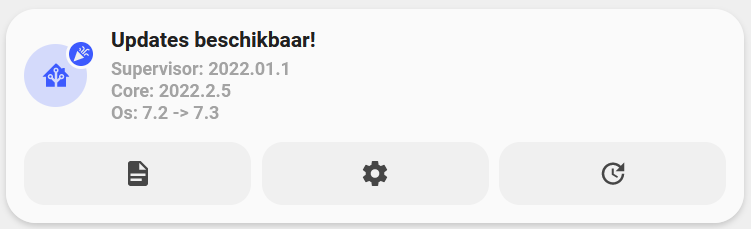

<!-- markdownlint-disable MD046 -->

# Custom-card "Homeassistant updates"



## Credits

- Author: AndyVRD - 2021
- Special thanks to [basbruss](https://github.com/basbruss/UI)
- Version: 1.0.2

## Changelog

<details>
<summary>1.0.0</summary>
Initial release
</details>
<details>
<summary>1.0.1</summary>
Added support for ulm_language variables
</details>
<details>
<summary>1.0.2</summary>
Updated capitalization of OS
</details>
<details>
<summary>1.0.3</summary>
Updated sensors and binary_sensors + Removed group.updaters
</details>

## Usage

```yaml
- type: "custom:button-card"
  template: card_homeassistant_updates
  variables:
    ulm_card_homeassistant_entity: "binary_sensor.updates"
    ulm_card_homeassistant_core: "sensor.core_updates"
    ulm_card_homeassistant_supervisor: "sensor.supervisor_updates"
    ulm_card_homeassistant_os: "sensor.os_updates"
```

## Requirements

!! Attention !!
This card needs additional template sensors and binary_sensor updaters to work, all detail can be found in this readme.

## Variables

<table>
<tr>
<th>Variable</th>
<th>Example</th>
<th>Required</th>
<th>Explanation</th>
</tr>
<tr>
<td>core_</td>
<td>sensor.core_updates</td>
<td>yes</td>
<td>sensor core installed/latest version</td>
</tr>
<tr>
<td>os_</td>
<td>sensor.os_updates</td>
<td>no</td>
<td>sensor os installed/latest version</td>
</tr>
<tr>
<td>supervisor_</td>
<td>sensor.supervisor_updates</td>
<td>no</td>
<td>sensor supervisor installed/latest version</td>
</tr>
</table>

<<<<<<< Updated upstream

## Template code

```yaml
---
card_homeassistant_updates:
  triggers_update: "all"
  template:
    - "ulm_language_variables"
  styles:
    grid:
      - grid-template-areas: "'item1' 'item2'"
      - grid-template-columns: "1fr"
      - grid-template-rows: "min-content  min-content"
      - row-gap: "12px"
    card:
      - border-radius: "var(--border-radius)"
      - box-shadow: "var(--box-shadow)"
      - padding: "12px"
  custom_fields:
    item1:
      card:
        triggers_update: "all"
        type: "custom:button-card"
        template:
          - "icon_info_updates"
        icon: "mdi:home-assistant"
        tap_action:
          action: "none"
        entity: "[[[ return variables.ulm_card_homeassistant_entity ]]]"
        name: >
              [[[
                if(states[variables.ulm_card_homeassistant_core].state ==='True' || states[variables.ulm_card_homeassistant_supervisor].state ==='True' || states[variables.ulm_card_homeassistant_os].state ==='True'){
                  return variables.ulm_updates_available;
                } else {
                  return variables.ulm_no_updates_available;
                }
              ]]]
        label: >
              [[[
                if(variables.ulm_card_homeassistant_core){
                  if(states[variables.ulm_card_homeassistant_core].state ==='True'){
                    var core = 'Core: ' + states[variables.ulm_card_homeassistant_core].attributes.installed_version + ' -> ' + states[variables.ulm_card_homeassistant_core].attributes.latest_version;
                  } else {
                    var core = 'Core: ' + states[variables.ulm_card_homeassistant_core].attributes.installed_version;
                  }
                }
                if(variables.ulm_card_homeassistant_supervisor){
                  if(states[variables.ulm_card_homeassistant_supervisor].state ==='True'){
                    var supervisor = 'Supervisor: ' + states[variables.ulm_card_homeassistant_supervisor].attributes.installed_version + ' -> ' + states[variables.ulm_card_homeassistant_supervisor].attributes.latest_version;
                  } else {
                    var supervisor = 'Supervisor: ' + states[variables.ulm_card_homeassistant_supervisor].attributes.installed_version;
                  }
                }
                if(variables.ulm_card_homeassistant_os){
                  if(states[variables.ulm_card_homeassistant_os].state ==='True'){
                    var os = 'OS: ' + states[variables.ulm_card_homeassistant_os].attributes.installed_version + ' -> ' + states[variables.ulm_card_homeassistant_os].attributes.latest_version;
                  } else {
                    var os = 'OS: ' + states[variables.ulm_card_homeassistant_os].attributes.installed_version;
                  }
                }
                if(variables.ulm_card_homeassistant_core && variables.ulm_card_homeassistant_supervisor && variables.ulm_card_homeassistant_os){
                  return supervisor + '<br>' + core + '<br>' + os;
                } else if(variables.ulm_card_homeassistant_core && variables.ulm_card_homeassistant_supervisor){
                  return supervisor + '<br>' + core;
                } else if(variables.ulm_card_homeassistant_core){
                  return core;
                }
              ]]]
        styles:
          icon:
            - color: "rgba(var(--color-theme),0.9)"
    item2:
      card:
        type: "custom:button-card"
        template: "list_3_items"
        custom_fields:
          item1:
            card:
              type: "custom:button-card"
              template: "widget_icon"
              icon: "mdi:file-document"
              tap_action:
                action: "url"
                url_path: "https://www.home-assistant.io/latest-release-notes/"
          item2:
            card:
              type: "custom:button-card"
              template: "widget_icon"
              icon: "mdi:cog"
              tap_action:
                action: "navigate"
                navigation_path: "/developer-tools/yaml"

          item3:
            card:
              type: "custom:button-card"
              template: "widget_icon"
              icon: "mdi:update"
              tap_action:
                action: "navigate"
                navigation_path: "/config/dashboard"

icon_info_updates:
  color: "var(--google-grey)"
  show_icon: true
  show_label: true
  show_name: true
  state:
    - value: "on"
      styles:
        custom_fields:
          notification:
            - border-radius: "50%"
            - position: "absolute"
            - left: "28px"
            - top: "8px"
            - height: "16px"
            - width: "16px"
            - border: "2px solid var(--card-background-color)"
            - font-size: "12px"
            - line-height: "14px"
            - background-color: >
                [[[
                  return "rgba(var(--color-blue),1)";
                ]]]
        icon:
          - color: "rgba(var(--color-blue),1)"
        img_cell:
          - background-color: "rgba(var(--color-blue), 0.2)"
  styles:
    icon:
      - color: "rgba(var(--color-theme),0.2)"
    label:
      - justify-self: "start"
      - align-self: "start"
      - font-weight: "bolder"
      - font-size: "12px"
      - filter: "opacity(40%)"
      - margin-left: "16px"
      - text-align: "start"
    name:
      - align-self: "end"
      - justify-self: "start"
      - font-weight: "bold"
      - font-size: "14px"
      - margin-left: "16px"
      - margin-bottom: "4px"
    state:
      - justify-self: "start"
      - align-self: "start"
      - font-weight: "bolder"
      - font-size: "12px"
      - filter: "opacity(40%)"
      - margin-left: "12px"
    img_cell:
      - background-color: "rgba(var(--color-theme),0.05)"
      - border-radius: "50%"
      - place-self: "center"
      - width: "42px"
      - height: "42px"
    grid:
      - grid-template-areas: "'i n' 'i l'"
      - grid-template-columns: "min-content auto"
      - grid-template-rows: "min-content min-content"
    card:
      - border-radius: "21px 8px 8px 21px"
      - box-shadow: "none"
      - padding: "0px"
  custom_fields:
    notification: >
      [[[
        if ( entity.state =="unavailable" || entity.state =="on" ){
          return `<ha-icon icon="mdi:party-popper" style="width: 12px; height: 12px; color: var(--primary-background-color);"></ha-icon>`;
        }
      ]]]
  size: "20px"

```

## Template sensors code

```yaml
sensor:
  - platform: command_line
    name: core_updates
    command: 'curl http://supervisor/core/info -H "Authorization: Bearer $(printenv SUPERVISOR_TOKEN)" | jq ''{"latest_version":.data.version_latest,"installed_version":.data.version,"update_available":.data.update_available}'''
    value_template: '{{ value_json.update_available }}'
    scan_interval: 600
    json_attributes:
      - update_available
      - latest_version
      - installed_version

  - platform: command_line
    name: supervisor_updates
    command: 'curl http://supervisor/supervisor/info -H "Authorization: Bearer $(printenv SUPERVISOR_TOKEN)" | jq ''{"latest_version":.data.version_latest,"installed_version":.data.version,"update_available":.data.update_available}'''
    value_template: '{{ value_json.update_available }}'
    scan_interval: 600
    json_attributes:
      - update_available
      - latest_version
      - installed_version

  - platform: command_line
    name: os_updates
    command: 'curl http://supervisor/os/info -H "Authorization: Bearer $(printenv SUPERVISOR_TOKEN)" | jq ''{"latest_version":.data.version_latest,"installed_version":.data.version,"update_available":.data.update_available}'''
    value_template: '{{ value_json.update_available }}'
    scan_interval: 600
    json_attributes:
      - update_available
      - latest_version
      - installed_version

  - platform: command_line
    name: addons_updates
    command: 'curl http://supervisor/addons -H "Authorization: Bearer $(printenv SUPERVISOR_TOKEN)" | jq ''{"addons":[.data.addons[] | select(.update_available)]}'''
    value_template: '{{ value_json.addons | length }}'
    scan_interval: 600
    unit_of_measurement: pending update(s)
    json_attributes:
      - addons

binary_sensor:
  - platform: template
    sensors:
      updater_core:
        friendly_name: Core
        device_class: problem
        value_template: "{{ states('sensor.core_updates') }}"
        attribute_templates:
          installed_version: "{{ state_attr('sensor.core_updates', 'installed_version') }}"
          latest_version: "{{ state_attr('sensor.core_updates', 'latest_version') }}"
=======
??? note "Template Code"
>>>>>>> Stashed changes

    ```yaml title="custom_card_homeassistant_updates.yaml"
    --8<-- "custom_cards/custom_card_homeassistant_updates/custom_card_homeassistant_updates.yaml"
    ```
