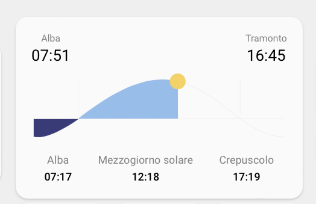

<!-- markdownlint-disable MD046 -->

# Custom-card "Sun"

The `custom_card_httpedo13_sun` adapt `sun card` for minimalist ui.

## Credits

Author: httpedo13 - 2021
Version: 1.0.0

## Changelog

<details>
<summary>1.0.0</summary>
Initial release
</details>

## Requirements

This card uses:

<table>
<tr>
<th>Component / card</th>
<th>required</th>
<th>Link</th>
</tr>
<tr>
<td>Sun integration</td>
<td>yes</td>
<td><a href="https://www.home-assistant.io/integrations/sun/">more info</a></td>
</tr>
<tr>
<td>Sun card</td>
<td>yes</td>
<td><a href="https://github.com/AitorDB/home-assistant-sun-card">more info</a></td>
</tr>
</table>

## Images



## Usage

```yaml
- type: custom:button-card
  template: custom_card_httpedo13_sun
  variables:
    language: "it"
```

## Variables

The same sun card config.

| Name          | Accepted values      | Description                          | Default                                             |
| ------------- | -------------------- | ------------------------------------ | --------------------------------------------------- |
| darkMode      | `boolean`            | Changes card colors to dark or light | Home assistant dark mode state                      |
| language      | `string`<sup>1</sup> | Changes card language                | Home assistant language or english if not supported |
| showAzimuth   | `boolean`            | Displays azimuth in the footer       | `false`                                             |
| showElevation | `boolean`            | Displays elevation in the footer     | `false`                                             |
| timeFormat    | `'12h'`/`'24h'`      | Displayed time format                | Locale based on Home assistant language             |
| title         | `string`             | Card title                           | Doesn't display a title by default                  |

(<sup>1</sup>) Supported languages: `da`, `de`, `en`, `es`, `et`, `fi`, `fr`, `hu`, `it`, `nl`, `pl`, `pt-BR`, `ru`, `sl`, `sv`
