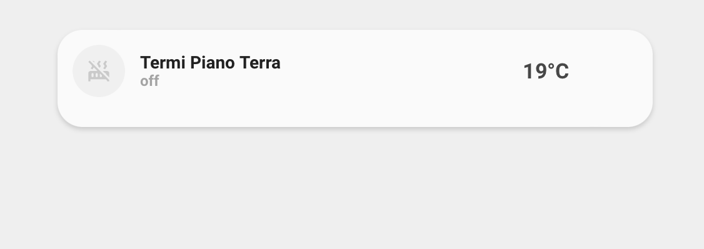
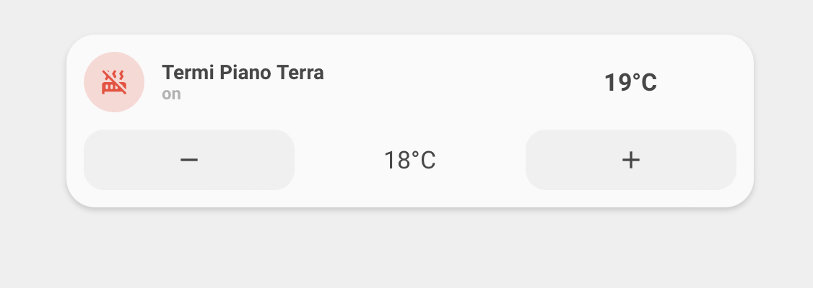
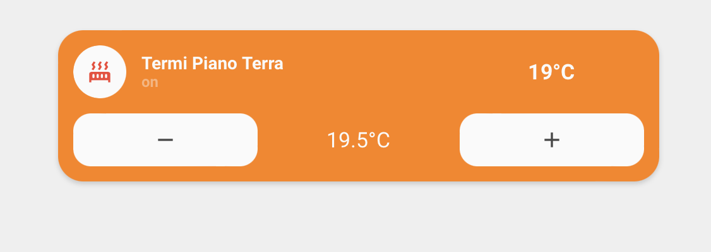
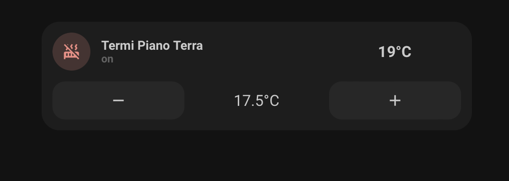
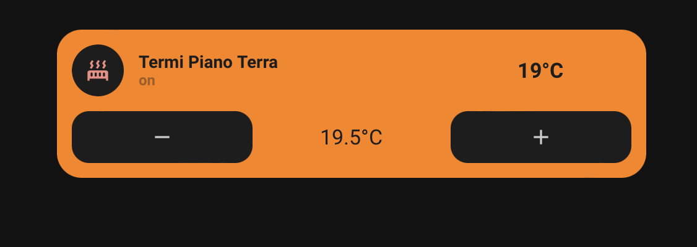

<!-- markdownlint-disable MD046 -->

# Custom-card "Thermostat"

The `custom_card_httpedo13_thermostat` shows data from your thermostat and gives you the possibility to control it. Thanks to [tpx01's](https://github.com/httpedo13/UI/tree/main/custom_cards/custom_card_tpx01_aircondition) air-condition custom card!

## Credits

Author: httpedo13 - 2021
Version: 1.0.0

This design was made by [tpx01's](https://github.com/httpedo13/UI/tree/main/custom_cards/custom_card_tpx01_aircondition)

## Changelog

<details>
<summary>1.0.0</summary>
Initial release
</details>

## Images











## Usage

With buttons:

```yaml
- type: custom:button-card
  template: custom_card_httpedo13_thermostat_with_buttons
  variables:
    entity: climate.ground_floor
    name: Heater Ground Floor
```

With collapse button:

```yaml
- type: custom:button-card
  template: custom_card_httpedo13_thermostat_with_buttons_collapse
  variables:
    entity: climate.ground_floor
    name: Heater Ground Floor
```

## Requirements

Entity climate with only heat mode

## Variables

<table>
<tr>
<th>Variable</th>
<th>Example</th>
<th>Required</th>
<th>Explanation</th>
</tr>
<tr>
<td>entity</td>
<td>climate.ground_floor</td>
<td>yes</td>
<td>Your climate with only heat mode entity</td>
</tr>
<tr>
<td>name</td>
<td>Heater Ground Floor</td>
<td>yes</td>
<td>The name to show</td>
</tr>
</table>

??? note "Template Code"

    ```yaml title="custom_card_httpedo13_thermostat.yaml"
    --8<-- "custom_cards/custom_card_httpedo13_thermostat/custom_card_httpedo13_thermostat.yaml"
    ```
