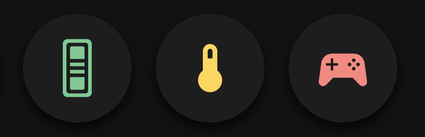

<!-- markdownlint-disable MD046 -->

# Custom-card "Battery Chip"

This is a `custom-card` or `custom-chip` to see your device's battery level at a glance.



## Credits

Author: Iñaki Abadia - 2024
Version: 1.0.0

## Changelog

<details>
<summary>1.0.0</summary>
Initial release
</details>

## Requirements

None

## Usage

```yaml
type: "custom:button-card"
template: custom_card_iAbadia_battery_chip
variables:
  ulm_custom_card_iAbadia_battery_chip_entity: sensor.living_room_sensor_battery
  ulm_custom_card_iAbadia_battery_chip_icon: mdi:thermostat
  ulm_custom_card_iAbadia_battery_chip_warning: 30
  ulm_custom_card_iAbadia_battery_chip_danger: 10
```

## Variables

| Variable                                       | Example              | Required | Explanation                                           |
| ---------------------------------------------- | -------------------- | -------- | ----------------------------------------------------- |
|  ulm_custom_card_iAbadia_battery_chip_entity   | `sensor.temperature` | ✓        | Battery entity                                        |
|  ulm_custom_card_iAbadia_battery_chip_icon     | `mdi:thermometer`    | ✘        | Icon to be displayed. Will default to mdi:battery     |
|  ulm_custom_card_iAbadia_battery_chip_warning  | `20`                 | ✘        | Battery level below which to color as warning (yellow) |
|  ulm_custom_card_iAbadia_battery_chip_danger   | `10`                 | ✘        | Battery level below which to color as danger (red)     |

## Template Code

??? note "Template Code"

    ```yaml title="custom_card_irmajavi_speedtest.yaml"
    --8<-- "custom_cards/custom_card_iAbadia_battery_chip/custom_card_iAbadia_battery_chip.yaml"
    ```
