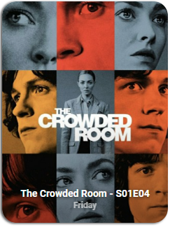

<!-- markdownlint-disable MD046 -->

# Custom Card "Media"

These are some `custom-card` for your plex, radarr and sonarr media libraries.


<br>


## Credits

- Author: imswel - 2023
- Version: 1.0.0

## Changelog

<details>
<summary>1.0.0</summary>
Initial release
</details>

## Requirements

This card needs the following to function correctly:

| Component                                                                                 | Required                           |
| ----------------------------------------------------------------------------------------- | ---------------------------------- |
|[Plex Recently Added](https://github.com/NemesisRE/sensor.plex_recently_added)             | Yes for **`Media Library Card`**   |
|[Radarr Upcoming Media](https://github.com/custom-components/sensor.radarr_upcoming_media) | Yes for **`Media Upcoming Card`**  |
|[Sonarr Upcoming Media](https://github.com/custom-components/sensor.sonarr_upcoming_media) | Yes for **`Media Upcoming Card`**  |

## Usage

**Media Library Card** for [Plex Recently Added](https://github.com/NemesisRE/sensor.plex_recently_added) :

<br>

| Variable                              | Default | Required | Notes                                                                   |
| -----------------------------         | ------- | -------- | ----------------------------------------------------------------------- |
| ulm_custom_card_imswel_medias_index   |    1    | Yes      | The index of the item in your **Plex library**  to show.                |

```yaml
- type: custom:button-card
  template: "custom_card_imswel_medias_library"
  entity: sensor.plex_recently_added
  variables:
    ulm_custom_card_imswel_medias_index: 1
```

<br>

**Media Upcoming Card** for [Radarr Upcoming Media](https://github.com/custom-components/sensor.radarr_upcoming_media) & [Sonarr Upcoming Media](https://github.com/custom-components/sensor.sonarr_upcoming_media) :


<br>

| Variable                              | Default | Required | Notes                                                                                                    |
| -----------------------------         | ------- | -------- | -------------------------------------------------------------------------------------------------------- |
| ulm_custom_card_imswel_medias_index   | 1       | Yes      | The index of the item in your **Radarr/Sonarr library** to show.                                         |
| ulm_custom_card_imswel_medias_platform| radarr  | Yes      | The platform to choose depending on the selected entity. <br> Can be: **`radarr`** or **`sonarr`**. <br> |

```yaml
- type: custom:button-card
  template: "custom_card_imswel_medias_upcoming"
  entity: sensor.sonarr_upcoming_media
  variables:
    ulm_custom_card_imswel_medias_index: 1
    ulm_custom_card_imswel_medias_platform: "sonarr"
```

## Template code

??? note "Template Code"

    ```yaml title="custom_card_imswel_medias.yaml"
    --8<-- "custom_cards/custom_card_imswel_medias/custom_card_imswel_medias.yaml"
    ```
