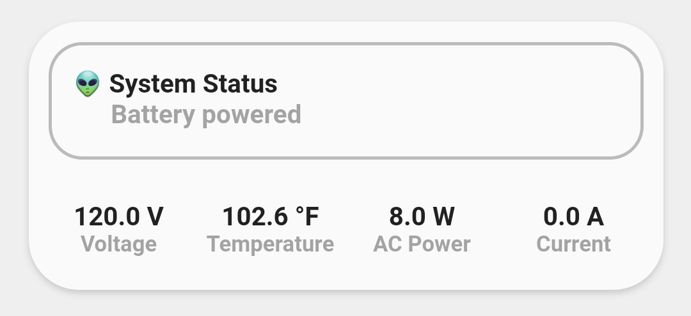

<!-- markdownlint-disable MD046 -->

## Custom-card "Entities"

This is a `custom-card` to display states from multiple entities or from an entity with multiples attributes (To use it with attributes need to modify the code)



## Credits

Author: irmajavi - 2022
Version: 1.0.0

## Changelog

<details>
<summary>1.0.0</summary>
Initial release
</details>

## Requirements

none

## Usage

```yaml
type: custom:button-card
template: custom_card_irmajavi_entities
variables:
  ulm_custom_card_irmajavi_entities_entity_1: sensor.inverter_voltage
  ulm_custom_card_irmajavi_entities_entity_2: sensor.inverter_temperature
  ulm_custom_card_irmajavi_entities_entity_3: sensor.active_ac_power
  ulm_custom_card_irmajavi_entities_entity_4: sensor.ac_load_current
  ulm_custom_card_irmajavi_entities_name_1: Voltage
  ulm_custom_card_irmajavi_entities_name_2: Temperature
  ulm_custom_card_irmajavi_entities_name_3: AC Power
  ulm_custom_card_irmajavi_entities_name_4: Current
  ulm_custom_card_irmajavi_entities_name: System Status
  ulm_custom_card_irmajavi_entities: sensor.inverter_operating_mode
```

## Variables

<table>
<thead>
<tr>
<th>Variable</th>
<th>Example</th>
<th>Required</th>
<th>Explanation</th>
</tr>
</thead>
<tbody>
<tr>
<td>ulm_custom_card_irmajavi_entities</td>
<td>sensor.main</td>
<td>Yes</td>
<td>Main entity</td>
</tr>
<tr>
<td>ulm_custom_card_irmajavi_entitites_name</td>
<td>Status</td>
<td>Yes</td>
<td>Main entity name</td>
</tr>
<tr>
<td>ulm_custom_card_irmajavi_entities_entity_1</td>
<td>sensor.test1</td>
<td>Yes</td>
<td>The first entity</td>
</tr>
<tr>
<td>ulm_custom_card_irmajavi_entities_entity_2</td>
<td>sensor.test2</td>
<td>Yes</td>
<td>The second entity</td>
</tr>
<tr>
<td>ulm_custom_card_irmajavi_entities_entity_3</td>
<td>sensor.test3</td>
<td>Yes</td>
<td>The third entity</td>
</tr>
<tr>
<td>ulm_custom_card_irmajavi_entities_entity_4</td>
<td>sensor.test4</td>
<td>Yes</td>
<td>The forth entity</td>
</tr>
<tr>
<td>ulm_custom_card_irmajavi_entities_name_1</td>
<td>Test1</td>
<td>Yes</td>
<td>The name of the first entity</td>
</tr>
<tr>
<td>ulm_custom_card_irmajavi_entities_name_2</td>
<td>Test2</td>
<td>Yes</td>
<td>The name of the second entity</td>
</tr>
<tr>
<td>ulm_custom_card_irmajavi_entities_name_3</td>
<td>Test3</td>
<td>Yes</td>
<td>The name of the third entity</td>
</tr>
<tr>
<td>ulm_custom_card_irmajavi_entities_name_4</td>
<td>Test4</td>
<td>Yes</td>
<td>The name of the forth entity</td>
</tr>
</tbody>
</table>

## Template Code

??? note "Template Code"

    ```yaml title="custom_card_irmajavi_entities.yaml"
    --8<-- "custom_cards/custom_card_irmajavi_entities/custom_card_irmajavi_entities.yaml"
    ```
