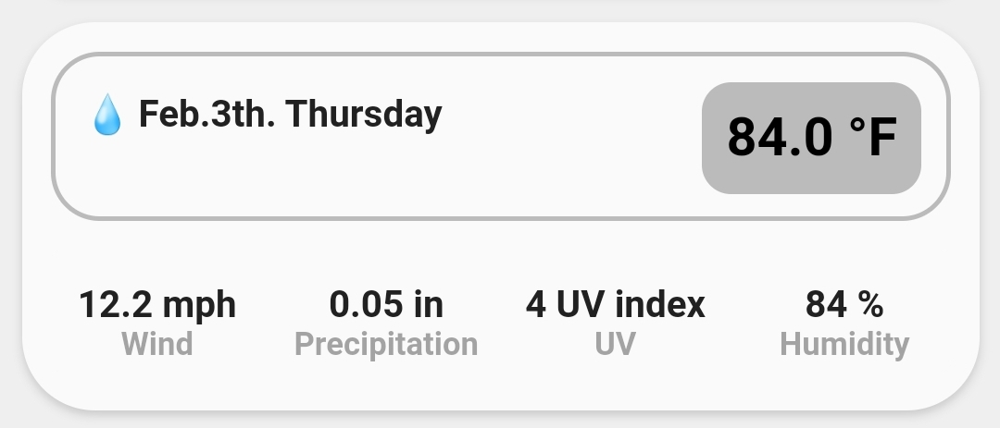

<!-- markdownlint-disable MD046 -->

## Custom-card "Weather"

This is a `custom-card` to display states from weather entities or from a weather entity with multiples attributes (To use it with attributes need to modify the code)



## Credits

Author: irmajavi - 2022
Version: 1.0.0

## Changelog

<details>
<summary>1.0.0</summary>
Initial release
</details>

## Requirements

In your `configuration.yaml` you need to create a new sensor in order to use the custom date format the card uses.

```yaml
- platform: template
  sensors:
    date_long:
      friendly_name: "Date and Day of week"
      value_template: >
        
        
        {{ months[now().month-1] }}.{{ now().day }}th. {{ days[now().weekday()] }}
```

## Usage

```yaml
type: custom:button-card
template: custom_card_irmajavi_weather
variables:
  ulm_custom_card_irmajavi_weather: weather.aguada_2
  ulm_custom_card_irmajavi_weather_entity_1: sensor.aguada_wind
  ulm_custom_card_irmajavi_weather_entity_2: sensor.aguada_precipitation
  ulm_custom_card_irmajavi_weather_entity_3: sensor.aguada_uv_index
  ulm_custom_card_irmajavi_weather_entity_4: sensor.weather_humidity
  ulm_custom_card_irmajavi_weather_name_1: Wind
  ulm_custom_card_irmajavi_weather_name_2: Precipitation
  ulm_custom_card_irmajavi_weather_name_3: UV
  ulm_custom_card_irmajavi_weather_name_4: Humidity
  ulm_custom_card_irmajavi_weather_temperature_outside: sensor.aguada_realfeel_temperature
  ulm_custom_card_irmajavi_weather_date: sensor.date_long
```

## Variables

<table>
<thead>
<tr>
<th>Variable</th>
<th>Example</th>
<th>Required</th>
<th>Explanation</th>
</tr>
</thead>
<tbody>
<tr>
<td>ulm_custom_card_irmajavi_weather</td>
<td>weather.yourplace</td>
<td>Yes</td>
<td>The main entity</td>
</tr>
<tr>
<td>ulm_custom_card_irmajavi_weather_entity_1</td>
<td>weather.humidity</td>
<td>Yes</td>
<td>Weather entity</td>
</tr>
<tr>
<td>ulm_custom_card_irmajavi_weather_entity_2</td>
<td>sensor.test1</td>
<td>Yes</td>
<td>Weather entity</td>
</tr>
<tr>
<td>ulm_custom_card_irmajavi_weather_entity_3</td>
<td>sensor.test2</td>
<td>Yes</td>
<td>Weather entity</td>
</tr>
<tr>
<td>ulm_custom_card_irmajavi_weather_entity_4</td>
<td>sensor.test3</td>
<td>Yes</td>
<td>Weather entity</td>
</tr>
<tr>
<td>ulm_custom_card_irmajavi_weather_name_1</td>
<td>Wind</td>
<td>Yes</td>
<td>Entity name</td>
</tr>
<tr>
<td>ulm_custom_card_irmajavi_weather_name_2</td>
<td>Humidity</td>
<td>Yes</td>
<td>Entity name</td>
</tr>
<tr>
<td>ulm_custom_card_irmajavi_weather_name_3</td>
<td>UV Index</td>
<td>Yes</td>
<td>Entity name</td>
</tr>
<tr>
<td>ulm_custom_card_irmajavi_weather_name_4</td>
<td>Precipitation</td>
<td>Yes</td>
<td>Entity name</td>
</tr>
<tr>
<td>ulm_custom_card_irmajavi_weather_temperature_outside</td>
<td>sensor.test4</td>
<td>Yes</td>
<td>Weather entity</td>
</tr>
<tr>
<td>ulm_custom_card_irmajavi_weather_date</td>
<td>sensor.test5</td>
<td>Yes</td>
<td>Custom date format sensor</td>
</tr>
</tbody>
</table>

## Template Code

??? note "Template Code"

    ```yaml title="custom_card_irmajavi_weather.yaml"
    --8<-- "custom_cards/custom_card_irmajavi_weather/custom_card_irmajavi_weather.yaml"
    ```
