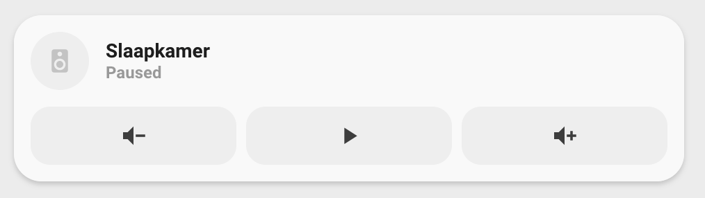

<!-- markdownlint-disable MD046 -->

### Media player: sonos

> NOTE
> This card is under review and is not ready to use!



<details>
<summary>Usage</summary>

#### Example

```yaml
- type: "custom:button-card"
  template: card_media_player_sonos_with_controls
  variables:
    ulm_card_media_player_with_controls_name: "Slaapkamer"
    ulm_card_media_player_with_controls_entity: media_player.slaapkamer
```

#### Variables

<table>
<tr>
<th>Variable</th>
<th>Example</th>
<th>Required</th>
<th>Explanation</th>
</tr>
<tr>
<td>ulm_card_media_player_with_controls_name</td>
<td>Sonos room 1</td>
<td>Yes</td>
<td>Name shown in lovelace</td>
<tr>
<td>ulm_card_media_player_with_controls_entity</td>
<td>media_player.sonos_room_1</td>
<td>Yes</td>
<td>Entity id</td>
</tr>
</table>
<br />
</details>

??? note "Template Code"

    ```yaml title="custom_card_media_player_sonos.yaml"
    --8<-- "custom_cards/custom_card_media_player_sonos/custom_card_media_player_sonos.yaml"
    ```
