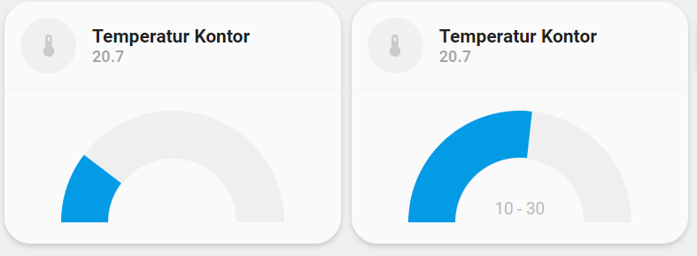

<!-- markdownlint-disable MD046 -->

# Custom-card "Gauge"

The `custom_card_mpse_gauge` is used present a value in form of a gauge. The card can handle two gauges so it would be easy to adapt the card to that if required. I preferred the minimal look.



## Credits

Author: mpse
Version: 0.1.0

## Changelog

<details>
Initial release.
</details>

## Usage

```yaml
- type: "custom:button-card"
  template: custom_card_mpse_gauge
  entity: sensor.temp_office_temperature
  variables:
    ulm_card_mpse_gauge_min: 10
    ulm_card_mpse_gauge_max: 30
```

## Requirements

Uses this card: <https://github.com/custom-cards/dual-gauge-card> which can be installed via HACS.

## Variables

<table>
<tr>
<th>Variable</th>
<th>Example</th>
<th>Required</th>
<th>Explanation</th>
</tr>
<tr>
<td>ulm_card_mpse_gauge_min</td>
<td>0</td>
<td>no</td>
<td>Minimum value, defaults to 0.</td>
</tr>
<tr>
<td>ulm_card_mpse_gauge_max</td>
<td>100</td>
<td>no</td>
<td>Maximum value, defaults to 100.</td>
</tr>
</table>

## Template code

??? note "Template Code"

    ```yaml title="custom_card_mpse_gauge.yaml"
    --8<-- "custom_cards/custom_card_mpse_gauge/custom_card_mpse_gauge.yaml"
    ```
