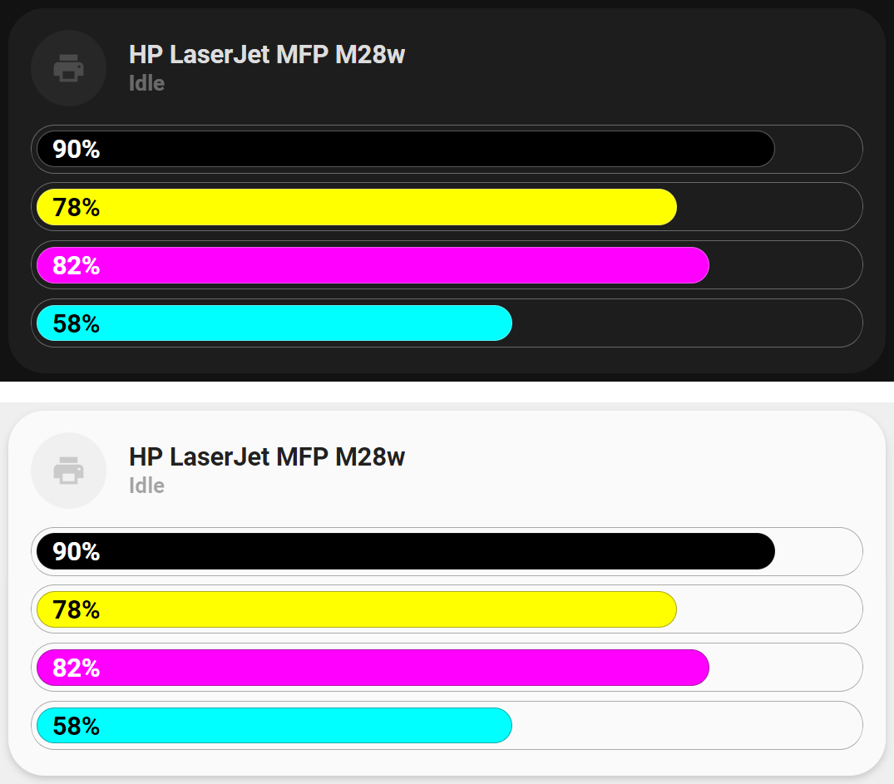

<!-- markdownlint-disable MD046 -->

# Custom-card "Printer"

The `custom_card_mpse_printer` is used to display the status of a printer and the ink levels.



## Credits

Author: mpse (based on clemalex post)
Version: 0.4.0

## Changelog

<details>
  <summary>0.4.0</summary>
  <h4>Contributor: <a href="https://github.com/sisimomo">Sisimomo</a> - 2022-06-15</h4>
  <ul>
    <li>Remove <a href="https://github.com/custom-cards/bar-card">bar-card</a> dependency.</li>
    <li>Now supports having zero or multiple ink sensors.</li>
    <li>Code refactoring to fit <a href="https://ui-lovelace-minimalist.github.io/UI/development/custom_cards/#order">framework structure</a>.</li>
    <li>Code clean up.</li>
    <li>Documentation clean up.</li>
  </ul>
</details>
<details>
  <summary>0.3.0</summary>
  Updated documention.
  Cleanup code in card.
  Updated colors to match input values.
</details>
<details>
  <summary>0.2.0</summary>
  Added reference to used card.
  Fixed yaml indentation
</details>
<details>
  <summary>0.1.0</summary>
  Initial release adapted from a post on home assistant forum by user clemalex.
</details>

## Usage

```yaml
- type: 'custom:button-card'
  template: custom_card_mpse_printer
  entity: sensor.printer_status
  variables:
    card_printer_name: My Printer name
    card_printer_black_ink: sensor.printer_black_ink
    card_printer_yellow_ink: sensor.printer_yellow_ink
    card_printer_cyan_ink: sensor.printer_cyan_ink
    card_printer_magenta_ink: sensor.printer_magenta_ink
```

## Variables

<table>
  <tr>
    <th>Variable</th>
    <th>Example</th>
    <th>Required</th>
    <th>Explanation</th>
  </tr>
  <tr>
    <td>ulm_card_printer_name</td>
    <td>HP Color Laser MFP 178nw</td>
    <td>no</td>
    <td>Name of printer to display on card</td>
  </tr>
  <tr>
    <td>ulm_card_printer_black_name</td>
    <td>sensor.printer_black_ink</td>
    <td>no</td>
    <td>Name of black ink sensor</td>
  </tr>
  <tr>
    <td>ulm_card_printer_yellow_name</td>
    <td>sensor.printer_yellow_ink</td>
    <td>no</td>
    <td>Name of yellow ink sensor</td>
  </tr>
  <tr>
    <td>ulm_card_printer_cyan_name</td>
    <td>sensor.printer_cyan_ink</td>
    <td>no</td>
    <td>Name of cyan ink sensor</td>
  </tr>
  <tr>
    <td>ulm_card_printer_magenta_name</td>
    <td>sensor.printer_magenta_ink</td>
    <td>no</td>
    <td>Name of magenta ink sensor</td>
  </tr>
</table>

## Template code

??? note "Template Code"

    ```yaml title="custom_card_mpse_printer.yaml"
    --8<-- "custom_cards/custom_card_mpse_printer/custom_card_mpse_printer.yaml"
    ```
