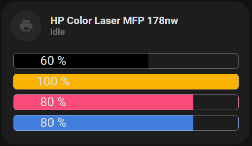

<!-- markdownlint-disable MD046 -->

# Custom-card "Printer"

The `custom_card_mpse_printer` is used to display the status of a printer and the toner.



## Credits

Author: mpse (based on clemalex post)
Version: 0.3.0

## Changelog

<details>
<summary>0.3.0</summary>
Updated documentation.
Cleanup code in card.
Updated colors to match input values.
</details>
<details>
<summary>0.2.0</summary>
Added reference to used card.
Fixed yaml indentation
</details>
<details>
<summary>0.1.0</summary>
Initial release adapted from a post on home assistant forum by user clemalex.
</details>

## Usage

```yaml
- type: "custom:button-card"
  template: custom_card_mpse_printer
  entity: sensor.hp_color_laser_mfp_178nw
  variables:
    ulm_card_printer_name: HP Color Laser MFP 178nw
    ulm_card_printer_black_name: sensor.hp_color_laser_mfp_178nw_black_toner
    ulm_card_printer_yellow_name: sensor.hp_color_laser_mfp_178nw_yellow_toner
    ulm_card_printer_cyan_name: sensor.hp_color_laser_mfp_178nw_cyan_toner
    ulm_card_printer_magenta_name: sensor.hp_color_laser_mfp_178nw_magenta_toner
```

## Requirements

Uses this card: <https://github.com/custom-cards/bar-card>
Tested with the IPP Integration from Home Assistant: <https://www.home-assistant.io/integrations/ipp>
On my printer i cannot get any state update, it always reports idle. I wanted to highlight the button when the printer is active.

## Variables

<table>
<tr>
<th>Variable</th>
<th>Example</th>
<th>Required</th>
<th>Explanation</th>
</tr>
<tr>
<td>ulm_card_printer_name</td>
<td>HP Color Laser MFP 178nw</td>
<td>yes</td>
<td>Name of printer to display on card</td>
</tr>
<tr>
<td>ulm_card_printer_black_name</td>
<td>sensor.hp_color_laser_mfp_178nw_black_toner</td>
<td>yes</td>
<td>Name of black toner sensor</td>
</tr>
<tr>
<td>ulm_card_printer_yellow_name</td>
<td>sensor.hp_color_laser_mfp_178nw_yellow_toner</td>
<td>yes</td>
<td>Name of yellow toner sensor</td>
</tr>
<tr>
<td>ulm_card_printer_cyan_name</td>
<td>sensor.hp_color_laser_mfp_178nw_cyan_toner</td>
<td>yes</td>
<td>Name of cyan toner sensor</td>
</tr>
<tr>
<td>ulm_card_printer_magenta_name</td>
<td>sensor.hp_color_laser_mfp_178nw_magenta_toner</td>
<td>yes</td>
<td>Name of magenta toner sensor</td>
</tr>

</table>

## Template code

??? note "Template Code"

    ```yaml title="custom_card_mpse_printer.yaml"
    --8<-- "custom_cards/custom_card_mpse_printer/custom_card_mpse_printer.yaml"
    ```
