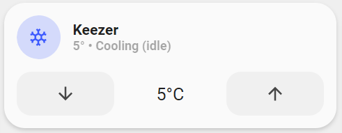

<!-- markdownlint-disable MD046 -->

# Custom-card "Thermostat"

The `custom_card_mpse_thermostat` is used to display temperature and control a simple thermostat. I have tested this with a cooling function that I use to control my beer fridge.

The buttons are used to lower/raise the set temperature which is displayed between the arrows. It uses the defined steps configured on the thermostat (In my case I use esphome to control the frigde). The current temperature is shown in the grey label. The card uses the standard language parameters.



## Credits

Author: mpse
Version: 0.1.0

## Changelog

<details>
<summary>0.1.0</summary>
Initial release inspired from various posts on home assistant forum.
</details>

## Usage

```yaml
- type: "custom:button-card"
  template: custom_card_mpse_thermostat
  entity: climate.fermentation_climate_controller
```

## Requirements

## Variables

<table>
<tr>
<th>Variable</th>
<th>Example</th>
<th>Required</th>
<th>Explanation</th>
</tr>
<tr>
<td>None</td>
<td></td>
<td></td>
<td></td>
</tr>
</tr>
</table>

## Template code

??? note "Template Code"

    ```yaml title="custom_card_mpse_thermostat.yaml"
    --8<-- "custom_cards/custom_card_mpse_thermostat/custom_card_mpse_thermostat.yaml"
    ```
