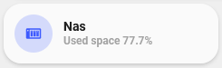

<!-- markdownlint-disable MD046 -->

# Custom-card "NAS"

The `card-nas` shows you a specific sensor value from your NAS, eg. the disk space used.



## Credits

Author: tben - 2021
Version: 1.0.0

## Changelog

<details>
<summary>1.0.0</summary>
Initial release
</details>
<details>
<summary>1.0.1</summary>
Fix card & add Screenshot
</details>

## Usage

```yaml
- type: "custom:button-card"
  template:
    - custom_card_nas
  variables:
    ulm_custom_card_nas_sensor: sensor.pinas_disk_use
    ulm_custom_card_nas_text: "HDD used"
    ulm_custom_cad_nas_unit: %
```

## Requirements

n/a

## Variables

<table>
<tr>
<th>Variable</th>
<th>Example</th>
<th>Required</th>
<th>Explanation</th>
</tr>
<tr>
<td>ulm_custom_card_nas_sensor</td>
<td>sensor.nas_disk_use</td>
<td>yes</td>
<td>The sensor that shows your sensor state, eg. the disk use on your NAS</td>
</tr>
<tr>
<td>ulm_custom_card_nas_text</td>
<td>HDD used</td>
<td>yes</td>
<td>The text to show on your card</td>
</tr>
<tr>
<td>ulm_custom_card_nas_unit</td>
<td>%</td>
<td>yes</td>
<td>The unit to show after your sensors state</td>
</tr>
</table>

## Template code

??? note "Template Code"

    ```yaml title="custom_card_nik_door.yaml"
    --8<-- "custom_cards/custom_card_nas/custom_card_nas.yaml"
    ```
