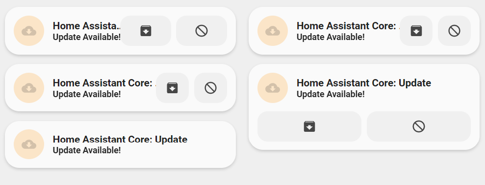

<!-- markdownlint-disable MD046 -->

# Custom-card "Update"



## Credits

Author: Neekster - 2022
Version: 1.0.0

## Changelog

<details>
  <summary>1.0.0</summary>
  Initial release
</details>

## Description

This custom cards works with any entity in the update domain and gives options for two-button control to begin the update or skip. It also supports both horizontal and vertical configurations.

## Variables

| Variable           | Default | Required | Notes                                                                       |
| ------------------ | ------- | -------- |---------------------------------------------------------------------------- |
| enable_controls    | false   | No       | Enable two-button controls for update and skip                              |
| collapsible        | false   | No       | Auto-collapse controls when no update is available/update has been skipped  |
| horizontal         | false   | No       | Display card horizontally                                                   |
| narrow_buttons     | false   | No       | Allow more space for text in horizontal configuration                       |

## Usage

<details>
<summary>Example 1</summary>

```yaml
- type: custom:button-card
  template: card_neekster_update
  entity: update.home_assistant_core_update
```

</details>
<details>
<summary>Example 2</summary>

```yaml
- type: custom:button-card
  template: card_neekster_update
  entity: update.home_assistant_core_update
  variables:
    ulm_card_neekster_update_enable_controls: true
    ulm_card_neekster_update_collapsible: true
    ulm_card_neekster_update_horizontal: true
    ulm_card_neekster_update_narrow_buttons: true
```

</details>

## Template code

??? note "Template Code"

    ```yaml title="custom_card_neekster_update.yaml"
    --8<-- "custom_cards/custom_card_neekster_update/custom_card_neekster_update.yaml"
    ```
