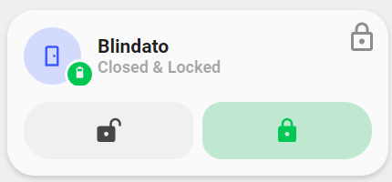

<!-- markdownlint-disable MD046 -->

# Custom-card "Minimal Door Lock"

This is a `custom-card` that shows the currenct state of your Lock and allows you to open and close it showing the state with a Minimal Design.



## Credits

Author: Nik - 2022 Version: 1.0.0

## Changelog

<details>
<summary>1.0.0</summary>
Initial release
</details>

## Requirements

To have the Minimalist cards and custom cards installed

## Usage

```yaml
- type: 'custom:button-card'
  template: custom_card_nik_door
  entity: sensor.nuki_blindato_door_security_state
  variables:
    ulm_custom_card_entity_1_name: Blindato
    ulm_custom_card_entity_1_lock: lock.nuki_blindato_lock
```

## Variables

<table>
<thead>
  <tr>
    <th>Variable</th>
    <th>Example</th>
    <th>Required</th>
    <th>Explanation</th>
  </tr>
</thead>
<tbody>
  <tr>
    <td>ulm_custom_card_entity_1_name</td>
    <td>sensor.nuki_blindato_door_security_state</td>
    <td>Yes</td>
    <td>Your Door Name</td>
  </tr>
  <tr>
    <td>ulm_custom_card_entity_1_lock</td>
    <td>lock.nuki_blindato_lock</td>
    <td>Yes</td>
    <td>Your Door Lock entity</td>
  </tr>
  <tr>
    <td>entity</td>
    <td>sensor.nuki_blindato_door_security_state</td>
    <td>Yes</td>
    <td>Your door sensor to track "Open" and "Close" state.</td>
  </tr>
</tbody>
</table>

## Template Code

```yaml
---
custom_card_nik_door:
  template:
    - "ulm_language_variables"
  variables:
    ulm_custom_card_entity_1_name: "[[[ return variables.ulm_custom_card_entity_1_name]]]"
    ulm_custom_card_entity_1_lock: "[[[ return variables.ulm_custom_card_entity_1_lock]]]"
  show_icon: false
  show_name: false
  show_label: false
  styles:
    grid:
      - grid-template-areas: >
          [[[
                var areas = [];
                areas.push("item1 item1");
                areas.push("item2 item2");
                return "\"" + areas.join("\" \"") + "\"";
          ]]]
      - grid-template-columns: "1fr 1fr"
      - grid-template-rows: "min-content" "min-content"
      - row-gap: "12px"
    card:
      - border-radius: "var(--border-radius)"
      - box-shadow: "var(--box-shadow)"
      - padding: "12px"

  custom_fields:
    item1:
      card:
        type: "custom:button-card"
        template:
          - "icon_more_info"
        custom_fields:
          item1:
            card:
              type: "custom:button-card"
              entity: "[[[ return entity.entity_id]]]"
              icon: "mdi:door"
              styles:
                icon:
                  - color: "rgba(var(--color-blue),1)"
                img_cell:
                  - background-color: "rgba(var(--color-blue),0.2)"
              tap_action:
                action: "none"
          item2:
            card:
              type: "custom:button-card"
              entity: "[[[ return entity.entity_id]]]"
              name: "[[[ return variables.ulm_custom_card_entity_1_name]]]"
              label: >
                [[[
                  return entity.state
                ]]]
    item2:
      card:
        type: "custom:button-card"
        template: "list_2_items"
        custom_fields:
          item1:
            card:
              type: "custom:button-card"
              template: "widget_icon"
              icon: "mdi:lock-open-variant"
              entity: "[[[ return entity.entity_id]]]"
              tap_action:
                action: "call-service"
                service: "lock.open"
                service_data:
                  entity_id: "[[[ return variables.ulm_custom_card_entity_1_lock]]]"
              state:
                - value: "Open"
                  styles:
                    icon:
                      - color: "rgba(var(--color-red),1)"
                    img_cell:
                      - background-color: "rgba(var(--color-red),0.2)"
                - value: "Closed & Unlocked"
                  styles:
                    icon:
                      - color: "rgba(var(--color-yellow),1)"
                    img_cell:
                      - background-color: "rgba(var(--color-yellow),0.2)"
          item2:
            card:
              type: "custom:button-card"
              template: "widget_icon"
              icon: "mdi:lock"
              entity: "[[[ return entity.entity_id]]]"
              tap_action:
                action: "call-service"
                service: "lock.lock"
                service_data:
                  entity_id: "[[[ return variables.ulm_custom_card_entity_1_lock]]]"
              state:
                - value: "Closed & Locked"
                  styles:
                    icon:
                      - color: "rgba(var(--color-green),1)"
                    img_cell:
                      - background-color: "rgba(var(--color-green),0.2)"
```
