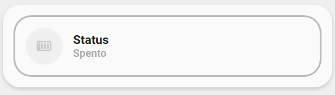
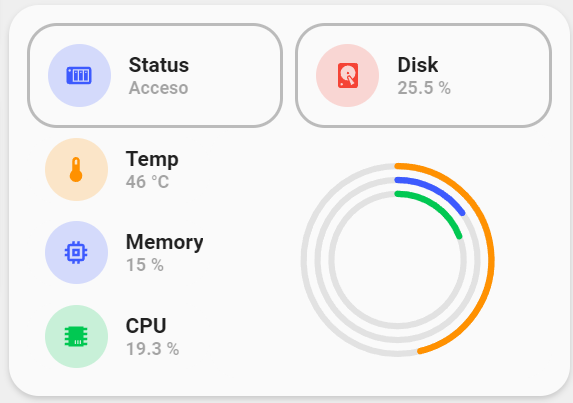

<!-- markdownlint-disable MD046 -->

# Custom-card "Nas Summary Card"

This is a `custom-card` that shows you a summary for your NAS with sensors, Wake on Lan and collapsed info. Once the NAS is off or unavailable it collapses the info.




## Credits

Author: Nik - 2022
Version: 1.0.0

## Changelog

<details>
<summary>1.0.0</summary>
Initial release
</details>
<summary>0.1.1</summary>
Fix for UI Minimalist v1.0.1.
</details>

## Requirements

To have the Minimalist cards and custom cards installed

## Usage

```yaml
- type: "custom:button-card"
    template: "custom_card_nik_nas"
    entity: switch.qnap_wol
    variables:
      graph_span: "1d"
      chart_type: "radialBar"
      entity_1:
        entity_id: "sensor.nas_cpu_temperature"
        icon: ''
        name: "Temp"
        color: "yellow"
        max_value: 100
      entity_2:
        entity_id: "sensor.nas_memory_usage"
        icon: ''
        name: "Memory"
        color: "blue"
        max_value: 100
      entity_3:
        entity_id: "sensor.nas_cpu_usage"
        icon: ''
        name: "CPU"
        color: "green"
        max_value: 100
      entity_4:
        entity_id: "sensor.disk_use_percent"
        icon: "mdi:harddisk"
        name: "Disk"
        color: "red"
```

## Variables

<table>
<thead>
  <tr>
    <th>Variable</th>
    <th>Example</th>
    <th>Required</th>
    <th>Explanation</th>
  </tr>
</thead>
<tbody>
  <tr>
    <td>entity</td>
    <td>switch.qnap_wol</td>
    <td>yes</td>
    <td>The Switch to turn On or Off the NAS</td>
  </tr>
  <tr>
    <td>chart_type</td>
    <td>line, scatter, pie, donut or radialBar</td>
    <td>yes</td>
    <td>The chart type you want to display</td>
  </tr>
  <tr>
    <td>graph_span</td>
    <td>1h, 12min, 1d, 1h25, 10sec, ...</td>
    <td>yes</td>
    <td>The span of the graph as a time interval</td>
  </tr>
  <tr>
    <td>entity_id</td>
    <td>sensor.disk_use_percent</td>
    <td>yes</td>
    <td>Entity sensor of choice. 4 entities must be added</td>
  </tr>
  <tr>
    <td>icon</td>
    <td>mdi:cpu-64-bit</td>
    <td>no</td>
    <td>mdi icon you want to be exposed in the img_cell, '' will return entity.attributes.icon </td>
  </tr>
  <tr>
    <td>name</td>
    <td>name for the used sensor</td>
    <td>no</td>
    <td>'' will return entity.attributes.friendly_name</td>
  </tr>
  <tr>
    <td>color</td>
    <td>green, blue, yellow, red or grey</td>
    <td>no</td>
    <td>if you don't use the color variable it will choice a random color</td>
  </tr>
  <tr>
    <td>max_value</td>
    <td>10, 300, ...</td>
    <td>no</td>
    <td>Maximum value of the sensor. Default will be 100</td>
  </tr>
</tbody>
</table>

## Template Code

??? note "Template Code"

    ```yaml title="custom_card_nik_nas.yaml"
    --8<-- "custom_cards/custom_card_nik_nas/custom_card_nik_nas.yaml"
    ```
