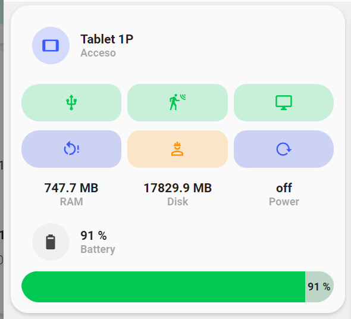
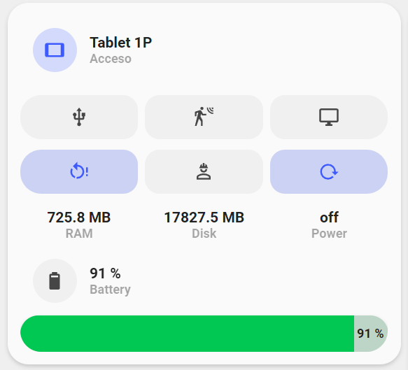

<!-- markdownlint-disable MD046 -->

## Custom-card "Tablet Custom Card"

This is a `custom-card` that uses the installed Kiosk app on a tablet to get information from. It includes USB Power (if the tablet has it), Motion, light and maintenance switch as well as restart and reload mode.




## Credits

Author: Nik - 2022
Version: 1.0.0

## Changelog

<details>
<summary>1.0.0</summary>
Initial release
</details>
<details>
<summary>0.1.1</summary>
Fix for UI Minimalist v1.0.1.
</details>

## Requirements

- To have all the Minimalist Cards and Custom Cards;
- To have installed and configured Kiosk APP on the Tablet (enabled permissions etc...);
- To have the HACS Integration "Fully Kiosk Browser" installed and configured in HomeAssistant;
- Add [Bar Card](https://github.com/custom-cards/bar-card) to HACS frontend

## Usage

```yaml
- type: "custom:button-card"
  template: "custom_card_nik_tablet"
  variables:
    ulm_custom_card_nik_tablet_main: binary_sensor.ping_tablet_1p
    ulm_custom_card_nik_tablet_name: "Tablet 1P"
    ulm_custom_card_nik_tablet_battery: sensor.tablet_1p_battery_level
    ulm_custom_card_nik_tablet_battery_name: "Battery"
    ulm_custom_card_nik_tablet_button1: switch.sonoff_tablet_1p
    ulm_custom_card_nik_tablet_button2: switch.tablet_1p_motion_detection
    ulm_custom_card_nik_tablet_button3: light.tablet_1p_screen
    ulm_custom_card_nik_tablet_restart: button.tablet_1p_restart_browser
    ulm_custom_card_nik_tablet_reload: button.tablet_1p_load_start_url
    ulm_custom_card_nik_tablet_maintenance: switch.tablet_1p_maintenance_mode
    ulm_custom_card_nik_tablet_par1: sensor.tablet_1p_ram_free_memory
    ulm_custom_card_nik_tablet_par1_name: "RAM"
    ulm_custom_card_nik_tablet_par2: sensor.tablet_1p_internal_storage_free_space
    ulm_custom_card_nik_tablet_par2_name: "Disk"
    ulm_custom_card_nik_tablet_par3: binary_sensor.tablet_1p_plugged_in
    ulm_custom_card_nik_tablet_par3_name: "Power"
```

## Variables

<table>
<thead>
<tr>
<th>Variable</th>
<th>Example</th>
<th>Required</th>
<th>Explanation</th>
</tr>
</thead>
<tbody>
<tr>
  <td>ulm_custom_card_nik_tablet_main</td>
  <td>binary_sensor.ping_tablet_1p</td>
  <td>Yes</td>
  <td>A sensor that checks if the tablet is online. A simple binary ping sensor does the job.</td>
</tr>
<tr>
  <td>ulm_custom_card_nik_tablet_name</td>
  <td>Tablet 1P</td>
  <td>Yes</td>
  <td>Name of the Tablet</td>
</tr>
<tr>
  <td>ulm_custom_card_nik_tablet_battery</td>
  <td>sensor.tablet_1p_battery_level</td>
  <td>Yes</td>
  <td>Battery sensor for the Tablet</td>
</tr>
<tr>
  <td>ulm_custom_card_nik_tablet_battery_name</td>
  <td>Battery</td>
  <td>Yes</td>
  <td>If you want to customize the Battery name</td>
</tr>
<tr>
  <td>ulm_custom_card_nik_tablet_button1</td>
  <td>switch.sonoff_tablet_1p</td>
  <td>Yes</td>
  <td>A Switch that enables or not USB Power for the Tablet. If not present you can replace it with another Switch of your choice. (check your device configs)</td>
</tr>
<tr>
  <td>ulm_custom_card_nik_tablet_button2</td>
  <td>switch.tablet_1p_motion_detection</td>
  <td>Yes</td>
  <td>The Motion detection switch for your tablet (check your device configs)</td>
</tr>
<tr>
  <td>ulm_custom_card_nik_tablet_button3</td>
  <td>light.tablet_1p_screen</td>
  <td>Yes</td>
  <td>The entity that turns on or off the Screen of the Tablet (check your device configs)</td>
</tr>
<tr>
  <td>ulm_custom_card_nik_tablet_restart</td>
  <td>button.tablet_1p_restart_browser</td>
  <td>Yes</td>
  <td>The entity to restart the Kiosk App of the Tablet (check your device configs)</td>
</tr>
<tr>
  <td>ulm_custom_card_nik_tablet_reload</td>
  <td>button.tablet_1p_load_start_url</td>
  <td>Yes</td>
  <td>The entity to reload the web page of the Kios App of the Tablet (check your device configs)</td>
</tr>
<tr>
  <td>ulm_custom_card_nik_tablet_maintenance</td>
  <td>switch.tablet_1p_maintenance_mode</td>
  <td>Yes</td>
  <td>The entity to put the tablet in maintenance mode. (check your device configs)</td>
</tr>
<tr>
  <td>ulm_custom_card_nik_tablet_par1</td>
  <td>sensor.example</td>
  <td>Yes</td>
  <td>An entity of your choice to monitor a specific tablet parameter</td>
</tr>
<tr>
  <td>ulm_custom_card_nik_tablet_par2</td>
  <td>sensor.example</td>
  <td>Yes</td>
  <td>An entity of your choice to monitor a specific tablet parameter</td>
</tr>
<tr>
  <td>ulm_custom_card_nik_tablet_par3</td>
  <td>sensor.example</td>
  <td>Yes</td>
  <td>An entity of your choice to monitor a specific tablet parameter</td>
</tr>
<tr>
  <td>ulm_custom_card_nik_tablet_par1_name</td>
  <td>sensor.example</td>
  <td>Yes</td>
  <td>Name for Parameter 1</td>
</tr>
<tr>
  <td>ulm_custom_card_nik_tablet_par2_name</td>
  <td>sensor.example</td>
  <td>Yes</td>
  <td>Name for Parameter 2</td>
</tr>
<tr>
  <td>ulm_custom_card_nik_tablet_par3_name</td>
  <td>sensor.example</td>
  <td>Yes</td>
  <td>Name for Parameter 3</td>
</tr>

</tr>
</tbody>
</table>

## Template Code

```yaml
---
custom_card_nik_tablet:
  template:
    - "ulm_language_variables"
  triggers_update: "all"
  show_icon: false
  show_name: false
  show_label: false
  variables:
    ulm_custom_card_nik_tablet_main: "[[[ return variables.ulm_custom_card_nik_tablet_main ]]]"
    ulm_custom_card_nik_tablet_name: "[[[ return variables.ulm_custom_card_nik_tablet_name ]]]"
    ulm_custom_card_nik_tablet_battery: "[[[ return variables.ulm_custom_card_nik_tablet_battery ]]]"
    ulm_custom_card_nik_tablet_battery_name: "[[[ return variables.ulm_custom_card_nik_tablet_battery_name ]]]"
    ulm_custom_card_nik_tablet_button1: "[[[ return variables.ulm_custom_card_nik_tablet_button1 ]]]"
    ulm_custom_card_nik_tablet_button2: "[[[ return variables.ulm_custom_card_nik_tablet_button2 ]]]"
    ulm_custom_card_nik_tablet_button3: "[[[ return variables.ulm_custom_card_nik_tablet_button3 ]]]"
    ulm_custom_card_nik_tablet_restart: "[[[ return variables.ulm_custom_card_nik_tablet_restart ]]]"
    ulm_custom_card_nik_tablet_reload: "[[[ return variables.ulm_custom_card_nik_tablet_reload ]]]"
    ulm_custom_card_nik_tablet_maintenance: "[[[ return variables.ulm_custom_card_nik_tablet_maintenance ]]]"
    ulm_custom_card_nik_tablet_par1: "[[[ return variables.ulm_custom_card_nik_tablet_par1 ]]]"
    ulm_custom_card_nik_tablet_par2: "[[[ return variables.ulm_custom_card_nik_tablet_par2 ]]]"
    ulm_custom_card_nik_tablet_par3: "[[[ return variables.ulm_custom_card_nik_tablet_par3 ]]]"
    ulm_custom_card_nik_tablet_par1_name: "[[[ return variables.ulm_custom_card_nik_tablet_par1_name ]]]"
    ulm_custom_card_nik_tablet_par2_name: "[[[ return variables.ulm_custom_card_nik_tablet_par2_name ]]]"
    ulm_custom_card_nik_tablet_par3_name: "[[[ return variables.ulm_custom_card_nik_tablet_par3_name ]]]"
  styles:
    grid:
      - grid-template-areas: >
          [[[
            var areas = [];
            areas.push("item1 item1");
            areas.push(". .");
            areas.push("item2 item2");
            areas.push(". .");
            areas.push("item3 item3");
            areas.push("item4 item4");
            areas.push("item5 item5");
            return "\"" + areas.join("\" \"") + "\"";
          ]]]
      - grid-template-columns: "1fr 1fr"
      - grid-template-rows: "min-content 10px min-content 10px min-content min-content min-content"
    card:
      - border-radius: "var(--border-radius)"
      - box-shadow: "var(--box-shadow)"
      - padding: "12px"
  custom_fields:
    item1:
      card:
        type: "custom:button-card"
        template: "card_input_boolean"
        entity: "[[[ return variables.ulm_custom_card_nik_tablet_main ]]]"
        icon: "mdi:tablet"
        name: "[[[ return variables.ulm_custom_card_nik_tablet_name ]]]"
        styles:
          card:
            - box-shadow: "none"
        tap_action:
          action: "none"
    item2:
      card:
        type: "custom:button-card"
        template: "list_3_items"
        custom_fields:
          item1:
            card:
              type: "custom:button-card"
              template:
                - "widget_icon"
                - "green"
              entity: "[[[ return variables.ulm_custom_card_nik_tablet_button1 ]]]"
              icon: "mdi:usb"
          item2:
            card:
              type: "custom:button-card"
              template:
                - "widget_icon"
                - "green"
              entity: "[[[ return variables.ulm_custom_card_nik_tablet_button2 ]]]"
              icon: "mdi:motion-sensor"
          item3:
            card:
              type: "custom:button-card"
              template:
                - "widget_icon"
                - "green"
              entity: "[[[ return variables.ulm_custom_card_nik_tablet_button3 ]]]"
              icon: "mdi:monitor"
    item3:
      card:
        type: "custom:button-card"
        template: "list_3_items"
        custom_fields:
          item1:
            card:
              type: "custom:button-card"
              template:
                - "widget_icon"
                - "blue_no_state"
              entity: "[[[ return variables.ulm_custom_card_nik_tablet_restart ]]]"
              icon: "mdi:restart-alert"
              tap_action:
              action: "call-service"
              service: "button.press"
              service_data:
                entity_id: "[[[ return variables.ulm_custom_card_nik_tablet_restart ]]]"
          item2:
            card:
              type: "custom:button-card"
              template:
                - "widget_icon"
                - "yellow"
              entity: "[[[ return variables.ulm_custom_card_nik_tablet_maintenance ]]]"
              icon: "mdi:account-hard-hat-outline"
          item3:
            card:
              type: "custom:button-card"
              template:
                - "widget_icon"
                - "blue_no_state"
              entity: "[[[ return variables.ulm_custom_card_nik_tablet_reload ]]]"
              icon: "mdi:reload"
              tap_action:
                action: "call-service"
                service: "button.press"
                service_data:
                  entity_id: "[[[ return variables.ulm_custom_card_nik_tablet_reload ]]]"
    item4:
      card:
        type: "custom:button-card"
        template: "list_3_items"
        custom_fields:
          item1:
            card:
              type: "custom:button-card"
              template: "custom_widget_nik_tablet"
              entity: "[[[ return variables.ulm_custom_card_nik_tablet_par1 ]]]"
              name: "[[[ return variables.ulm_custom_card_nik_tablet_par1_name ]]]"
          item2:
            card:
              type: "custom:button-card"
              template: "custom_widget_nik_tablet"
              entity: "[[[ return variables.ulm_custom_card_nik_tablet_par2 ]]]"
              name: "[[[ return variables.ulm_custom_card_nik_tablet_par2_name ]]]"
          item3:
            card:
              type: "custom:button-card"
              template: "custom_widget_nik_tablet"
              entity: "[[[ return variables.ulm_custom_card_nik_tablet_par3 ]]]"
              name: "[[[ return variables.ulm_custom_card_nik_tablet_par3_name ]]]"
    item5:
      card:
        type: "custom:button-card"
        template: "custom_bar_card_nik_tablet"
        variables:
          ulm_custom_bar_card_nik_tablet_card_entity: "[[[ return variables.ulm_custom_card_nik_tablet_battery ]]]"
          ulm_custom_bar_card_nik_tablet_card_name: "[[[ return variables.ulm_custom_card_nik_tablet_battery_name ]]]"
          ulm_custom_bar_card_nik_tablet_card_value: true
          ulm_custom_bar_card_nik_tablet_card_indicator: false

custom_widget_nik_tablet:
  show_label: true
  show_icon: false
  label: |
    [[[
      if (entity.attributes.unit_of_measurement) {
        var unit = entity.attributes.unit_of_measurement != null ? ' ' + entity.attributes.unit_of_measurement: ''
        return entity.state + unit;
      } else {
        return entity.state;
      }
    ]]]
  styles:
    name:
      - justify-self: "center"
      - align-self: "start"
      - font-weight: "bolder"
      - font-size: "12px"
      - filter: "opacity(40%)"
    label:
      - margin-top: "10px"
      - justify-self: "center"
      - font-weight: "bold"
      - font-size: "14px"
    grid:
      - grid-template-areas: "'l' 'n'"
      - grid-template-columns: "1fr"
      - grid-template-rows: "min-content min-content"
    card:
      - box-shadow: "none"

custom_bar_card_nik_tablet:
  triggers_update: "all"
  styles:
    grid:
      - grid-template-areas: "'item1' 'item2'"
      - grid-template-rows: "1fr"
    card:
      - border-radius: "none"
      - background-color: "transparent"
      - box-shadow: "none"
      - padding: "0px"
  custom_fields:
    item1:
      card:
        type: "custom:button-card"
        template:
          - "icon_info"
          - "card_generic"
        styles:
          card:
            - box-shadow: "none"
            - border-radius: "none"
            - padding: "12px"
        entity: "[[[ return variables.ulm_custom_bar_card_nik_tablet_card_entity ]]]"
        name: "[[[ return variables.ulm_custom_bar_card_nik_tablet_card_name != '' ? variables.ulm_custom_bar_card_nik_tablet_card_name : '' ]]]"
    item2:
      card:
        type: "custom:bar-card"
        entities:
          - entity: "[[[ return variables.ulm_custom_bar_card_nik_tablet_card_entity ]]]"
        positions:
          icon: "off"
          indicator: "[[[ return variables.ulm_custom_bar_card_nik_tablet_card_indicator == true ? 'inside' : 'off' ]]]"
          minmax: "off"
          title: "off"
          value: "[[[ return variables.ulm_custom_bar_card_nik_tablet_card_value == true ? 'inside' : 'off' ]]]"
          name: "off"
        severity:
          - color: "var(--google-red)"
            from: 1
            to: 30
          - color: "var(--google-yellow)"
            from: 31
            to: 59
          - color: "var(--google-green)"
            from: 60
            to: 100
        min: 1
        max: 100
        style: |-
          bar-card-currentbar {
            right: 0;
          }
          bar-card-backgroundbar {
            right: 0;
          }
          #states {
            padding: 0;
            height: 35px;
          }
          bar-card-background {
            height: 35px !important;
          }
          bar-card-indicator {
            left: 10px;
          }
          bar-card-value {
            font-weight: bold;
            font-size: 12px;
          }
```
