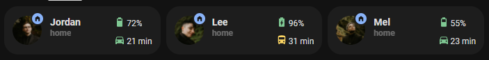
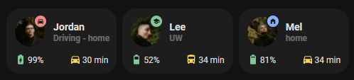

<!-- markdownlint-disable MD046 -->

## Description




The `custom_card_person_info` is an extension of `card_person`. It can also show if the user is driving, a related battery level, and a related commute time.

## Credits

- Author: Jordan Janzen <@jordandrako>
- Version: 1.0.0

## Variables

| Variable                             | Default   | Required         | Notes                                                                                                                                           |
| ------------------------------------ | --------- | ---------------- | ----------------------------------------------------------------------------------------------------------------------------------------------- |
| ulm_card_person_entity               |           | :material-check: | The person entity                                                                                                                               |
| ulm_card_person_use_entity_picture   |           | :material-close: | If you set this to true, the card shows the entity picture from your user, otherwise (set to false) shows the icon. Default is false.           |
| ulm_card_person_zone1                |           | :material-close: | Set another zone (beside "home") to use for the card. You can set up two zones besides "home".                                                  |
| ulm_card_person_zone2                |           | :material-close: | Set another zone (beside "home") to use for the card. You can set up two zones besides "home".                                                  |
| ulm_address                          |           | :material-close: | Show an address as label, add an entity with a geo location                                                                                     |
| ulm_multiline                        | false     | :material-close: | Show battery and commute sensors below state                                                                                                    |
| ulm_card_person_driving_entity       |           | :material-close: | Set a binary sensor that depicts when this person is driving                                                                                    |
| ulm_card_person_battery_entity       |           | :material-close: | Set a battery level sensor                                                                                                                      |
| ulm_card_person_battery_state_entity |           | :material-close: | Set a battery state sensor (eg the battery state sensor from the home assistant companion app will have the states "charging" or "discharging") |
| ulm_card_person_commute_entity       |           | :material-close: | Set a travel time sensor                                                                                                                        |
| ulm_card_person_cummute_icon         | "mdi:car" | :material-close: | Set an icon for the commute sensor to use                                                                                                       |

## Usage

```yaml
- type: "custom:button-card"
  template: card_person_info
  variables:
    ulm_card_person_entity: person.lee
    ulm_card_person_use_entity_picture: true
    ulm_card_person_zone1: zone.uw
    ulm_card_person_zone2: zone.store
    ulm_multiline: true
    ulm_card_person_driving_entity: binary_sensor.lee_in_car
    ulm_card_person_commute_entity: sensor.uw_commute
    ulm_card_person_commute_icon: mdi:bus
    ulm_card_person_battery_entity: sensor.lees_phone_battery_level
    ulm_card_person_battery_state_entity: sensor.lees_phone_battery_state
```

## Template Code

??? note "Template Code"

    ```yaml title="custom_card_person_info.yaml"
    --8<-- "custom_cards/custom_card_person_info/custom_card_person_info.yaml"
    ```
