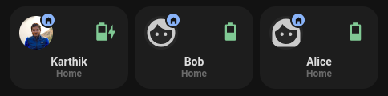
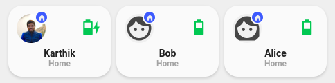

<!-- markdownlint-disable MD046 -->

## Description




The `custom_card_person_info_small` is based on `card_person_info`.

## Credits

- Author: Imaginelenses <@imaginelenses>
- Based on [person info card](https://ui-lovelace-minimalist.github.io/UI/usage/custom_cards/custom_card_person_info/#variables) by Jordan Janzen <@jordandrako>
- Version: 1.0.0

## Variables

| Variable                                     | Default              | Required         | Notes                                                                                                                                           |
| -------------------------------------------- | -------------------- | ---------------- | ----------------------------------------------------------------------------------------------------------------------------------------------- |
| ulm_card_person_entity                       |                      | :material-check: | The person entity                                                                                                                               |
| ulm_card_person_use_entity_picture           | true                 | :material-close: | If you set this to true, the card shows the entity picture from your user, otherwise (set to false) shows the icon. Default is false.           |
| ulm_card_person_zone1                        |                      | :material-close: | Set another zone (beside "home") to use for the card. You can set up two zones besides "home".                                                  |
| ulm_card_person_zone2                        |                      | :material-close: | Set another zone (beside "home") to use for the card. You can set up two zones besides "home".                                                  |
| ulm_address                                  |                      | :material-close: | Show an address as label, add an entity with a geo location                                                                                     |
| ulm_card_person_driving_entity               |                      | :material-close: | Set a binary sensor that depicts when this person is driving                                                                                    |
| ulm_card_person_battery_entity               |                      | :material-close: | Set a battery level sensor                                                                                                                      |
| ulm_card_person_battery_state_entity         |                      | :material-close: | Set a battery state sensor (eg the battery state sensor from the home assistant companion app will have the states "charging" or "discharging") |
| ulm_card_battery_battery_level_danger        | 15                   | :material-close: | Changes the color of the Icon, if the battery level falls below the provided value. Must be higher than ulm_card_battery_battery_level_waring   |
| ulm_card_battery_battery_level_waring        | 30                   | :material-close: | Changes the color of the Icon, if the battery level falls below the provided value.                                                             |
| ulm_card_battery_color_battery_level_danger  | var(--google-red)    | :material-close: | Color of icon if battery level is within the 'danger' zone.                                                                                     |
| ulm_card_battery_color_battery_level_warning | var(--google-yellow) | :material-close: | Color of icon if battery level is within the 'warning' zone.                                                                                    |
| ulm_card_battery_color_battery_level_ok      | var(--google-green)  | :material-close: | Color of icon if battery level is not within the 'danger' or 'warning' zone.                                                                    |

## Usage

```yaml
- type: "custom:button-card"
  template: card_person_info_small
  variables:
    ulm_card_person_entity: person.imaginelenses
    ulm_card_person_zone1: zone.work
    ulm_card_person_driving_entity: binary_sensor.driving
    ulm_card_person_battery_entity: sensor.phone_battery_level
    ulm_card_person_battery_state_entity: sensor.phone_battery_state
```

## Template Code

??? note "Template Code"

    ```yaml title="custom_card_person_info_small.yaml"
    --8<-- "custom_cards/custom_card_person_info_small/custom_card_person_info_small.yaml"
    ```
