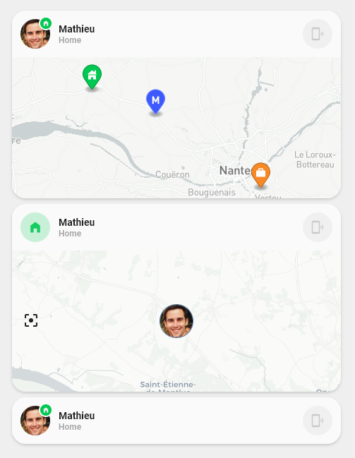
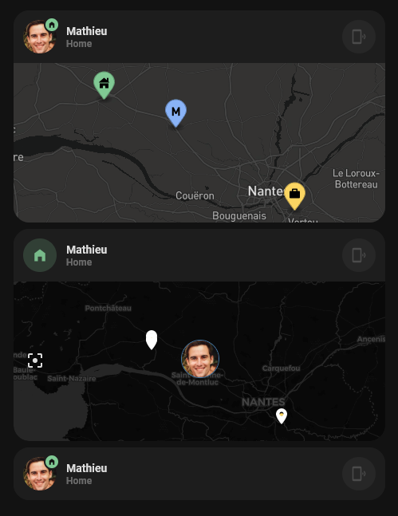
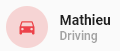

<!-- markdownlint-disable MD046 -->

# Custom Card Ristou Person

| Light | Dark |
|---------|----|
|  |  |

## Credits

- Author: Ristou - 2022
- Version: 1.0.0

## Changelog

<details>
<summary>1.0.1</summary>

- Fixed image path on documentation
- Added new template on card ( `icon_more_info_new` & `ulm_actions_card` )

</details>

<details>
<summary>1.0.0</summary>
Initial release
</details>

## Description

The `custom_card_ristou_person` shows if a person is `home` or `not_home`. If you have setup other zones, it will show these as well (e.g `work`, `school`, `doctor`, etc... ).

Showing driving state is also possible with a binary sensor.

In addition, this card can display a map (either static or using built in map) in a second row.

## Icon style

As the main icon of this card you can choose the following set up

| Variables | UI |
|---------|----|
| ulm_custom_card_ristou_use_badge: `true` <br> ulm_custom_card_ristou_use_entity_picture: `false` |  |
| ulm_custom_card_ristou_use_badge: `true` <br> ulm_custom_card_ristou_use_entity_picture: `true` |  |
| ulm_custom_card_ristou_use_badge: `false` <br> ulm_custom_card_ristou_use_entity_picture: `false` |  |

## map style

| Variables | UI |
|---------|----|
|ulm_custom_card_ristou_camera_entity_light != "" and <br> ulm_custom_card_ristou_camera_entity_dark != "" | |
| ulm_custom_card_ristou_map_enable: `true` |  |
| ulm_custom_card_ristou_camera_entity_light = "" and <br>ulm_custom_card_ristou_camera_entity_dark = "" and <br>ulm_custom_card_ristou_map_enable = `false` |  |

## About Static maps

The advantage of static map is that it is easy to custom and non-draggable.
For instance when you scroll down and you accidentally press first on map card.

I choose map box for the following reasons:

- Easy to sep it up with [static image API playground](https://docs.mapbox.com/playground/static/)
- Already existing styles (light & dark) to fit to your theme.
- Add many custom markers, I decided to represent my current location , home, and work.
- Possibility to remove attribution and logo.

URL can be directly used inside a camera entity using dynamic markers as explain [here](https://www.home-assistant.io/examples/google_maps_card/)

below is an example of the url I use for mapbox:

``` yaml
https://api.mapbox.com/styles/v1/mapbox/light-v10/static/pin-l-suitcase+f88927({{ state_attr('zone.work', 'longitude') }},{{ state_attr('zone.work', 'latitude') }}),pin-l-home+01C852({{ state_attr('zone.home', 'longitude') }},{{ state_attr('zone.home', 'latitude') }}),pin-l-m+3D5AFE({{ state_attr('device_tracker.mathieu_phone', 'longitude') }},{{ state_attr('device_tracker.mathieu_phone', 'latitude') }})/auto/466x200?attribution=false&logo=false&&access_token=YOUR_TOKEN
```

## Known issues

### map

built in map is not always rendering properly. I observed 2 issues:

- Not displaying if under sub stack like `horizontal stack` or `vertical stack`. another map has to be added somewhere else in the page. [Github issue](https://github.com/home-assistant/frontend/issues/12023)
- In IOS (never tried with other devices) bottom corner radius is not taken into consideration

### Static map

Static map can be blurry if ratio does not fit card width.
In my case I used developer tool to find out exact width of the card (which is 466px) and then I adjusted the height to my needs.

## Variables

| Variable | Default | Required         | Notes             |
|----------|---------|------------------|-------------------|
| entity     |  | ✔️ | person entity |
| ulm_custom_card_ristou_use_entity_picture     | false | ❌ | If you set this to true, the card shows the entity picture from your user, otherwise (set to false) shows the icon. Default is false. |
| ulm_custom_card_ristou_use_badge     | true | ❌ | Show a notification badge on the icon. if set to false and not sing entity picture, then icon will be dynamically displayed to (Home, Away, Known place, or CAR) |
| ulm_custom_card_ristou_map_enable     |false| ❌ | Display built in map as a second row |
| ulm_custom_card_ristou_map_aspect_ratio     |16:5| ❌ | Display built in map as a second row |
| ulm_custom_card_ristou_map_hours_to_show     |24| ❌ | Display built in map as a second row |
| ulm_custom_card_ristou_map_default_zoom     |9| ❌ | Display built in map as a second row |
| ulm_custom_card_ristou_camera_entity_light     |         | ❌ | Camera entity picture in light mode |
| ulm_custom_card_ristou_camera_entity_dark     |         | ❌ | Camera entity picture in dark mode |
| ulm_custom_card_ristou_zones     |         | ❌ | Used to display known zone on badge, icon, label or map |
| ulm_custom_card_ristou_find_device_script     |         | ❌ | Show a button to find your device |

## Usage

```yaml
- type: "custom:button-card"
  template: custom_card_ristou_person
  entity: person.mathieu
  variables:
    ulm_custom_card_ristou_use_entity_picture: true
    ulm_custom_card_ristou_find_device_script: script.find_phone_mathieu
    ulm_custom_card_ristou_person_driving_entity: binary_sensor.mathieu_driving
    ulm_custom_card_ristou_camera_entity_light: "camera.mapbox_mathieu_light"
    ulm_custom_card_ristou_camera_entity_dark: "camera.mapbox_mathieu_dark"
    ulm_custom_card_ristou_zones:
      - person.isabelle
      - person.mathieu
      - zone.work
      - zone.judo
      - zone.doctor
      - zone.nounou
      - zone.work_isabelle
```

## Template code

??? note "Template Code"

    ```yaml title="custom_card_ristou_person.yaml"
    --8<-- "custom_cards/custom_card_ristou_person/custom_card_ristou_person.yaml"
    ```
