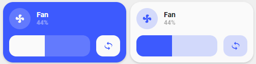

<!-- markdownlint-disable MD046 -->

# Custom-card "Fan"

This is a _custom card_ to control a fan. It allows you to turn on/off the fan, adjusting the fan speed with a slider, and turn on/off oscillation. Two styles are available:

| Template                   | Description                                                              |
|----------------------------|--------------------------------------------------------------------------|
| custom_card_saxel_fan      | Follows the standard theme of _UI-Lovelace-Minimalist_                   |
| custom_card_saxel_fan_blue | Card is theme based when the fan is __OFF__, Blue when the fan is __ON__ |

#### Light theme



#### Dark theme


## Credits

Author: saxel - 2021
Version: 1.0.0

## Changelog

<details>
  <summary>1.0.0</summary>
  Initial release
</details>

## Requirements

This card needs the following to function correctly:
<table>
  <tr>
    <th>Component / card</th>
    <th>Required</th>
    <th>Note</th>
  </tr>
  <tr>
    <td><a href="https://github.com/AnthonMS/my-cards">My Cards</a></td>
    <td>yes</td>
    <td></td>
  </tr>
  <tr>
    <td><a href="https://github.com/thomasloven/lovelace-card-mod">Card Mod</a></td>
    <td>yes</td>
    <td></td>
  </tr>
</table>

## Usage

#### Standard

```yaml
- type: custom:button-card
  template: custom_card_saxel_fan_blue
  entity: fan.smart_fan
  name: Fan
  variables:
    collapsible: false
    oscillate_attribute: oscillate
```

#### Blue

```yaml
- type: custom:button-card
  template: custom_card_saxel_fan
  entity: fan.smart_fan
  name: Fan
  variables:
    collapsible: true
    oscillate_attribute: oscillate
```

## Variables

<table>
  <tr>
    <th>Variable</th>
    <th>Example</th>
    <th>Required</th>
    <th>Explanation</th>
  </tr>
  <tr>
    <td>entity</td>
    <td>fan.smart_fan</td>
    <td>yes</td>
    <td>Fan entity</td>
  </tr>
  <tr>
    <td>name</td>
    <td>Fan</td>
    <td>no</td>
    <td>Name to show. If not specified the attribute <i>friendly_name</i> is shown instead</td>
  </tr>
  <tr>
    <td>collapsible</td>
    <td>true</td>
    <td>no</td>
    <td>true/false if the fan speed row should collapse when the fan is turned off. Default: true</td>
  </tr>
  <tr>
    <td>ulm_card_fan_horizontal</td>
    <td>true</td>
    <td>no</td>
    <td>Single Line Horizontal Control. Collapsible MUST be false for this currently. Default: false</td>
  </tr>
  <tr>
    <td>ulm_show_button</td>
    <td>false</td>
    <td>no</td>
    <td>Set to false to remove the Button and have a full width Slider. Default: true</td>
  </tr>
  <tr>
    <td>ulm_button_icon</td>
    <td>mdi:button</td>
    <td>no</td>
    <td>Set the icon for the Button. Default: mdi:rotate-3d-variant</td>
  </tr>
  <tr>
    <td>ulm_button_service</td>
    <td>fan.toggle</td>
    <td>no</td>
    <td>Name of the Service Call on button press. Default: fan.oscillate</td>
  </tr>
  <tr>
    <td>oscillate_attribute</td>
    <td>oscillate</td>
    <td>no</td>
    <td>Name of the oscillate attribute of the fan entity. Default: oscillate</td>
  </tr>
</table>
