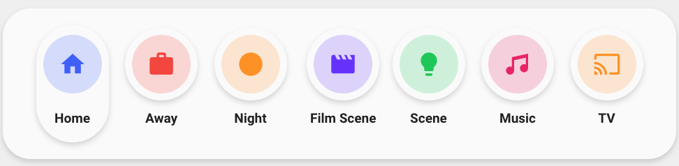

<!-- markdownlint-disable MD046 -->

# Custom-card "Scenes Card"

The `card_scenes` you can control a input_number entity



## Credits

Author: sildehoop - 2021
Version: 1.1.0

## Changelog

<details>
<summary>1.1.0</summary>
Auto dark mode box shadow
</details>
<details>
<summary>1.0.0</summary>
Initial release
</details>

## Usage

```yaml
- type: "custom:button-card"
  template:
    - card_scenes
  variables:
    entity_1: "scene.YOUR_SCENE"
    entity_2: "scene.YOUR_SCENE"
    entity_3: "scene.YOUR_SCENE"
    entity_4: "scene.YOUR_SCENE"
    entity_5: "scene.YOUR_SCENE"
    name_1: "YOUR_NAME"
    name_2: "YOUR_NAME"
    name_3: "YOUR_NAME"
    name_4: "YOUR_NAME"
    name_5: "YOUR_NAME"
    icon_1: "mdi:YOUR_ICON"
    icon_2: "mdi:YOUR_ICON"
    icon_3: "mdi:YOUR_ICON"
    icon_4: "mdi:YOUR_ICON"
    icon_5: "mdi:YOUR_ICON"
    color_icon_1: "yellow"
    color_icon_2: "blue"
    color_icon_3: "purple"
    color_icon_4: "green"
    color_icon_5: "red"
    color_bg_1: "yellow"
    color_bg_2: "blue"
    color_bg_3: "purple"
    color_bg_4: "green"
    color_bg_5: "red"
```

## Requirements

n/a

## Variables

<table>
<tr>
<th>Variable</th>
<th>Example</th>
<th>Required</th>
<th>Explanation</th>
</tr>
<tr>
<td>entity_</td>
<td>scene.evening_light</td>
<td>yes</td>
<td>Your scene entity</td>
</tr>
<tr>
<td>name_</td>
<td>Night</td>
<td>yes</td>
<td>The name to show</td>
</tr>
<tr>
<td>icon_</td>
<td>mdi:weather-night</td>
<td>yes</td>
<td>The icon to show</td>
</tr>
<tr>
<td>color_icon_</td>
<td>yellow, blue, purple, green, red</td>
<td>no</td>
<td>The color of the icon to show</td>
</tr>
<tr>
<td>color_bg_</td>
<td>yellow, blue, purple, green, red</td>
<td>no</td>
<td>The color of the icon background to show</td>
</tr>
</table>

## Template code

```yaml
---
card_scenes:
  show_icon: false
  show_name: false
  show_label: false
  variables:
    icon_1: "mdi:help-circle-outline"
    icon_2: "mdi:help-circle-outline"
    icon_3: "mdi:help-circle-outline"
    icon_4: "mdi:help-circle-outline"
    icon_5: "mdi:help-circle-outline"
    name_1: "n/a"
    name_2: "n/a"
    name_3: "n/a"
    name_4: "n/a"
    name_5: "n/a"
    color_icon_1: "gray"
    color_icon_2: "gray"
    color_icon_3: "gray"
    color_icon_4: "gray"
    color_icon_5: "gray"
    color_bg_1: "gray"
    color_bg_2: "gray"
    color_bg_3: "gray"
    color_bg_4: "gray"
    color_bg_5: "gray"
  styles:
    grid:
      - grid-template-areas: "'item1 item2 item3 item4 item5'"
      - grid-template-columns: "1fr 1fr 1fr 1fr 1fr"
      - grid-template-rows: "min-content"
      - justify-items: "center"
      - column-gap: "auto"
    card:
      - border-radius: "var(--border-radius)"
      - box-shadow: "var(--box-shadow)"
      - padding: "12px"
  custom_fields:
    item1:
      card:
        type: "custom:button-card"
        template: "card_scenes_pill"
        entity: "[[[ return variables.entity_1 ]]]"
        icon: "[[[ return variables.icon_1 ]]]"
        name: "[[[ return variables.name_1 ]]]"
        variables:
          color_icon: "[[[ return variables.color_icon_1 ]]]"
          color_bg: "[[[ return variables.color_bg_1 ]]]"
        tap_action:
          action: "call-service"
          service: "scene.turn_on"
          service_data:
            entity_id: "[[[ return variables.entity_1 ]]]"
    item2:
      card:
        type: "custom:button-card"
        template: "card_scenes_pill"
        entity: "[[[ return variables.entity_2 ]]]"
        icon: "[[[ return variables.icon_2 ]]]"
        name: "[[[ return variables.name_2 ]]]"
        variables:
          color_icon: "[[[ return variables.color_icon_2 ]]]"
          color_bg: "[[[ return variables.color_bg_2 ]]]"
        tap_action:
          action: "call-service"
          service: "scene.turn_on"
          service_data:
            entity_id: "[[[ return variables.entity_2 ]]]"
    item3:
      card:
        type: "custom:button-card"
        template: "card_scenes_pill"
        entity: "[[[ return variables.entity_3 ]]]"
        icon: "[[[ return variables.icon_3 ]]]"
        name: "[[[ return variables.name_3 ]]]"
        variables:
          color_icon: "[[[ return variables.color_icon_3 ]]]"
          color_bg: "[[[ return variables.color_bg_3 ]]]"
        tap_action:
          action: "call-service"
          service: "scene.turn_on"
          service_data:
            entity_id: "[[[ return variables.entity_3 ]]]"
    item4:
      card:
        type: "custom:button-card"
        template: "card_scenes_pill"
        entity: "[[[ return variables.entity_4 ]]]"
        icon: "[[[ return variables.icon_4 ]]]"
        name: "[[[ return variables.name_4 ]]]"
        variables:
          color_icon: "[[[ return variables.color_icon_4 ]]]"
          color_bg: "[[[ return variables.color_bg_4 ]]]"
        tap_action:
          action: "call-service"
          service: "scene.turn_on"
          service_data:
            entity_id: "[[[ return variables.entity_4 ]]]"
    item5:
      card:
        type: "custom:button-card"
        template: "card_scenes_pill"
        entity: "[[[ return variables.entity_5 ]]]"
        icon: "[[[ return variables.icon_5 ]]]"
        name: "[[[ return variables.name_5 ]]]"
        variables:
          color_icon: "[[[ return variables.color_icon_5 ]]]"
          color_bg: "[[[ return variables.color_bg_5 ]]]"
        tap_action:
          action: "call-service"
          service: "scene.turn_on"
          service_data:
            entity_id: "[[[ return variables.entity_5 ]]]"

card_scenes_pill:
  show_icon: true
  show_label: false
  show_name: true
  variables:
    color_icon: "gray"
    color_bg: "gray"
  styles:
    grid:
      - grid-template-areas: "'i' 'n'"
      - grid-template-columns: "min-content"
      - grid-template-rows: "1fr 1fr"
      - row-gap: "12px"
      - justify-items: "center"
      - column-gap: "auto"
    card:
      - box-shadow: "none"
      - padding: "5px"
      - box-shadow: >
          [[[
            if (hass.themes.darkMode){
              return "0px 2px 4px 0px rgba(0,0,0,0.80)";
            } else {
              return "var(--box-shadow)";
            }
          ]]]
      - border-radius: "50px"
      - place-self: "center"
      - width: "52px"
      - height: "84px"
    icon:
      - color: >
          [[[
            var color = [variables.color_icon];
            if (color == "gray"){
              var color = "rgba(var(--color-theme),0.20)";
            } else if(color == "yellow"){
              var color = "rgba(var(--color-yellow),1)";
            } else if(color == "blue"){
              var color = "rgba(var(--color-blue),1)";
            } else if(color == "purple"){
              var color = "rgba(var(--color-purple),1)";
            } else if(color == "green"){
              var color = "rgba(var(--color-green),1)";
            } else if(color == "red"){
              var color = "rgba(var(--color-red),1)";
            }
            return color;
          ]]]
    img_cell:
      - background-color: >
          [[[
            var color = [variables.color_bg];
            if (color == "gray"){
              var color = "rgba(var(--color-theme),0.05)";
            } else if(color == "yellow"){
              var color = "rgba(var(--color-yellow),0.20)";
            } else if(color == "blue"){
              var color = "rgba(var(--color-blue),0.20)";
            } else if(color == "purple"){
              var color = "rgba(var(--color-purple),0.20)";
            } else if(color == "green"){
              var color = "rgba(var(--color-green),0.20)";
            } else if(color == "red"){
              var color = "rgba(var(--color-red),0.20)";
            }
            return color;
          ]]]
      - border-radius: "50%"
      - width: "42px"
      - height: "42px"
    name:
      - font-weight: "bold"
      - font-size: "9.5px"
      - width: "33px"
      - padding-bottom: "7px"
    state:
      - color: "rgba(var(--color-theme),0.9)"
  color: "var(--google-grey)"

```
