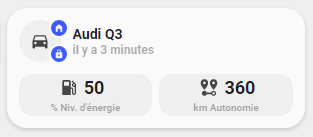

<!-- markdownlint-disable MD046 -->

# Custom-card "Car"

This is a `custom-card` to information about your car.



_NB : This card has only been tested with Audi Connect integration but should work with some others._

## Credits

Author: schumijo - 2021
Version: 1.0.0

## Changelog

<details>
<summary>1.0.0</summary>
Initial release
</details>

## Usage

```yaml
- type: "custom:button-card"
  template: custom_card_schumijo_car
  variables:
    ulm_card_schumijo_car_name: "Audi Q3"
    ulm_card_schumijo_car_tracker: device_tracker.audi_q3_position
    ulm_card_schumijo_car_lock: lock.audi_q3_door_lock
    ulm_card_schumijo_car_energy_level: sensor.audi_q3_tank_level
    ulm_card_schumijo_car_range: sensor.audi_q3_range
```

#### Variables

<table>
<tr>
<th>Variable</th>
<th>Example</th>
<th>Required</th>
<th>Explanation</th>
</tr>
<tr>
<td>ulm_card_schumijo_car_name</td>
<td>Audi Q3</td>
<td>yes</td>
<td>The name of your car</td>
</tr>
<tr>
<td>ulm_card_schumijo_car_tracker</td>
<td>device_tracker.audi_q3_position</td>
<td>yes</td>
<td>A device_tracker entity of your car</td>
</tr>
<tr>
<td>ulm_card_schumijo_car_lock</td>
<td>lock.audi_q3_door_lock</td>
<td>yes</td>
<td>A lock entity of your car</td>
</tr>
<tr>
<td>ulm_card_schumijo_car_energy_level</td>
<td>sensor.audi_q3_tank_level</td>
<td>yes</td>
<td>A sensor entity that represents energy level of your car (can be fuel or electric)</td>
</tr>
<tr>
<td>ulm_card_schumijo_car_range</td>
<td>sensor.audi_q3_range</td>
<td>yes</td>
<td>A sensor entity that represents range of your car</td>
</tr>
</table>

## Template code

??? note "Template Code"

    ```yaml title="custom_card_schumijo_car.yaml"
    --8<-- "custom_cards/custom_card_schumijo_car/custom_card_schumijo_car.yaml"
    ```
