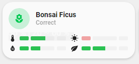

<!-- markdownlint-disable MD046 -->

# Custom-card "Flower"

This is a `custom-card` to display a plant entity. Shows state of the plant and attributes.



## Credits

- Author: schumijo - 2021
- Update 2.0.0 : Ashino - 2024
- Version: 2.0.0

## Changelog

<details>
<summary>1.0.0</summary>
Initial release
</details>
<details>
<summary>1.1.0</summary>
Fix language files for beta5
Updated README
</details>
<details>
<summary>2.0.0</summary>
Add support to lovelace-flower-card from Olen (advanced forked version)
Updated README
</details>

## Usage

```yaml
- type: "custom:button-card"
  template: card_flower
  variables:
    ulm_card_flower_entity: plant.bonsai_ficus
    ulm_card_flower_name: Bonsai Ficus
    ulm_card_flower_species: "ficus retusa"
    ulm_card_flower_show_bars:
        - temperature
        - humidity
        - moisture
```

#### Variables

<table>
<tr>
<th>Variable</th>
<th>Example</th>
<th>Required</th>
<th>Explanation</th>
</tr>
<tr>
<td>ulm_card_flower_entity</td>
<td>plant.bonsai_ficus</td>
<td>yes</td>
<td>The entity of your plant</td>
</tr>
<tr>
<td>ulm_card_flower_name</td>
<td>Bonsai Ficus</td>
<td>no</td>
<td>The name of your plant</td>
</tr>
<tr>
<td>ulm_card_flower_species</td>
<td>"ficus retusa"</td>
<td>yes</td>
<td>The species of your plant</td>
</tr>
<tr>
<td>ulm_card_flower_show_bars</td>
<td>
- temperature
<br>
- moisture
<br>
- humidity
</td>
<td>no</td>
<td>The bar you want to display. Any of :
<li>illuminance</li>
<li>humidity</li>
<li>moisture</li>
<li>conductivity</li>
<li>temperature</li>
<li>dli</li>
</td>
</tr>
</table>

## Requirements

Need [lovelace-flower-card](https://github.com/Olen/lovelace-flower-card)

## Template code

??? note "Template Code"

    ```yaml title="custom_card_schumijo_flower.yaml"
    --8<-- "custom_cards/custom_card_schumijo_flower/custom_card_schumijo_flower.yaml"
    ```
