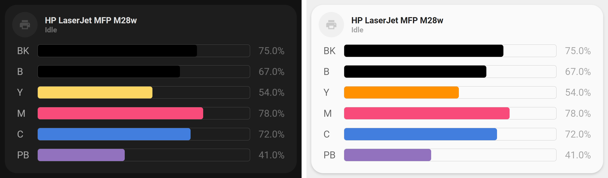

<!-- markdownlint-disable MD046 -->

# Custom-card "Printer"

{ width="650" }

This is the `custom_card_sisimomo_printer`, used to show the state of a printer including, if wanted, ink sensors.
The card has support any number of ink sensors under the state of the printer. These can be configured using custom colors and labels.

## Credits

Author: [Sisimomo](https://github.com/sisimomo) (based on [hiddevanbrussel pictures](https://community.home-assistant.io/t/lovelace-ui-minimalist/322687/203))
Version: 0.1.0

Contributors:

- [ByteFloater](https://github.com/bytefloater) Version 0.2.0

## Changelog

<details open>
  <summary>0.1.0 - Initial Release</summary>

- Initial release

</details>
<details open>
  <summary>0.2.0 - Added additional cases</summary>

- Added support for other cartridge types (tricolor)
- Added further error checking for previously uncaught states
- Added support for the IPP 'unavailable' state
- Added CSS for better theming of error screens
- Added card string translation files
- Changed `text-transform` of label to capitalize
- Changed `ulm_unavailable` to `ulm_translation_unavailable`
- Removed some unnecessary inline stylings
- Fixed the handling of unavailable and idle state styling

</details>

## Card options

| Options      | Required         | Description    |
|--------------|------------------|----------------|
| entity       | :material-check: | The entity_id for the large card |

## Variables

| Variable                               | Required         | Description    |
|----------------------------------------|------------------|----------------|
| printer_name                           | :material-close: | The chosen display name of the printer. <br> If not provided, will use the friendly name of the provided entity. |
| cartridges                             | :material-close: | A list of  `Cartridge entity` objects. (See below) |

## Cartridge entity

|  Variable  | Required         | Description    | Requirement |
|------------|------------------|----------------|-------------|
| label      | :material-check: | The label for the ink sensor. For better aesthetic, keep this string short eg: "BK", "Y", "M", "C", "PB" |  |
| entity_id  | :material-check: | The entity_id of the ink sensor | Must be a value between 0-100 (percentage). |
| type       | :material-close: | The type of cartridge associated with the ink sensor | Must be either 'unicolor' or 'tricolor'. <br> If not provided, 'unicolor' is assumed for backwards compatibility. |
| color      | :material-check: | The color of the ink bar | For unicolor cartridges, must be a single [CSS Legal Color Value](https://www.w3schools.com/cssref/css_colors_legal.asp). For tricolor cartridges, 3 colours are required. (See usage for more info) |

## Usage

### Unicolor Printers

```yaml
- type: "custom:button-card"
  template: "custom_card_sisimomo_printer"
  entity: sensor.hp_printer_status
  variables:
    printer_name: HP LaserJet MFP M28w
    cartridges:
      - label: "BK"
        entity_id: sensor.printer_black_ink
        type: unicolor
        color: "black"
      - label: "B"
        entity_id: sensor.printer_photo_black_ink
        type: unicolor
        color: "black"
      - label: "Y"
        entity_id: sensor.printer_yellow_ink
        type: unicolor
        color: "rgba(var(--color-yellow), 1)"
      - label: "M"
        entity_id: sensor.printer_magenta_ink
        type: unicolor
        color: "#F84B7A"
      - label: "C"
        entity_id: sensor.printer_cyan_ink
        type: unicolor
        color: "#427EDE"
      - label: "PB"
        entity_id: sensor.printer_photo_blue_ink
        type: unicolor
        color: "#9272BE"
```

### Tricolor Printers

```yaml
- type: "custom:button-card"
  template: custom_card_sisimomo_printer
  entity: sensor.canon_mg3600_series
  variables:
    ulm_card_printer_name: Canon MG3650
    cartridges:
      - label: "Col"
        entity_id: sensor.canon_mg3600_series_black
        type: tricolor
        color:
          - cyan
          - magenta
          - yellow
      - label: "BK"
        entity_id: sensor.canon_mg3600_series_black
        type: unicolor
        color: black
```

## Template code

??? note "Template Code"

    ```yaml title="custom_card_sisimomo_printer.yaml"
    --8<-- "custom_cards/custom_card_sisimomo_printer/custom_card_sisimomo_printer.yaml"
    ```
