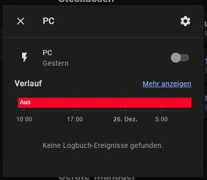

<!-- markdownlint-disable MD046 -->

# Custom-card "Device Tracker (Online or Offline ?)"

This card indicated whether a given device is online or offline using the Home Assistant device_tracker or the WoL-integration.


<br> Turn on you device with WoL: <br>


## Credits

Author: vncnt.dev - 2021
Version: 1.0.0

## Changelog

<details>
<summary>1.1.1</summary>
Fix for UI Minimalist v1.0.1.
</details>

<details>
<summary>1.1.0</summary>
Support WoL
</details>

<details>
<summary>1.0.0</summary>
Initial release
</details>

## Usage

```yaml
- type: "custom:button-card"
  template: "custom_card_vncntdev_device_tracker"
  entity: switch.pc
  variables:
    custom_card_vncntdev_device_tracker_icon: mdi:desktop-mac
    custom_card_vncntdev_device_tracker_name: "PC"
    custom_card_vncntdev_device_tracker_status_as_name: true

- type: "custom:button-card"
  template: "custom_card_vncntdev_device_tracker"
  entity: device_tracker.raspberry4
  variables:
    custom_card_vncntdev_device_tracker_name: "Raspberry Pi 4"
```

## Requirements

Setup [the device tracker integration](https://www.home-assistant.io/integrations/device_tracker/)

if you want to use WoL:
Setup [WoL integration](https://www.home-assistant.io/integrations/wake_on_lan/)

## Variables

<table>
<tr>
<th>Variable</th>
<th>Example</th>
<th>Required</th>
<th>Explanation</th>
</tr>
<tr>
<td>entity</td>
<td>device_tracker.pc</td>
<td>true</td>
<td>Icon of the Card</td>
</tr>
<tr>
<td>custom_card_vncntdev_device_tracker_name</td>
<td>"PC"</td>
<td>false</td>
<td>Custom name of device<br>default: friendly name of device tracer</td>
</tr>
<tr>
<td>custom_card_vncntdev_device_tracker_status_as_name</td>
<td>true</td>
<td>true</td>
<td>swap label and name?<br>default: false
default: "mdi:server"</td>
</tr>
<tr>
<td>custom_card_vncntdev_device_tracker_icon</td>
<td>mdi:desktop-mac</td>
<td>false</td>
<td>Icon of the Card<br>
default: "mdi:server"</td>
</tr>
<tr>
<td>custom_card_vncntdev_device_tracker_color_online</td>
<td>"var(--google-green)"</td>
<td>false</td>
<td>Color of icon if device is online<br>
default: "var(--google-green)"</td>
</tr>
<tr>
<td>custom_card_vncntdev_device_tracker_color_offline</td>
<td>"var(--google-red)"</td>
<td>false</td>
<td>Color of icon if offline<br>
default: "var(--google-red)"</td>
</tr>
</table>

## Template code

??? note "Template Code"

    ```yaml title="vncntdev_card_device_tracer.yaml"
    --8<-- "custom_cards/custom_card_vncntdev_device_tracer/vncntdev_card_device_tracer.yaml"
    ```

## Note
