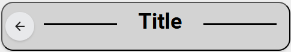

<!-- markdownlint-disable MD046 -->

# Custom-card "Title"

This is a `custom-card` to display a title header.



## Credits

Author: wilbiev - 2023
Version: 1.0.0

## Changelog

<details>
<summary>1.0.0</summary>
Initial release.
</details>

## Requirements

This card needs the following to function correctly:

['Text Divider Row'](https://github.com/iantrich/text-divider-row)

## Variables

<table>
<tr>
<th>Variable</th>
<th>Example</th>
<th>Required</th>
<th>Default</th>
<th>Explanation</th>
</tr>
<tr>
<td>ulm_custom_card_wilbiev_title_name</td>
<td>"Title"</td>
<td>yes</td>
<td></td>
<td>The name to display</td>
</tr>
<tr>
<td>ulm_custom_card_wilbiev_title_nav</td>
<td>"/adaptive-dash/home"</td>
<td>no</td>
<td>"<none>"</td>
<td>"Navigate to another view. Shows the 'Back'-button when having a value"</td>
</tr>
</table>

## Usage

```yaml
- type: "custom:button-card"
  template: "custom_card_wilbiev_title"
  variables:
    ulm_custom_card_wilbiev_title_name: "Living room"
    ulm_custom_card_wilbiev_title_nav: "/adaptive-dash/home" # OPTIONAL
```

??? note "Template Code"

    ```yaml title="custom_card_wilbiev_title.yaml"
    --8<-- "custom_cards/custom_card_wilbiev_title/custom_card_wilbiev_title.yaml"
    ```
