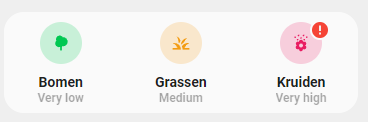
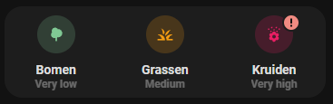

<!-- markdownlint-disable MD046 -->

# Custom-card "Tomorrow.io Pollen card"

This is a `custom-card` to display the pollen index of the [Tomorrow.io](https://www.home-assistant.io/integrations/tomorrowio) index




## Credits

Author: wsly - 05/2022
Version: 1.0.0

## Changelog

<details>
<summary>1.0.0</summary>
Initial release.
</details>

## Requirements

This card uses the following integration:

 [Tomorrow.io](https://www.home-assistant.io/integrations/tomorrowio)

## Usage

```yaml
- type: 'custom:button-card'
  template: custom_card_wsly_pollen
  variables:
    custom_card_wsly_pollen_tree: sensor.tomorrow_io_home_tree_pollen_index
    custom_card_wsly_pollen_grass: sensor.tomorrow_io_home_grass_pollen_index
    custom_card_wsly_pollen_weed: sensor.tomorrow_io_home_weed_pollen_index
```

## Variables

<table>
<tr>
<th>Variable</th>
<th>Example</th>
<th>Required</th>
<th>Default</th>
<th>Explanation</th>
</tr>
<tr>
<td>custom_card_wsly_pollen_tree</td>
<td>"sensor.tomorrow_io_home_tree_pollen_index"</td>
<td>Yes</td>
<td></td>
<td>The entity for the tree pollen index</td>
</tr>
<tr>
<td>custom_card_wsly_pollen_grass</td>
<td>"sensor.tomorrow_io_home_grass_pollen_index"</td>
<td>Yes</td>
<td></td>
<td>The entity for the grass pollen index</td>
</tr>
<tr>
<td>custom_card_wsly_pollen_weed</td>
<td>"sensor.tomorrow_io_home_weed_pollen_index"</td>
<td>Yes</td>
<td></td>
<td>The entity for the weed pollen index</td>
</tr>
</table>

<details>
<summary>Template code</summary>

```yaml
---
### Custom card Pollen ###
custom_card_wsly_pollen: 
  type: "custom:button-card"
  template: "list_3_items"
  triggers_update: "all"
  custom_fields:
    item1:
      card:
        type: "custom:button-card"
        template: custom_card_wsly_pollen_item
        entity: "[[[ return variables.custom_card_wsly_pollen_tree ]]]"
    item2:
      card:
        type: "custom:button-card"
        template: custom_card_wsly_pollen_item
        entity: "[[[ return variables.custom_card_wsly_pollen_grass ]]]"
    item3:
      card:
        type: "custom:button-card"
        template: custom_card_wsly_pollen_item
        entity: "[[[ return variables.custom_card_wsly_pollen_weed ]]]"

custom_card_wsly_pollen_item:
  type: "custom:button-card"
  template:
    - custom_card_wsly_pollen_language_variables
    - vertical_buttons
  label: >
    [[[ 
      let pollen_state_label = variables.custom_card_wsly_pollen_none;
      if (entity.state == "very_low") pollen_state_label = variables.custom_card_wsly_pollen_very_low;
      else if (entity.state == "low") pollen_state_label = variables.custom_card_wsly_pollen_low;
      else if (entity.state == "medium") pollen_state_label = variables.custom_card_wsly_pollen_medium;
      else if (entity.state == "high") pollen_state_label = variables.custom_card_wsly_pollen_high;
      else if (entity.state == "very_high") pollen_state_label = variables.custom_card_wsly_pollen_very_high;
      return pollen_state_label;
    ]]]
  state:
    - value: "none"
      styles:
        icon:
          - color: "rgba(var(--color-grey), 1)"
        img_cell:
          - background-color: "rgba(var(--color-grey), 0.2)"
    - value: "very_low"
      styles:
        icon:
          - color: "rgba(var(--color-green), 1)"
        img_cell:
          - background-color: "rgba(var(--color-green), 0.2)"
    - value: "low"
      styles:
        icon:
          - color: "rgba(241, 196, 15, 1)"
        img_cell:
          - background-color: "rgba(241, 196, 15, 0.2)"
    - value: "medium"
      styles:
        icon:
          - color: "rgba(243, 156, 18, 1)"
        img_cell:
          - background-color: "rgba(243, 156, 18, 0.2)"
    - value: "high"
      styles:
        icon:
          - color: "rgba(231, 76, 60, 1)"
        img_cell:
          - background-color: "rgba(231, 76, 60, 0.2)"
    - value: "very_high"
      styles:
        icon:
          - color: "rgba(var(--color-pink), 1)"
        img_cell:
          - background-color: "rgba(var(--color-pink), 0.2)"
  styles: 
    card:
      - box-shadow: "none"
      - border-radius: "var(--border-radius)"
    custom_fields:
      extreme:
        - border-radius: "50%"
        - position: "absolute"
        - margin-left: "auto"
        - margin-right: "auto"
        - left: "38px"
        - right: "0"
        - top: "8px"
        - height: "16px"
        - width: "16px"
        - border: "2px solid var(--card-background-color)"
        - font-size: "12px"
        - line-height: "14px"
        - background-color: "rgba(var(--color-red),1)"
        - color: "white"
  custom_fields:
    extreme: >
      [[[
        if (entity.state == "very_high"){
          return `<ha-icon icon="mdi:exclamation-thick" style="width: 12px; height: 12px; color: var(--primary-background-color);"></ha-icon>`
        }
      ]]]
      
```
</details>
