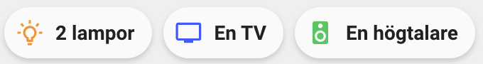

<!-- markdownlint-disable MD046 -->

# Custom Card "Group Counter"




## Credits

- Author: Albin Médoc - 2023
    Version: 1.0.0

## Changelog

<details>
  <summary>1.0.0</summary>
  Initial release
</details>

## Description

This cards show a chip with custom text representing how many entities in a group have a specific state. Pressing on the chip will toggle the entity group, eg turn on/off all lights.

## Variables

| Variable                                    | Default                  | Required | Notes                                                                                              |
| ------------------------------------------- | ------------------------ | -------- | -------------------------------------------------------------------------------------------------- |
| entity                                      |                          | Yes      | Hide chip if no entities are active.                                                               |
| ulm_custom_chip_group_counter_hide_if_zero  | false                    | No       | Hide chip if no entities are active.                                                               |
| ulm_custom_chip_group_counter_type          | light                    | No       | Specify the type of entities, used for translation                                                 |
| ulm_custom_chip_group_counter_count_state   | on                       | No       | States that should be counted                                                                      |
| ulm_custom_chip_group_counter_color         | yellow                   | Yes      | Color of the icon <br> Can choose between: `blue`, `red`, `green`, `yellow`, `pink`, `purple` <br> |
| ulm_custom_chip_group_counter_icon_zero     | mdi:lightbulb-outline    | No       | Icon when no entity's state is satisfied                                                           |
| ulm_custom_chip_group_counter_icon_one      | mdi:lightbulb-on-outline | No       | Icon when one entity's state is satisfied                                                          |
| ulm_custom_chip_group_counter_icon_multiple | mdi:lightbulb-on-outline | No       | Icon when multiple entities state is satisfied                                                     |

## Usage

### Minimal config 1

The entities active within the group will only go one level down. If you have a group with a group the subgroup will only be treated as a single entity.

```yaml
- type: 'custom:button-card'
  template: 'custom_chip_group_counter'
  entity: 'lights.living_room'
```

### Minimal config 2

This configuration can be used if you have a sensor that should represent the state. This can be good if you have groups within groups and the calculation is happening outside this card. The entity must still be set and should represent all the entities that should be toggled on press.

```yaml
- type: 'custom:button-card'
  template: 'custom_chip_group_counter'
  entity: 'light.all'
  variables:
      ulm_custom_chip_group_counter_entities_active: 'sensor.lights_on'
```

### Full config 2

```yaml
- type: 'custom:button-card'
  template: 'custom_chip_group_counter'
  entity: 'light.all'
  variables:
      ulm_custom_chip_group_counter_hide_if_zero: true
      ulm_custom_chip_group_counter_type: speaker
      ulm_custom_chip_group_counter_count_state:
          - 'playing'
          - 'buffering'
      ulm_custom_chip_group_counter_color: green
      ulm_custom_chip_group_counter_icon_zero: 'mdi:speaker'
      ulm_custom_chip_group_counter_icon_one: 'mdi:speaker'
      ulm_custom_chip_group_counter_icon_multiple: 'mdi:speaker-multiple'
```

## Template code

??? note "Template Code"

    ```yaml title="custom_chip_group_counter.yaml"
    --8<-- "custom_cards/custom_chip_group_counter/custom_chip_group_counter.yaml"
    ```
