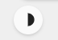
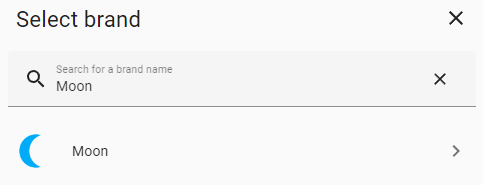

<!-- markdownlint-disable MD046 -->

## Custom-Chip `Moon`



Custom-Chip `Moon` is a chip which shows the phases of the moon. To do this, you need to add the “Moon” integration



## Credits

- Author: JStaegerino - 2024
- Version 1.0.0

## Changelog

<details>
<summary>1.0.0</summary>
Initial release
</details>


## Variables

| Variable | Default | Required         | Notes             |
|----------|---------|------------------|-------------------|
| ulm_chip_moon | `true` | :material-check: | This is the moon sensor |

## Usage

```yaml
- type: custom:button-card
  template: chip_moon
  variables:
    ulm_chip_moon: sensor.moon_phase
```

??? note "Template Code"

    ```yaml title="custom_chip_moon.yaml"
    --8<-- "custom_cards/custom_chip_moon/custom_chip_moon.yaml"
    ```
