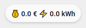
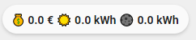

<!-- markdownlint-disable MD046 -->

# Custom-chip "My Enedis"

The `myenedis` you can control a input_number entity





## Credits

Author: acesyde - 2021
Version: 1.0.0

## Changelog

<details>
<summary>1.0.0</summary>
Initial release
</details>

## Why not the default `chip_power_consumption`

- The my enedis integration doesn't split the cost and the consumption in a specific sensor
- All values are in the main sensor under the `attributes` item
- Split `Heures Creuses (HC)` and `Heures pleines (HP)`

## Usage

```yaml
- type: "custom:button-card"
  template: custom_chip_myenedis
  entity: sensor.myenedis_123456789
  variables:
    ulm_chip_separate_hp_hc: true
```

## Requirements

[My Enedis integration](https://github.com/saniho/apiEnedis)

## Variables

| Variable                | Default | Required         | Notes                      |
| ----------------------- | ------- | ---------------- | -------------------------- |
| entity                  |         | :material-check: | Your MyEnedis Sensor       |
| ulm_chip_separate_hp_hc | false   | :material-close: | Separate HC/HC in the chip |

## Template code

??? note "Template Code"

    ```yaml title="custom_chip_myenedis.yaml"
    --8<-- "custom_cards/custom_chip_myenedis/custom_chip_myenedis.yaml"
    ```
