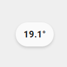
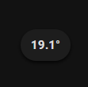

<!-- markdownlint-disable MD046 -->

# Custom-Chip "Simple Temp"




## Credits

Author: JStaegerino - 2025
Version 1.0.0

## Changelog

<details>
<summary>1.0.0</summary>
Initial release
</details>

## Usage

```yaml
- type: "custom:button-card"
  template: custom_chip_simple_temp
  entity: sensor.temperature
```

## Requirements

Add an temperature sensor

## Variables

| Variable                | Default | Required         | Notes                      |
| ----------------------- | ------- | ---------------- | -------------------------- |
| entity                  |         | :material-check: | Your temperature sensor    |

## Template code

??? note "Template Code"

    ```yaml title="custom_chip_simple_temp.yaml"
    --8<-- "custom_cards/custom_chip_simple_temp/custom_chip_simple_temp.yaml"
    ```
