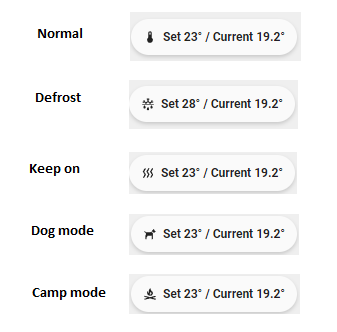

# Custom-chip `Tesla Temperature`



## Information

Custom-chip `Tesla Temperature` is a chip showing the status of set temperature and current inside temperature.

## Changelog

<details>
<summary>1.0.0</summary>
Initial release
</details>

## Usage

```yaml
- type: "custom:button-card"
  template: custom_chip_tesla_temperature
  variables:
      ulm_chip_hvac: climate.tesla_hvac_climate_system
```

## Requirements

[UI Lovelace Minimalist](https://github.com/UI-Lovelace-Minimalist/UI)

[Tesla Custom Integration](https://github.com/alandtse/tesla)

## Variables

<table>
  <tr>
    <th>Variable</th>
    <th>Default</th>
    <th>Required</th>
    <th>Explanation</th>
  </tr>
  <tr>
    <td>ulm_chip_hvac</td>
    <td></td>
    <td>Yes</td>
    <td>Tesla hvac entity</td>
  </tr>
</table>

## Template code

```yaml
---
custom_chip_tesla_temperature:
  template:
    - "chip_icon_label"
    - "ulm_translation_engine"
  variables:
  ulm_card_enable_popup: false
  triggers_update: "all"
  label: |
    [[[
      function convertTemperature(temp) {
        if (parseFloat(temp) == temp && Math.floor(temp) != temp) {
          return parseFloat(temp).toFixed(1);
        }
        return temp;
      }
      var set_temp = states[variables.ulm_chip_hvac].attributes.temperature;
      var inside_temp = states[variables.ulm_chip_hvac].attributes.current_temperature;
      var label = "Set " + convertTemperature(set_temp) + "°" + " / Current " + convertTemperature(inside_temp) + "°";
      return label;
    ]]]
  icon: |
    [[[
      var preset = states[variables.ulm_chip_hvac].attributes.preset_mode.toLowerCase();
      var icon = {
        "normal": "mdi:thermometer",
        "defrost": "mdi:snowflake-melt",
        "keep on": "mdi:heat-wave",
        "dog mode": "mdi:dog-side",
        "camp mode": "mdi:campfire",
        "default": "mdi:thermometer"
      }
      return (icon[preset] || icon["default"]);
    ]]]
```
