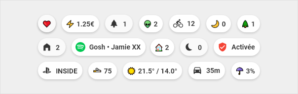
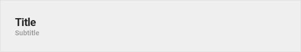
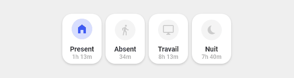
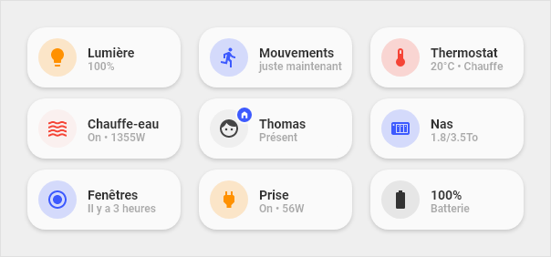
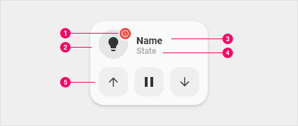

<!-- markdownlint-disable MD046 -->
## Card Style Guide

## This "theme" introduced

This "theme" provides you with four different elements, that combined give you a nice and functional layout. The basis for all these elements is `button-card` that allows for a great and individual styling. These elements, "cards", "chips", "title" and "vertical buttons", are fully customizable and can be enhanced to fit your needs.
All this is only possible, because we are able to use the templating function from `button-card`.

### Chips

At the top of each page you can find the `chips`, which allow to quickly visualize important information.

### Title

`Titles` are used to separate the different sections. Kind of a divider.

### Vertical buttons

`Vertical buttons` show the information vertically aligned. These find their use eg. as navigation or scene buttons.

### Cards

`Cards` are the main part of this design and are widely used in very different designs and functions. With these `cards` you can set up nearly every entity in HA, showing from "state-only" over a "full blown" information graphic with various values to "controlling" your covers and climate entities.

#### Anatomy of cards

1. **Dot**: Visible when the device is unavailable. Also used on the entity **person**
2. **Icon**: Icon that represents the device
3. **Primary line**: Main information
4. **Secondary line**: Secondary information
5. **Optional part**: Possibility to display buttons to launch actions related to the device. Or display a graph to view the history of a sensor or you let your fantasy take the ride...

In the list above #5 enhances the normal `cards` with a "second line", that is used to display other information like a graph or the controls for your covers. For this readme the `cards` are divided into three groups:

- 1-line cards: These are cards for `sensor` or `binary_sensors` like *light* or *power outlets*.
- 2-line cards: These are cards with a second line for informations or controls, eg. your `cover controls`.
- Custom cards: These are special cards, that you can install, only if needed. These cards are mostly developed and contributed to the repository. Eg. an `aircondition-card` that shows the state of your aircondition and buttons to control it.

#### Color Scheme

| Type | Color | Hex | RGB |
|------|:-----:|-----|-----|
| 💡 Light   ⚡ Electricity | <svg width="16" height="16"><circle cx="8" cy="8" r="8" stroke-width="0" fill="#FF9101" /></svg> | #FF9101 | rgb(255,145,1) |
| 🔥 Heating | <svg width="16" height="16"><circle cx="8" cy="8" r="8" stroke-width="0" fill="#F54436" /></svg> | #F54436 | rgb(245,6,54) |
| ☑️ on/off   🏠 Home | <svg width="16" height="16"><circle cx="8" cy="8" r="8" stroke-width="0" fill="#3D5AFE" /></svg> | #3D5AFE | rgb(61,90,254) |
| 🌳 Exterior | <svg width="16" height="16"><circle cx="8" cy="8" r="8" stroke-width="0" fill="#01C852" /></svg> | #01C852 | rgb(1,200,82) |

#### Icons

For the `chips`, this “theme” uses the standard *unicode emojis*. The main reason is, they are multi-color whereas the `mdi-icons` that HomeAssistant uses are one color only.

These emojis are only used on the `chips`, all other cards or buttons use the standard `mdi-icons`!

Overview over standard unicode emojis:

- https://emojipedia.org or
- https://github.com/ikatyang/emoji-cheat-sheet

Overview Home Assistant mdi-icons:

- https://materialdesignicons.com/

Using emojis is easy:

- Go to one of the Github pages above
- Select the emoji you want and copy it (“CTRL + C” or right-click “copy” / at emojipedia.org you already find a “copy” button)
- Go to your view and paste the icon

!!! info ""

    **Note**: There are a lot of emojis on these pages, so we suggest you use the
    built-in search at emojipedia or the browser integrated search by pressing “CTRL + F”
    and type in your query like “heart”.

### Language specific buttons

Sometimes the language specific strings from Home Assistant aren't available for your button, so we added the possibility to use language specific strings over the template system.

### Custom cards

This "theme" is designed with an open structure in mind, that's why it is possible to add `custom-cards` without much hassle. A few `custom-cards` are readily available through the folder `custom-cards` in the repository.
`Custom-cards` are `cards`, that don't fit everywhere and therefor are not part of the standard installation, but can be easily added, if needed. Take an air-condition card. Not everybody has an air-condition. So why include this `card` as a default? And that's why we did a structure and system for `custom-cards`. Easily added, but only when needed!
And the best thing is: everybody can develop a cool `card` and can (not have to) share it afterwards with the community (hint, hint, the support thread is [here](https://community.home-assistant.io/t/lovelace-ui-minimalist/322687)).

See a complete list of already included `custom-cards` in our [wiki](https://ui-lovelace-minimalist.github.io/UI/usage/custom_cards/custom_card_bar_card/).

Find informations on how to develop a `custom-card` [here](https://ui-lovelace-minimalist.github.io/UI/development/custom_cards/).

### Extend with your own code

As we tried to be as modular as possible (and useful), it is easy to enhance or extend the code, we provide with your own definitions. That means for you, you can inherit every template to enhance it only with functions, you really want. No need to copy full blocks of code - just inherit and enhance only where changes are needed.

We provided some instructions in our wiki, see [this page](https://ui-lovelace-minimalist.netlify.app/usage/changing_template).
