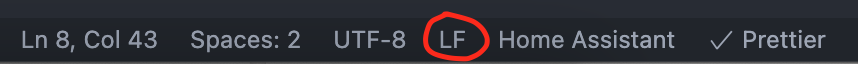

<!-- markdownlint-disable MD046 -->

## Develop a custom-card

If you have configured something great for this theme, like a new card, you might want to share it with the community. To ease this process, here are some instructions on how to do that.

### Building your custom-card

- Create a new folder following the naming convention of this theme, preferably by using the username and describing your card, eg. custom_card_paddy_temperature.
- Create a new file `README.md` where you describe your card, note of specific requirements (like `custom_components` from HA or other `custom-cards`) and your name as the author.
- Create a new file in this folder, naming it the same like your folder, eg. `custom_card_paddy_temperature.yaml`.
- **IMPORTANT!**
  Name the folder and file to your liking (preferably describing your chip/card), **but you must add the prefix custom\_** to both, the folder and the file name. Otherwise the file will not be correctly included!
  Example: `custom_card_paddy_temperature/custom_card_paddy_temperature.yaml`
- **IMPORTANT!** All files need to follow our community style-guidelines. Please read these guidelines carefully before adding a pull request.
- You can use and inherit all template definitions, that are available through the main button_card_templates.yaml of this theme. See the here for all definitions, including internal templates.
- If you need to use language specific strings, please see here.
- Please don’t inherit from other custom-cards, as the user might not have installed that card! If you really need to inherit from other custom-cards, you should clearly state this in your readme file!

### Style and Qualtiy guidelines

- Your card needs to satisfy some guidelines to assure your card is easy to read and looks like all the other cards in the repository.

  1. Each file needs to start only with `---` on the first line.
  2. Each file needs to end with a empty code line.
  3. All strings need to be `"double-quoted"`.
  4. Only use `lowercase` in your code.
  5. No trailing white-space (No random space between and around the code).
  6. A line-length of 256.
  7. **IMPORTANT!** Unix-style line endings. (It's recommended to use a code-editor like VSCode and set CRLF to LF)
     { width="500" }

- More advanced users can make use of Pre-commit to apply most of the styles automatically.
  1. Open your fork in a code-editor like VSCode.
  2. Install [Pre-commit](https://pre-commit.com/) (Linux or Mac-system recommended).
  3. All the needed hooks are available within the repository.
  4. After your changes run `pre-commit run --all-files` in the terminal of your editor.
  5. You could test your card in a dev-environment with the use of [Docker-desktop](https://www.docker.com/products/docker-desktop).
  6. Make sure you read https://github.com/UI-Lovelace-Minimalist/UI/blob/dev/.devcontainer/README.md

### Add your custom-card

- You can make a pull request on [Github](https://github.com/UI-Lovelace-Minimalist/UI/tree/dev) to add your custom-card.
- To make a pull request you need to fork the repository first.
  { width="500" }
- Add your custom-card folder to your fork. This needs to be in the already existing folder: `custom_cards`.
  { width="500" }
- All pull requests for `custom_cards` need to be directed to the `main` branch: `UI-Lovelace-Minimalist:main`. [Additional documentation](https://docs.github.com/en/pull-requests/collaborating-with-pull-requests/proposing-changes-to-your-work-with-pull-requests/creating-a-pull-request)

### Naming conventions

To make it easier for the user, we would prefer, if you would use the following naming conventions to name your folders and files.

- Prefix (custom\_)
- Type (like chip or card)
- Developer name (like paddy0174)
- Name describing your chip/card (temperature)

This should look like this:
`custom_card_paddy0174_temperature/custom_card_paddy0174_temperature.yaml`

In the end, your custom-card folder should have at least these structure:

```bash
custom_card_paddy_temperature
└── custom_card_paddy_temperature.yaml
└── README.md
└── languages
   └── DE.yaml (optional)
   └── EN.yaml (if language variables are used, at least EN needs to be provided)
```

!!! info ""

    **Note**: This is **optional** and you can use whatever naming you want,
    but keep in mind, the use of **custom_** as a prefix **is required**!

### Order

To make reading the definitions easier, we use the following structure in our definitions in button_card_templates.yaml:

```yaml
name:
  template:
  variables:
  tap_action/hold action/...:
  triggers_update:
  show_icon:
  show_label:
  show_name:
  show_state:
  icon:
  label:
  name:
  state:
  entity:
  styles:
    icon:
    label:
    name:
    state:
    img_cell:
    grid:
    card:
  custom_fields:
    item1:
      card:
        type:
        template:
```

Feel free to delete definitions, that you don’t use or need.

!!! info ""

    **Note**: Here as well, this is **optional**! It is just easier to use a structure,
    that can be easily compared to other definitions. But please do to your own liking
    and needs!

### Language specific strings

This “theme” supports language specific strings, as the translated strings (states) from HA are sometimes not available.

Most variables are already provided by Home Assistant:

- On
- Off
- Open
- Closed
- Unavailable
- Standby
- Idle
- and more

The usage is easy:
Include the language variables by including the template ulm_translation_engine in your card and then use them just like every other variable. As long as you want to translate an entity state to a human readable state, you should be good with just using variables.ulm_translation_state. If you use variables to supply an entity this variable won't work (yet).

```yaml
template:
  - ulm_translation_engine
  # optional, only if general language variables not provided by Home Assistant are used
  - ulm_language_variables
  # optional, only if language variables are used
  - custom_card_paddy0174_temperature_language_variables
state:
  [[[
    # if you use your own language variables, use them like this
    if (state == 'cool') {
      return variables.custom_card_paddy0174_temperature_cool;
    } else {
      return variables.ulm_translation_state;
    }
  ]]]
# Alternative short version, works in 90 percent of use cases, useful if you have lots of states or other variables which act for one entity
  [[[
  let state = entity.state;
  # Check if custom language variable for the entity state exists, otherwise check default language_variables, otherwise just output the entity state
  return variables["ulm_custom_card_paddy0174_temperature_" + state] ? variables["ulm_custom_card_paddy0174_temperature_" + state] : variables["ulm_" + state] ? variables["ulm_" + state] : state;
  ]]]
```

Your language file should use this format:

```yaml
# EN.yaml for custom_card_paddy0174_temperature
custom_card_paddy0174_temperature_language_variables:
  variables:
    ulm_custom_card_paddy0174_temperature_cool: "Cool"
```

Provide at least a file `EN.yaml` in your `custom-cards` language folder. If you want to support more languages, name them accordingly and use the same structure as in the `EN.yaml` file. In the end you will have different files in your languages folder, like `EN.yaml`, `FR.yaml` and `DE.yaml`. Please advise the user in your readme to delete all but one of these language files, otherwise the loading order gets messed up and the wrong strings get loaded.
