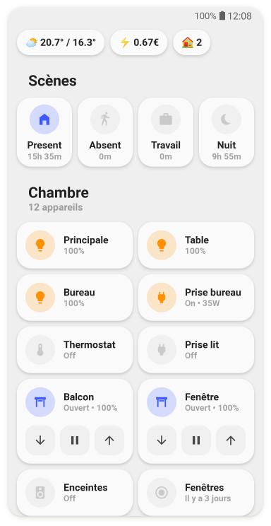
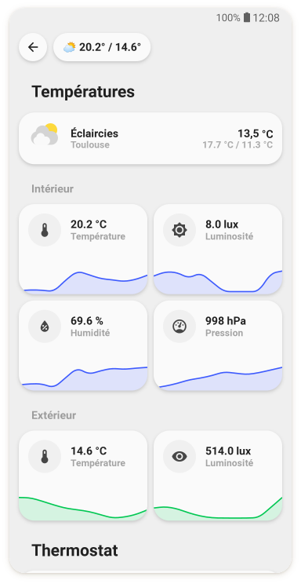
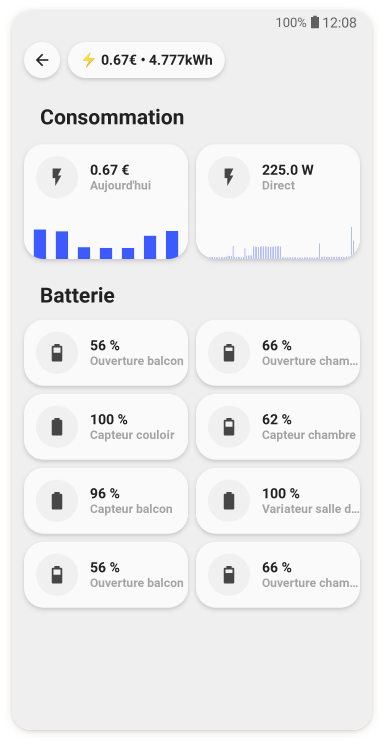
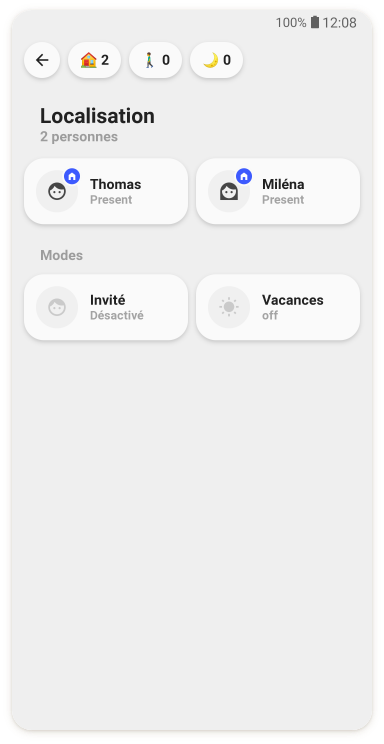

<!-- markdownlint-disable MD046 -->
# Welcome to the UI-Lovelace-Minimalist wiki

!!! danger "Under construction!"

    Hello dear UI Lovelace Minimalist fan. Nice that you found our new wiki.
    This is currently under construction!
    The contents are therefore to be enjoyed with caution
    and can still change at any time.

This wiki is intended to help you install and use the wonderful “theme” UI-Lovelace-Minimalist created by tben. Feel free to look around and get a deeper insight into the internal functions and tricks, this “theme” is using. Use them to your own likings, and if you develop something, that others must see, feel free to post it to this wiki or in the thread at the Home Assistant forum, which you can find [here](https://community.home-assistant.io/t/lovelace-ui-minimalist/322687?u=paddy0174).

{ width="200" } { width="200" } { width="200" } { width="200" }

## What is "Ui-Lovelace-Minimalist"

We call it a "theme" (the quotation marks are on purpose), as it uses theme specific techniques, but it uses so much more, that one can’t say it is only a theme. This "theme" is depending on two things, namely using a theme and make extensive use of the `template` function from the `custom_component` [button-card](https://github.com/custom-cards/button-card) made by RomRaider.

## A little history

This "theme" is based on the awesome work `7ahang` made on behance (see the links under credits), and was developed from tben for his own use of Home Assistant. But as this “theme” is such a wonderful and nice look for Home Assistant, it quickly became clear, that some organizational work should be done, to give others the possibility to use it as well. And here we are!

### Contributions

This is a living project and all input is very welcome! If you configured and designed a card, that you would like to share, please feel free to do so! We are happy to include your contribution so others can use it as well!

### Credits

- This design was made by [tben](https://community.home-assistant.io/u/tben/summary)
- A lot of inspiration is taken from [7ahang’s work](https://www.behance.net/gallery/88433905/Redesign-Smart-Home) found on Behance.
- Contributions from others in the HomeAssistant forum thread, you can find it here.
- The technical part is realised mostly by taking advantage of the great work RomRaider did with his [button-card](https://github.com/custom-cards/button-card).
- Code refactor, cleanup and maintainance by [schumijo](https://github.com/schumijo) and [paddy0174](https://github.com/Paddy0174) & [CM000n](https://github.com/CM000n).
- [dwainscheeren](https://github.com/dwainscheeren) for his inspiration to deliver themes via HACS.
- Wiki by [paddy0174](https://github.com/Paddy0174).
- Special thanks to clemalex and [schumijo](https://github.com/schumijo)for contributing their cards to the main repository.
- [stokkie90](https://github.com/stokkie90) for implementing most of the HACS functionalities.
- And of course [all the others](https://github.com/UI-Lovelace-Minimalist/UI/graphs/contributors) who cannot be named here due to space limitations. 😉 Thank you for your contribution ❤️
