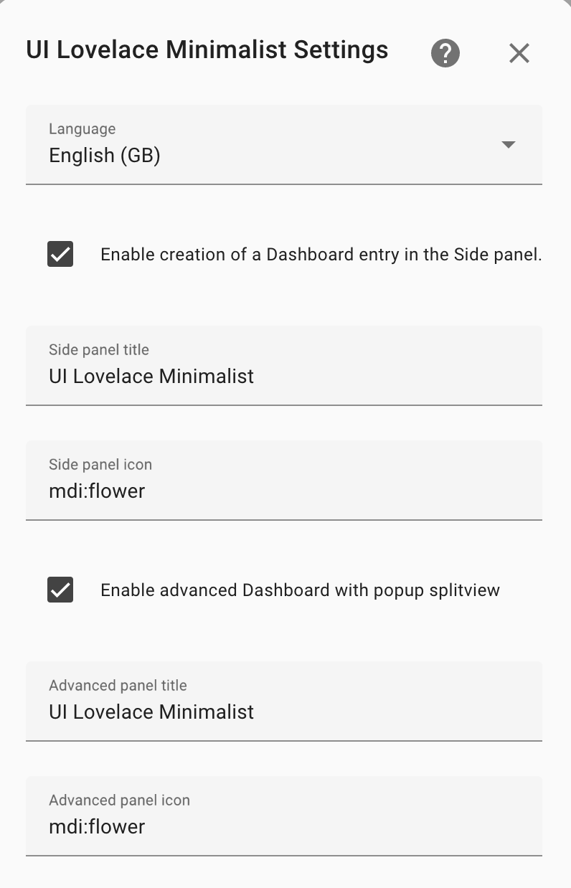

<!-- markdownlint-disable MD046 -->


## Add Adaptive Dashboard

To get full use of your Minimalist themed HA you need to setup some more custom_components (see requirements below). <br>
This dashboard automatically changes based on the device/screen size your are using. You can also alter the cards showing on the right-side by double-tapping a card. (Steps to configure this are described below)

### Additional Requirements

This dashboard make extensive use of `state-switch` and `layout-card`. These are available through HACS or as manual install from Github.

!!! warning "Warning"
For now the `state-switch` works only with version `v1.9.3` or below!

| Additional lovelace resources                                          |
| ---------------------------------------------------------------------- |
| [`layout-card`](https://github.com/thomasloven/lovelace-layout-card)   |
| [`state-switch`](https://github.com/thomasloven/lovelace-state-switch) |

You need also configure an `input_select` with options for each popup_card and view you have configured. This `input_select` controls the cards showing on the right-side of the screen when in fullscreen mode.

!!! note "Popups"

    **Note:** Not all device types do have Minimalist UI themed popups.
    Currently supported devices are: `lights`, `mediaplayers`, `thermostats`, `sensors`.

You can setup an `input_select` either via the GUI or in YAML. [See HA docs](https://www.home-assistant.io/integrations/input_select/)

```yaml
# Example configuration.yaml entry
input_select:
  minimalist_ui_switch:
    name: Select popup/view
    options:
      - light 1
      - light 2
      - mediaplayer 1
      - mediaplayer 2
      - climate 1
      - climate 2
      - power 1
      - power 2
      - livingroom
```

## Setup

To enable the adaptive dashboard you need to select the right option in the integration configuration menu. You can also set a name and icon for the new dashboard.

{ width="300" }

Once setup you should see another dashboard in your sidebar. This dashboard is filled with `card_title` template cards as placeholders on the pre-configured grid.

We have also added a folder with all the needed files to customizing your new dashboard:

```yaml
config
└── ui_lovelace_minimalist
├── custom_cards
└── dashboard
└── ui-lovelace.yaml
└── adaptive-dash
└── adaptive-ui.yaml
└── popup
└── popup.yaml
└── views
└── livingroom.yaml
└── main.yaml
```

## Customizing

The best place to start adding your personal cards is in `adaptive-dash/views/main.yaml`.

!!! tip "Grid-Layout"

    All files use CSS grids. By giving each card an own grid-area we can control there place in the dashboard. For more information on how `grid-areas` do work check this [amazing guide](https://css-tricks.com/snippets/css/complete-guide-grid/).

When you are familiar with CSS grids you can start to alter the `grid-template-areas` to your personal preference.

### Adding Cards

You can assign cards to a certain `grid-area` by adding this to your card configuration. We already have put in this config for some cards and titles.

```yaml
view_layout:
  grid-area: "card1"
```

To put card_light to the area: `card1`; you have to paste in the code as in your normal Minimalist UI dashboard on the place of the placeholder.

```yaml
# Placeholder for card1 in main.yaml
- view_layout:
    grid-area: "card1"
  type: "custom:button-card"
  template: "card_title"
  name: "Put here your <br> first card"
  label: "grid-area: card1"
```

```yaml
# Example of a card_light assigned to area card1
- view_layout:
    grid-area: "card1"
  type: "custom:button-card"
  template: "card_light"
  entity: "light.your_light"
  variables:
    ulm_card_light_enable_color: true
    ulm_card_light_enable_slider: true
    ulm_card_light_enable_popup: true
```

Do this for all placeholders. You can always use less cards by deleting placeholders or add more cards by adding new areas under the `grid-template-areas`.

For adapting the action use `adaptive` within the corresponding custom actions' variables. Take a look in the
[custom actions](https://ui-lovelace-minimalist.github.io/UI/setup/custom_actions/) section within this docs.

### Adding popups on the right-side

All cards on the right-side are configured in `adaptive-dash/popup/popup.yaml`.

First you need to add the `input_select` you have created to the file.

!!! tip "Important"

    ```yaml
    type: custom:state-switch
    view_layout:
      grid-area: popup
      show:
        mediaquery: "(min-width: 1100px)"
    entity: input_select.minimalist_ui # put your input_select here
    ```

We preconfigured multiple popups for different types of devices. In `popup.yaml` you only have to complete the information in the variables part. The `light 1`, `mediaplayer 1`, `livingroom` parts in the code refer to the options you have configured in your `input_select`. Make sure they are spelled the same. ([see documentation on `state-switch`](https://github.com/thomasloven/lovelace-state-switch))

!!! warning "Warning"
Only uncomment the options you have configured!
Else it could result in multiple errors in the dev-console of your browser.

Follow this part to add a card to an option of your `input_select`:
To add a light popup to your first light card you just have to add the corresponding entity:

```yaml
type: custom:state-switch
view_layout:
  grid-area: popup
  show:
    mediaquery: "(min-width: 1100px)"
entity: input_select.minimalist_ui # put your input_select here
default: default
transition: slide-down
transition_time: 500
states:
  ## Lights
  light 1:
    type: "custom:button-card"
    template: "popup_light_brightness"
    entity: "<your_entity>"
```

You can also add any other card by copying its yaml code in without the hyphen `(-)`

```yaml
states:
  ## Lights
  light 1:
    type: "custom:button-card"
    template: "popup_light_brightness"
    entity: "<your_entity>"
  card 1:
    type: "custom:button-card"
    template: "<your_template>"
```

!!! note "Important!"

    All options(devices) do need its own config in `popup.yaml`!

To switch between popups we need to go back to `adaptive-dash/views/main.yaml`. Here we have to add two variables to the cards we want to show a popup off. After adding these variables the cards need to be double_tapped to change popups.

```yaml
variables:
  ulm_input_select_option: light 1
  ulm_input_select: input_select.minimalist_ui_switch
```

Eventually the `card_light` we did configure should be like this:

```yaml
- view_layout:
    grid-area: "card1"
  type: "custom:button-card"
  template: "card_light"
  entity: "light.your_light"
  variables:
    ulm_card_light_enable_color: true
    ulm_card_light_enable_slider: true
    ulm_card_light_enable_popup: true
    ulm_input_select_option: light 1
    ulm_input_select: input_select.minimalist_ui_switch
```

From here you can duplicate the steps for each card.
!!! note "Supported"

    All cards working with official popups and the card_room support these variables. The name is uniform between all supported cards.

### Setup more views

We already made a file for a second view: `adaptive-dash/views/livingroom.yaml`. You can make as many views as you want by duplicating and alter the views files.

To make the new view visible you have to add some entry to `adaptive-dash/adaptive-ui.yaml`. You only have to change the name of the room/view to the new entry.

??? note "Add an extra view example (click to open)"

    ```yaml
    title: "UI Lovelace Minimalist"
    theme: "minimalist-desktop"
    background: "var(--background-image)"
    views:
      - type: "custom:grid-layout"
        title: "home"
        icon: "mdi:home"
        path: "0"
        layout:
        grid-template-columns: "1fr 1fr"
        grid-template-rows: "min-content"
        grid-template-areas: |
            "main popup"
        mediaquery:
            "(max-width: 1100px), (orientation: portrait)":
            grid-template-columns: "100%"
            grid-template-areas: "main"
        cards:
        - !include "views/main.yaml"
        - !include "popup/popup.yaml"

      - type: "custom:grid-layout"
        title: "Livingroom"
        icon: "mdi:sofa"
        path: "Livingroom"
        layout:
        grid-template-columns: "1fr 1fr"
        grid-template-rows: "min-content"
        grid-template-areas: |
            "livingroom popup"
        mediaquery:
            "(max-width: 1100px), (orientation: portrait)":
            grid-template-columns: "100%"
            grid-template-areas: "livingroom"
        cards:
        - !include "views/livingroom.yaml"
        - !include "popup/popup.yaml"

      - type: "custom:grid-layout"
        title: "New View"
        icon: "mdi:flower"
        path: "New View"
        layout:
        grid-template-columns: "1fr 1fr"
        grid-template-rows: "min-content"
        grid-template-areas: |
            "new_view popup"
        mediaquery:
            "(max-width: 1100px), (orientation: portrait)":
            grid-template-columns: "100%"
            grid-template-areas: "newview"
        cards:
        - !include "views/newview.yaml"
        - !include "popup/popup.yaml"
    ```

You can also show room views as a popup. To configure this add a `!include` entry in the popup.yaml file. As example we configured `livingroom` already. Make sure this is also an option in your `input_select`.

```yaml
# Add livingroom popup to popup.yaml
livingroom: !include "../views/livingroom.yaml"
```

Also add the two variables to the corresponding card_room:

```yaml
variables:
  ulm_input_select_option: livingroom
  ulm_input_select: input_select.minimalist_ui_switch
```
